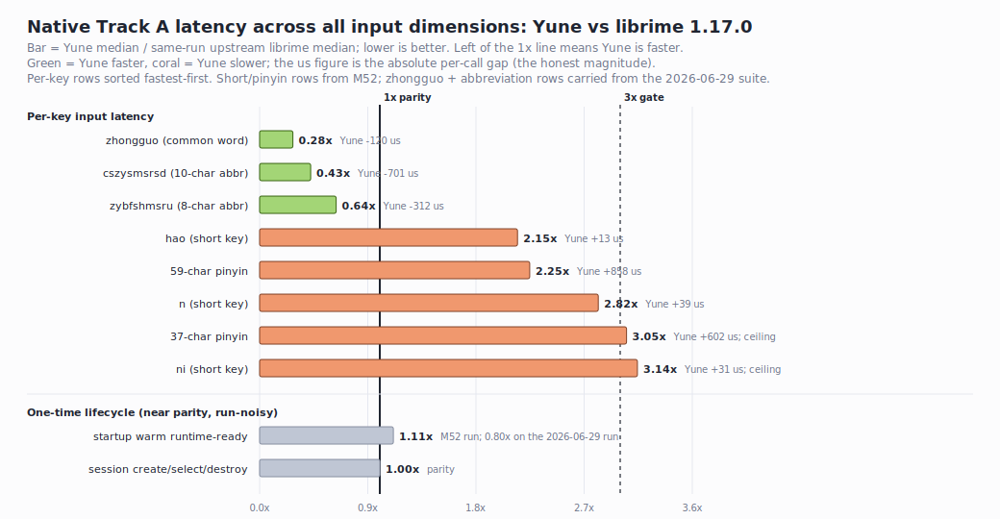

# Yune

[](LICENSE)
[](https://www.rust-lang.org)

**Languages:** English | [简体中文](README.zh-CN.md) | [粵語](README.yue.md)

> The engine that turns your typing into Chinese characters.
> Type `nihao`, get 你好. Type `nei5 hou2`, get 你好 in Cantonese.
> Built in Rust - native ABI, browser WASM, and CLI paths.

## Contents

- [What Yune Does](#what-yune-does)
- [Why It Exists](#why-it-exists)
- [How It Works](#how-it-works)
- [Current Status](#current-status)
- [Compatibility](#compatibility)
- [Performance](#performance)
- [Quick Start](#quick-start)
- [Quality Checks](#quality-checks)
- [Repository Layout](#repository-layout)
- [Documentation](#documentation)
- [Non-Goals](#non-goals)
- [Contributing](#contributing)
- [License](#license)

## What Yune Does

You type romanized Chinese (Pinyin for Mandarin, Jyutping for Cantonese) on a
standard keyboard. Yune converts it to the right Chinese characters in real time.

Under the hood, Yune reads RIME-style dictionary and configuration files for its
named targets and supported common-schema behavior. The goal is predictable
compatibility with existing RIME schemas when a target has oracle evidence, not
a universal all-schema claim.

**[yune-web.pages.dev](https://yune-web.pages.dev)** — try it in your browser.

### Capabilities

- RIME schema and config handling: `__include`, `__patch`, custom patches, deploy
  freshness, schema installation, and schema switching.
- Full input pipeline: speller, selector, navigator, key binder, editor, ASCII
  composer, chord composer, punctuation, recognizer, translators, and filters.
- Dictionary support: source `.dict.yaml`, imports, Yune-native compiled
  table/prism/reverse artifacts, rebuild execution, and fixture-backed ranking
  verified against the reference engine.
- C ABI compatibility: upstream-shaped default `RimeApi` and `RimeLeversApi`,
  config/context/candidate/session/deploy APIs, dynamic-loader tests, and
  frontend lifecycle tests.
- TypeDuck profile behavior: fork-only ABI slots exposed through
  `rime_get_typeduck_profile_api()`, rich Cantonese dictionary comments,
  TypeDuck-Web browser evidence, and TypeDuck-Windows backend/profile/IPC smoke
  evidence.
- Browser runtime: `@yune-ime/yune-web-runtime`, the `yune-web` Vite app,
  multi-schema browser harness (jyut6ping3, cangjie5, luna_pinyin, and more),
  UI language switching, output standard selection, public demo, and Playwright
  evidence.
- AI foundation: provider trait, local/mock providers, staged AI rows, privacy
  policy, separate AI memory, and default-off browser exposure.

## Why It Exists

RIME has been the backbone of open-source Chinese input for over a decade. It
works well. But it's a large C++ codebase that's difficult to change, test, or
embed in modern environments like browsers and mobile apps.

Yune rebuilds the engine from scratch in Rust with three goals:

**Run everywhere.** The same core engine can be exposed as a native
librime-shaped shared library for desktop host experiments, as WebAssembly for
browser-based input, or as a CLI tool for testing and benchmarking.

**Be testable.** Covered behavior is verified byte-for-byte against the relevant
RIME-family oracle. Instead of porting C++ code (and inheriting its bugs and
assumptions), Yune runs the oracle as a behavior reference: capture what it
outputs for a given input, then assert Yune produces the exact same result. This
preserves compatibility without cargo-culting a 15-year-old C++ architecture.

**Prepare for AI-native input.** The engine has a built-in, default-off AI layer.
In the future, an on-device language model could suggest completions or
corrections alongside traditional dictionary candidates — without slowing down
the classic path and without sending your typing to a cloud service.

## How It Works

```
keystrokes  ──►  spelling algebra  ──►  dictionary lookup  ──►  ranking & filtering  ──►  commit text
                    (normalize)          (find candidates)        (sort, deduplicate)        (output)
```

The pipeline is built from swappable Rust traits — translators, filters, and
rankers — rather than a monolithic class hierarchy. Want to plug in a custom
ranking model? Implement a trait. Want a different dictionary format? Swap the
translator.

The deterministic core is safe Rust. The workspace forbids unsafe code by
default, with explicit ABI/FFI exceptions in `yune-rime-api` and `yune-cli`.

## Current Status

Yune is an active engine project.

- **Compatibility baseline:** Phase 1 is complete. Yune produces identical
  output to its oracle on each named target: Mandarin `luna_pinyin` against
  upstream `rime/librime 1.17.0`, and Cantonese `jyut6ping3` against
  TypeDuck-HK/librime `v1.1.2` through the TypeDuck profile. `yune-web` has real
  in-browser validation (TypeDuck-Web); the TypeDuck-Windows backend has
  package/header, profile-ABI, and stock real-server IPC compatibility smoke
  through the named profile accessor, while interactive TSF typing and visible
  candidate UI remain Phase 2 product/frontend work.
- **Current work:** milestones M38-M52 are complete. On the fair `luna_pinyin`
  lane, same-run against upstream librime, latency is mixed and honestly
  measured: Yune is faster on the more expensive queries (`zhongguo` and both
  abbreviation rows) and matches librime candidate output on every row, but is
  slower on short keys (`n`/`ni`/`hao`) and on the 37/59-character pinyin
  sentence rows. The short-key losses are tens of microseconds (imperceptible
  while typing); the sentence-row losses are a few hundred microseconds. Startup
  and session are near parity. The one large gap is memory: Yune is ~10-11x
  heavier than librime on the fair native comparison (M52 guardrails it against
  regression), and the Jyutping product path is heavier still (it carries a much
  larger multilingual dictionary, so it has no like-for-like librime baseline).
- **Public demo:** `yune-web` is deployed at <https://yune-web.pages.dev>. It's
  a Yune engine demo, not a claim that browser-level performance is solved.
- **AI posture:** the AI layer exists but is default-off, local-only in the web
  harness, and outside the classic deterministic input path.

See [docs/roadmap.md](docs/roadmap.md) for the detailed milestone plan.

## Compatibility

Yune's compatibility is target-driven, not checklist-driven.

**Reference engines** (the "oracles" that define correct behavior):

- Default core oracle: upstream `rime/librime 1.17.0`
  (`33e78140250125871856cdc5b42ddc6a5fcd3cd4`).
- TypeDuck profile oracle: TypeDuck-HK/librime `v1.1.2`
  (`74cb52b78fb2411137a7643f6c8bc6517acfde69`).

**Rules:**

- Preserve upstream-observable behavior for named targets.
- Isolate TypeDuck fork behavior behind the TypeDuck profile surface.
- Add librime features only when a named target needs them.
- Keep expected bytes non-circular: always capture them from the relevant oracle,
  never derive them from Yune itself.

Default `rime_get_api()` remains upstream-shaped. TypeDuck fork-only ABI slots
are exposed exclusively through `rime_get_typeduck_profile_api()`.

## Performance

The current native comparison is mixed, honest, and intentionally measured
same-run against upstream `rime/librime 1.17.0`. Yune **matches librime
candidate output on every row**. Latency is faster on the more expensive queries
(`zhongguo` and the two abbreviation rows) and slower on short keys and the
37/59-character pinyin sentence rows; startup and session are near parity. The
one real gap is memory, where Yune is ~10-11x heavier than librime.



Current native Track A same-run ratios (M52 final, 2026-06-30; lower is better):

- **Faster than librime:** `zhongguo` `0.28x` (Yune saves ~120 us),
  `cszysmsrsd` (10-char abbreviation) `0.43x` (~701 us), `zybfshmsru` (8-char
  abbreviation) `0.64x` (~312 us). Yune matches librime candidate output on
  these rows *and* beats its latency.
- **Near parity:** startup `1.11x` and session `1.00x` (both run-noisy).
- **Slower than librime:** the short keys `hao` `2.15x` (+13 us), `n` `2.82x`
  (+39 us), and `ni` `3.14x` (+31 us) — single-character inputs, tens of
  microseconds, imperceptible in use; and the 37-character `3.05x` (+602 us) and
  59-character `2.25x` (+858 us) pinyin sentence rows. Candidate output matches
  librime on every row. M52 freezes `ni` and the 37-character row as
  bounded-microsecond regression ceilings, not `<=3.0x` passes.
- **Memory is the honest weak spot.** On the fair `luna_pinyin` comparison —
  same schema, no dictionary confound — Yune is about `11x` heavier than a
  librime-family engine both natively (`188.4 MB` vs librime `17.3 MB`, M52
  guardrailed) and in the browser (`64 MiB` vs My RIME `16 MiB`). The gap is
  real, not a dictionary artifact; it grew after M48 loaded the full essay
  preset vocabulary and is a storage-strategy difference (librime mmaps its
  data — see the roadmap's "Closing the 188 MB gap" sketch for the byte-backing
  path). The Jyutping product path is heavier still (`504 MB` native, `160 MiB`
  browser after WEB-03 byte-backing), but it is **not** a like-for-like
  comparison — Yune runs TypeDuck's multilingual `jyut6ping3` (Cantonese plus
  English/Hindi/Urdu/Nepali), recorded as a guard rather than a comparison. M47
  already byte-backed the shipping keyboard profile to about `67 MB` working set
  / `22 MB` private.
- Track B TypeDuck-profile rows and browser startup are separate evidence lanes,
  not upstream-librime native comparisons.

Current reports:

- [docs/reports/yune-vs-librime-performance.md](docs/reports/yune-vs-librime-performance.md)
- [docs/reports/yune-vs-librime-root-cause-analysis.md](docs/reports/yune-vs-librime-root-cause-analysis.md)

## Quick Start

Prerequisites:

- Rust 1.76 or newer
- Node.js and npm (for the browser harness and TypeScript runtime)
- Emscripten (only if building the WASM artifact locally)

Build and test:

```bash
cargo build
cargo test --workspace
```

Feed keystrokes directly to the core engine:

```bash
cargo run -p yune-cli -- run "nihao "
```

Run against real RIME data through the full ABI path:

```bash
cargo run -p yune-cli -- frontend \
  --shared-data-dir ./path/to/rime-data \
  --user-data-dir ./tmp/yune-user \
  --schema luna_pinyin \
  --sequence "nihao "
```

Run the browser demo locally:

```bash
npm --prefix apps/yune-web install
npm --prefix apps/yune-web run build
npm --prefix apps/yune-web run start
```

For browser validation work, start with
[apps/yune-web/e2e/yune-browser-smoke.md](apps/yune-web/e2e/yune-browser-smoke.md).

## Quality Checks

Run these before merging significant changes:

```bash
cargo fmt --check
cargo clippy --workspace --all-targets -- -D warnings
cargo test --workspace
npm --prefix packages/yune-web-runtime test
npm --prefix packages/yune-web-runtime run build
```

Browser-visible claims need Playwright or equivalent real-browser evidence.

## Repository Layout

| Path | What's In It |
| --- | --- |
| `crates/yune-core` | The engine: dictionary lookup, spelling algebra, candidate ranking, filters, user dictionary, AI staging. |
| `crates/yune-rime-api` | C ABI adapter: exposes the engine through the supported librime-shaped default ABI and named profile surfaces. |
| `crates/yune-cli` | Developer CLI: feed it keystrokes, get JSON output for testing and debugging. |
| `packages/yune-web-runtime` | TypeScript wrapper for the WASM build. |
| `apps/yune-web` | Browser demo app — the public face of the project. |
| `docs` | Roadmap, architecture decisions, conventions, reports. |
| `fixtures` | Deterministic test fixtures (expected engine output for given inputs). |
| `scripts` | Build helpers, benchmarks, oracle-capture tooling. |

## Documentation

- [docs/conventions.md](docs/conventions.md) — architecture, stack, coding rules,
  testing conventions, ABI rules, integrations, and current risks.
- [docs/roadmap.md](docs/roadmap.md) — active roadmap and milestone gates.
- [docs/decisions.md](docs/decisions.md) — decision log and standing principles.
- [docs/requirements.md](docs/requirements.md) — requirement IDs and status.
- [docs/ledgers/fork-parity-ledger.md](docs/ledgers/fork-parity-ledger.md) —
  Cantoboard and TypeDuck fork deltas versus upstream.
- [docs/plans/](docs/plans/) — active, reference, and completed execution
  records.

## Non-Goals

Equally important as the goals — these are things Yune intentionally does not do:

- Bit-for-bit librime internals or full C++ plugin ABI parity.
- A broad librime feature checklist without a named target.
- Widening the default upstream `RimeApi` for TypeDuck-only behavior.
- Cloud inference as a hard dependency.
- Remote AI providers without explicit privacy and product gates.
- Claiming application/browser performance wins from native engine evidence.

## Contributing

Bug reports, feature proposals, and pull requests are welcome. For anything that
affects behavioral compatibility, include oracle-captured evidence (real RIME
output against the same input — expected values must not be derived from Yune
itself). Start with [docs/conventions.md](docs/conventions.md) for architecture
and coding rules.

## License

Original code is [MIT](LICENSE). Third-party schemas, dictionaries, fixtures,
generated data, and provenance materials keep their upstream licenses — see
[THIRD_PARTY_NOTICES.md](THIRD_PARTY_NOTICES.md).
