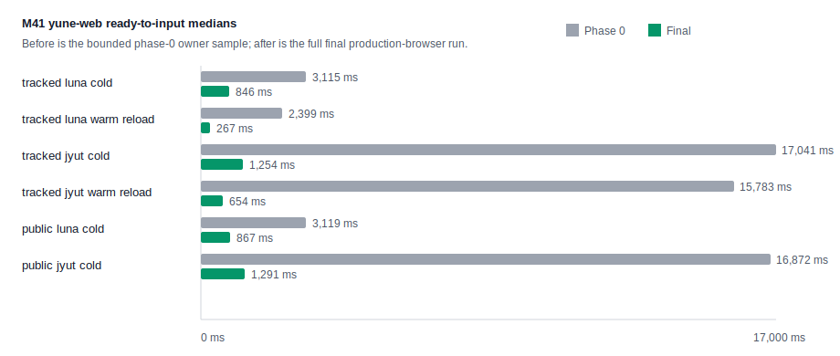
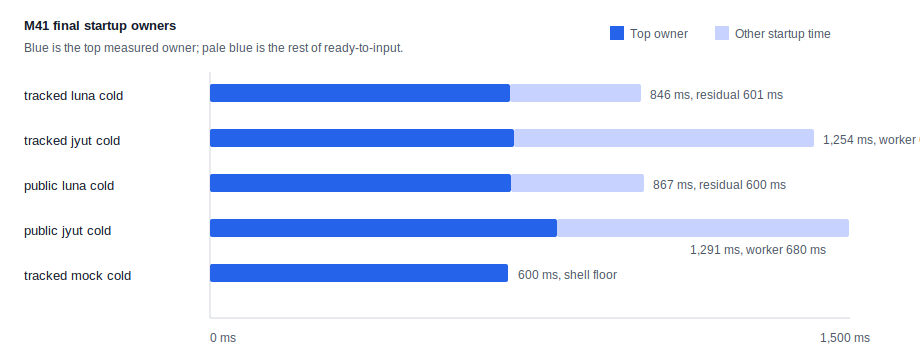

# M41 Startup Dashboard

## Visuals

## Summary

| Scenario | Samples | Schema | Mode | Public | Median ready ms | p95 ready ms | Median first key ms | Transfer bytes | Encoded bytes | Cache h/m/e |
| --- | ---: | --- | --- | --- | ---: | ---: | ---: | ---: | ---: | ---: |
| tracked-luna-cold | 10 | luna_pinyin | real-worker-cold | no | 846.0 | 932.0 | 64.0 | 5451094 | 5449894 | 0/0/0 |
| tracked-luna-warm-reload | 20 | luna_pinyin | real-worker-warm-reload | no | 266.0 | 268.0 | 86.0 | 0 | 5449894 | 0/0/0 |
| tracked-luna-warm-new-page | 20 | luna_pinyin | real-worker-warm-new-page | no | 306.0 | 322.0 | 86.0 | 0 | 5449894 | 0/0/0 |
| tracked-jyut-cold | 10 | jyut6ping3_mobile | real-worker-cold | no | 1254.0 | 1330.0 | 26.0 | 34862027 | 34860827 | 0/0/0 |
| tracked-jyut-warm-reload | 20 | jyut6ping3_mobile | real-worker-warm-reload | no | 654.0 | 691.0 | 26.0 | 0 | 35142383 | 0/0/0 |
| tracked-jyut-warm-new-page | 20 | jyut6ping3_mobile | real-worker-warm-new-page | no | 704.0 | 737.0 | 27.0 | 0 | 34860827 | 0/0/0 |
| tracked-mock-cold | 10 | luna_pinyin | mock-worker-cold | no | 609.0 | 646.0 | 25.0 | 743347 | 742147 | 0/0/0 |
| tracked-mock-warm | 20 | luna_pinyin | mock-worker-warm | no | 383.0 | 393.0 | 25.0 | 743347 | 742147 | 0/0/0 |
| public-luna-cold | 10 | luna_pinyin | real-worker-cold | yes | 867.0 | 883.0 | 40.0 | 5451034 | 5449834 | 2/20/0 |
| public-jyut-cold | 10 | jyut6ping3_mobile | real-worker-cold | yes | 1291.0 | 1349.0 | 26.0 | 34861967 | 34860767 | 1/36/0 |

## Startup Owner Map

| Scenario | Top owner | Owner median ms | Ready median ms | Ready p95 ms |
| --- | --- | ---: | ---: | ---: |
| tracked-luna-cold | React/browser ready residual | 601.0 | 846.0 | 932.0 |
| tracked-luna-warm-reload | worker total to initialized | 203.0 | 266.0 | 268.0 |
| tracked-luna-warm-new-page | worker total to initialized | 205.0 | 306.0 | 322.0 |
| tracked-jyut-cold | worker total to initialized | 646.0 | 1254.0 | 1330.0 |
| tracked-jyut-warm-reload | worker total to initialized | 592.0 | 654.0 | 691.0 |
| tracked-jyut-warm-new-page | worker total to initialized | 601.0 | 704.0 | 737.0 |
| tracked-mock-cold | React/browser ready residual | 609.0 | 609.0 | 646.0 |
| tracked-mock-warm | React/browser ready residual | 383.0 | 383.0 | 393.0 |
| public-luna-cold | React/browser ready residual | 600.0 | 867.0 | 883.0 |
| public-jyut-cold | worker total to initialized | 680.0 | 1291.0 | 1349.0 |

## Asset Transfer By Group

| Group | Transfer bytes | Encoded bytes | Duration ms |
| --- | ---: | ---: | ---: |
| wasm binary | 0 | 2339632 | 0.0 |
| schema binary | 0 | 1341677 | 0.0 |
| schema yaml | 0 | 846399 | 0.0 |
| other | 0 | 491196 | 3.0 |
| app js | 0 | 217756 | 1.0 |
| wasm glue | 0 | 72063 | 0.0 |
| opencc | 0 | 69609 | 0.0 |
| worker script | 0 | 40381 | -57.0 |
| app css | 0 | 31181 | 1.0 |

## Browser Memory

| Scenario | JS heap used | JS heap total | DOM nodes | Windows working set |
| --- | ---: | ---: | ---: | ---: |
| tracked-luna-cold | 5672764 | 11444224 | 1069 | 497397760 |
| tracked-luna-warm-reload | 9708900 | 15048704 | 1700 | 533327872 |
| tracked-luna-warm-new-page | 5928248 | 11706368 | 1087 | 506036224 |
| tracked-jyut-cold | 6051784 | 38789120 | 1189 | 718516224 |
| tracked-jyut-warm-reload | 6528840 | 16359424 | 802 | 756490240 |
| tracked-jyut-warm-new-page | 6116020 | 38526976 | 1071 | 708665344 |
| tracked-mock-cold | 4399168 | 8495104 | 609 | 360001536 |
| tracked-mock-warm | 7342420 | 11902976 | 1713 | 412348416 |
| public-luna-cold | 5319260 | 11706368 | 1069 | 500723712 |
| public-jyut-cold | 6078336 | 38789120 | 1189 | 724533248 |
