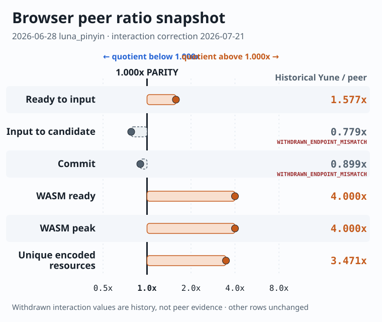
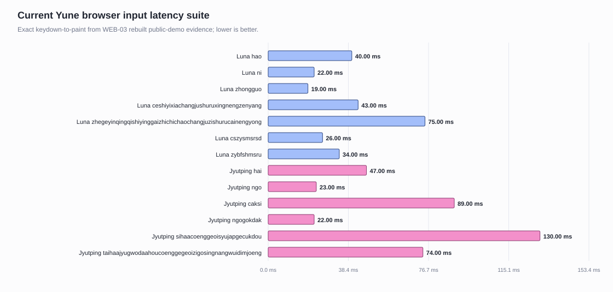

# Yune Web vs My RIME Browser Baseline — Archived Detail

> Archived on 2026-07-14 when the current measurements, visualizations, and
> bottleneck disposition moved into the single
> [`performance dashboard`](../yune-vs-librime-performance.md). This snapshot
> preserves the 2026-06-28 browser comparison immediately before
> consolidation.

Measurement date: 2026-06-28

> **Freshness note (2026-07-14):** this remains the latest direct browser peer
> measurement, but it is a dated 2026-06-28 snapshot, not a current-main
> benchmark. Native M59 and the later macOS run do not refresh or supersede
> browser startup, interaction, payload, or WASM-memory results. `WEB03-11`
> remains pending until the first clean source-current Cloudflare pass.

This report shows that measured browser benchmark state. The previous WEB-01/M46
handoff narrative has been archived at
[`2026-06-28-yune-web-vs-my-rime-browser-baseline-pre-current-dashboard.md`](./2026-06-28-yune-web-vs-my-rime-browser-baseline-pre-current-dashboard.md).

## Technical Summary

All fair-lane ratios use **Yune divided by My RIME**. Below `1.000x` means Yune
uses less of that metric, `1.000x` is parity, and above `1.000x` means Yune uses
more. A value such as `0.779x` means 77.9% of the peer latency, not “0.779x
faster.”

- **Fair same-schema lane**: in this snapshot, Yune is below latency parity on
  first input (`0.779x`) and commit (`0.899x`), but above parity on ready time
  (`1.577x`), WASM ready/peak (`4.000x`), and unique encoded resources
  (`3.471x`).
- **Jyutping lane**: the measured Yune public demo uses `160.0 MiB` WASM peak and
  is byte-backed. The My RIME Jyutping row is retained only as guard context
  because it uses a different Cantonese-only dictionary.
- **Long input**: the captured Yune WEB-03 evidence covers both short and long
  browser input rows. The longest Jyutping row is `74 ms` exact
  keydown-to-paint, and the 28-character Jyutping row is `130 ms`.
- **Snapshot blocker**: the clean browser target was the fair `luna_pinyin`
  memory/startup gap, not the old Jyutping `893.1 MiB` source-fallback row.

## Comparison Validity

| Lane | Meaning | Validity |
| --- | --- | --- |
| Yune public demo vs My RIME on `luna_pinyin` | Same schema and dictionary family | fair cross-engine browser comparison |
| Yune public demo Jyutping | Yune launch/profile guard | not fair against My RIME; dictionary-confounded |
| My RIME Jyutping | Cantonese-only My RIME guard context | not a target for TypeDuck `jyut6ping3` |

The measured dashboard source bundle is
[`evidence/current-performance-dashboard-2026-06-28/`](../evidence/current-performance-dashboard-2026-06-28/).

## Measured Browser Peer Results

The fair `luna_pinyin` lane is plotted on the same parity-centered ratio scale
as the native reports. Latency, memory, and payload remain separate metrics;
the chart only makes their direction relative to the peer explicit.



| Fair `luna_pinyin` metric | Yune | My RIME | Yune/peer | Parity read |
| --- | ---: | ---: | ---: | --- |
| ready to input | `1000 ms` | `634 ms` | `1.577x` | above parity; Yune uses more time |
| input to candidate | `74 ms` | `95 ms` | `0.779x` | below parity; Yune uses less time |
| commit | `107 ms` | `119 ms` | `0.899x` | below parity; Yune uses less time |
| WASM ready | `64.0 MiB` | `16.0 MiB` | `4.000x` | above parity; Yune uses more memory |
| WASM peak | `64.0 MiB` | `16.0 MiB` | `4.000x` | above parity; Yune uses more memory |
| unique encoded resources | `29.5 MiB` | `8.5 MiB` | `3.471x` | above parity; Yune transfers more bytes |

The raw snapshot table is retained below. Its Jyutping rows are guard context,
not peer ratios, because the dictionaries differ.

| Scenario | Schema | Ready | Input -> candidate | Commit | WASM ready | WASM peak | Unique encoded resources | Commit check |
| --- | --- | ---: | ---: | ---: | ---: | ---: | ---: | --- |
| Yune public demo | `luna_pinyin` | `1000 ms` | `74 ms` | `107 ms` | `64.0 MiB` | `64.0 MiB` | `29.5 MiB` | `ni -> 你` |
| My RIME live | `luna_pinyin` | `634 ms` | `95 ms` | `119 ms` | `16.0 MiB` | `16.0 MiB` | `8.5 MiB` | `ni -> 你` |
| Yune public demo | Jyutping | `1347 ms` | `103 ms` | `108 ms` | `160.0 MiB` | `160.0 MiB` | `72.2 MiB` | `nei -> 你` |
| My RIME live | Jyutping | `998 ms` | `99 ms` | `114 ms` | `56.6 MiB` | `68.0 MiB` | `24.9 MiB` | `nei -> 你` |

Snapshot comparator command:

```powershell
$env:YUNE_WEB_COMPARATOR_BASELINE='1'
$env:YUNE_WEB_COMPARATOR_INCLUDE_MY_RIME='1'
$env:YUNE_WEB_COMPARATOR_SAMPLES='3'
$env:YUNE_WEB_COMPARATOR_PHASE='current-dashboard'
npm.cmd --prefix apps/yune-web/e2e run test:e2e -- --grep "YUNE WEB COMPARATOR" --workers=1
```

Result: passed, writing
[`../../../apps/yune-web/e2e/results/yune-web-vs-my-rime-baseline/current-dashboard/`](../../../apps/yune-web/e2e/results/yune-web-vs-my-rime-baseline/current-dashboard/).

## Measured Yune Input-Latency Suite

This is a **Yune-only absolute-latency chart**. It has no My RIME denominator
and no `1.000x` parity interpretation.



| Schema | Input | Exact keydown-to-paint | Max during input | Worker process sum | WASM peak | First candidate |
| --- | --- | ---: | ---: | ---: | ---: | --- |
| `luna_pinyin` | `hao` | `40 ms` | `40 ms` | `6 ms` | `64.0 MiB` | `好` |
| `luna_pinyin` | `ni` | `22 ms` | `22 ms` | `0 ms` | `64.0 MiB` | `你` |
| `luna_pinyin` | `zhongguo` | `19 ms` | `30 ms` | `2 ms` | `64.0 MiB` | `中國大陸` |
| `luna_pinyin` | `ceshiyixiachangjushuruxingnengzenyang` | `43 ms` | `45 ms` | `8 ms` | `64.0 MiB` | `測是一下長據書如行能怎樣` |
| `luna_pinyin` | `zhegeyinqingqishiyinggaizhichichaochangjuzishurucainengyong` | `75 ms` | `78 ms` | `16 ms` | `64.0 MiB` | `這個因請其是應該之喫差哦長據子書如才能用` |
| `luna_pinyin` | `cszysmsrsd` | `26 ms` | `29 ms` | `7 ms` | `64.0 MiB` | placeholder row |
| `luna_pinyin` | `zybfshmsru` | `34 ms` | `47 ms` | `1 ms` | `64.0 MiB` | placeholder row |
| `jyut6ping3_mobile` | `hai` | `47 ms` | `47 ms` | `7 ms` | `160.0 MiB` | `係` |
| `jyut6ping3_mobile` | `ngo` | `23 ms` | `24 ms` | `2 ms` | `160.0 MiB` | `我` |
| `jyut6ping3_mobile` | `caksi` | `89 ms` | `90 ms` | `60 ms` | `160.0 MiB` | `測時` |
| `jyut6ping3_mobile` | `ngogokdak` | `22 ms` | `33 ms` | `4 ms` | `160.0 MiB` | `我覺得` |
| `jyut6ping3_mobile` | `sihaacoenggeoisyujapgecukdou` | `130 ms` | `136 ms` | `93 ms` | `160.0 MiB` | `試下場據輸入嘅速都` |
| `jyut6ping3_mobile` | `taihaajyugwodaahoucoenggegeoizigosingnangwuidimjoeng` | `74 ms` | `74 ms` | `12 ms` | `160.0 MiB` | `睇下如果打好場嘅據自個責會點樣` |

Evidence:
[`../../../apps/yune-web/e2e/results/web03-latency-regression-fix/local-browser-latency/`](../../../apps/yune-web/e2e/results/web03-latency-regression-fix/local-browser-latency/).

## Browser Read at This Snapshot

| Dimension | Snapshot read |
| --- | --- |
| Fair memory gap | Yune `luna_pinyin` is `4.0x` My RIME on WASM peak (`64.0 MiB` vs `16.0 MiB`). |
| Fair startup gap | Yune `luna_pinyin` ready-to-input is `1.577x` My RIME (`1000 ms` vs `634 ms`), above parity. |
| Fair first-input latency | Yune `luna_pinyin` is `0.779x` My RIME (`74 ms` vs `95 ms`), below parity. |
| Fair commit latency | Yune `luna_pinyin` is `0.899x` My RIME (`107 ms` vs `119 ms`), below parity. |
| Public-demo Jyutping memory | The measured byte-backed launch path is `160.0 MiB`; old `893.1 MiB` is historical source-fallback evidence. |
| Public-demo Jyutping long typing | The measured WEB-03 long rows are below `150 ms` exact keydown-to-paint in the checked-in local evidence. |

## Blockers at This Snapshot

1. **Browser fair-lane memory floor**: reduce or explain the `4.000x` Yune
   `luna_pinyin` WASM high-water (`64.0 MiB` vs `16.0 MiB`).
2. **Browser fair-lane startup**: attribute the `1.577x` ready-to-input row
   (`1000 ms` vs `634 ms`).
3. **Resource payload**: Yune `luna_pinyin` transfers `29.5 MiB` unique encoded
   resources versus My RIME `8.5 MiB` (`3.471x`); this is visible, but must be
   separated from runtime heap before claiming a memory fix.

The ratio table and visual are reproducible from
[`current-ratio-visuals-2026-07-14/`](../evidence/current-ratio-visuals-2026-07-14/).

## History

Archived milestone-style browser report:
[`2026-06-28-yune-web-vs-my-rime-browser-baseline-pre-current-dashboard.md`](./2026-06-28-yune-web-vs-my-rime-browser-baseline-pre-current-dashboard.md).
