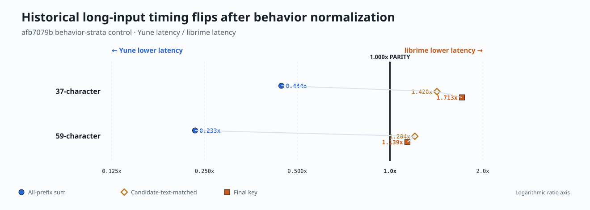
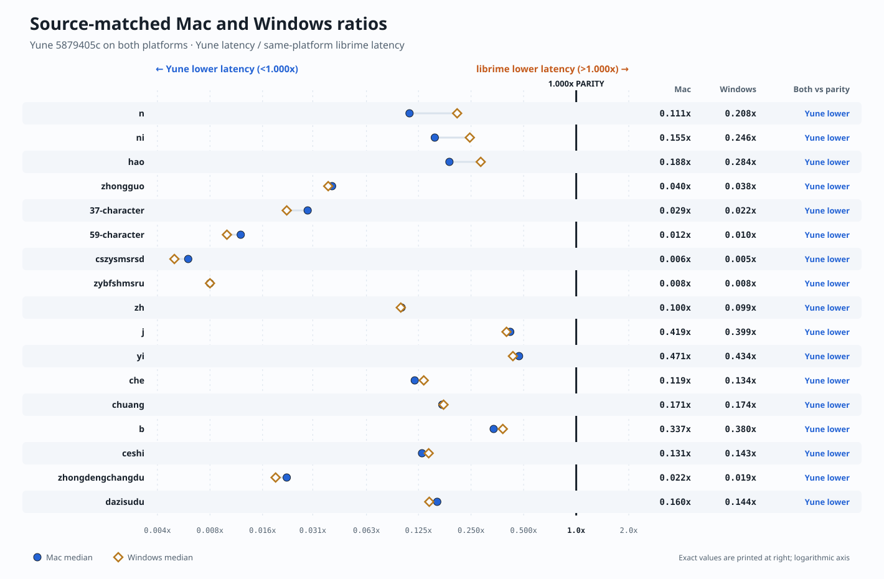
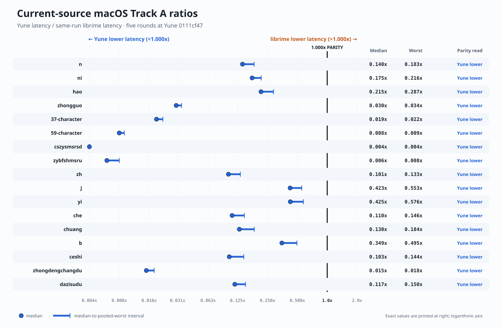

# Yune vs librime Performance Root-Cause Analysis — Archived Detail

> Archived on 2026-07-14 when the current measurements, visualizations, and
> bottleneck disposition moved into the single
> [`performance dashboard`](../yune-vs-librime-performance.md). This snapshot
> preserves the source-bound diagnosis available immediately before
> consolidation.

Date: 2026-07-14

> **M59 supersession:** final Windows behavior source `443cc636` preserves the
> named `/3` behavior, closes Lane A/Lane B/Cangjie and the deployed 37/59
> surfaces, and passes the unchanged signed ratchet at `32/32` aggregate rows
> and `160/160` individual observations in the source-current follow-up packet.
> `5fa986d8` records the accepted 60-asset REACH-03 registry and `07845e02`
> makes full-tree reconciliation bidirectional. Every `afb7079b`
> macOS table, `6/17` read, `n`/`zh` instruction diagnosis, `/3` zero-candidate
> statement, and priority map is a historical, source-bound diagnostic—not
> current-main acceptance or a current optimization backlog. The later Mac
> packet at `5879405c` is also source-bound and predates the authoritative
> `443cc636` Windows source. A later Mac-only packet measures production source
> `0111cf47`; it confirms the current same-Mac direction but has no exact-source
> Windows peer, so it does not replace the `5879405c` causal platform control.
> Final evidence:
> [`evidence/m59-canonical-jyutping-reachability-parity/`](../evidence/m59-canonical-jyutping-reachability-parity/).

## Report role and freshness

This report answers **why the observed Yune/librime gaps occurred, which causes
were fixed, and what remains unproven**. Primary comparison numbers live in the
overall [`performance scorecard`](../yune-vs-librime-performance.md) and the
dedicated [`macOS report`](./2026-07-14-yune-vs-librime-macos-performance-pre-consolidation.md).

The newest exact Windows/Mac comparison still uses behavior source
`5879405c7b0f76af4dca7382f00b3e0605386f2c` and pinned librime
`33e78140250125871856cdc5b42ddc6a5fcd3cd4`. It predates the authoritative
`443cc636` Windows follow-up, so its causal claims remain bound to the measured
engine source and are not current-main acceptance. The newest measured Mac-only
result uses `0111cf47c09bfe7a4a3d55a1832f35a55bc59435`; it answers “how does
Yune compare with librime on this Mac now?” but cannot isolate a platform effect
against final-M59 Windows. The older `afb7079b` Mac packet remains historical
owner evidence.

All peer ratios in this report are **Yune latency divided by librime latency**.
Below `1.000x` means Yune used less time, `1.000x` is parity, and above
`1.000x` means Yune used more time. Thus `0.250x` means 25% of librime's
latency—not “0.25x faster.”

## Answer

The former “why is librime much faster on macOS?” question did not have one
platform-only answer:

- M57 found a real **Yune macOS construction defect**: the target-scoped Luna
  compact table did not accept the Mac-generated upstream MARISA checksum pair,
  which produced the wrong sentence-model owner shape. That defect was fixed
  and two complete Mac verification passes proved the repair.
- At later Mac source `afb7079b`, the remaining short-input deficit contained a
  real **engine work-volume difference**. Yune executed `8.682x` librime's
  instructions on `n` and `4.092x` on `zh`, with worse CPI in the inspected
  lanes.
- Cross-engine behavior was not generally exact at that snapshot: only 2/17
  captured final pages had full semantic equality, while candidate text was
  exact on 9/17. Timing rows therefore remain diagnostic unless their behavior
  boundary is stated.
- The apparent 37/59 Mac wins at that source were **behavior-confounded**:
  most librime time occurred on prefixes where candidate text differed. On
  candidate-text-matched prefixes Yune was slower, not faster.
- macOS Nano allocation was a **partial platform effect**, moving stable
  medium/long ratios by about 6–14% when disabled. It was far too small to
  explain candidate divergence or 4–9x instruction differences.
- M59 then materially changed and accepted the translator path. Its final
  Windows behavior source has all 17 aggregate Track A latency medians below
  `1.000x`, closes the named Lane A/Lane B/Cangjie and deployed 37/59 surfaces,
  and passes the unchanged ratchet.
- The source-matched Increment-4e Mac rerun at `5879405c` has all 17 median
  ratios and pooled worsts below `1.000x`. Its candidates exactly match the
  paired `5879405c` Windows packet, the
  named Lane-B and 37/59 behavior gates pass, and logical owner shape matches.
  The old Mac deficit therefore does not persist on the accepted engine path.
- The later `0111cf47` Mac-only run preserves that direction: all 17 medians
  are `0.004x`–`0.425x`, and the largest pooled worst is `0.576x`. Both long
  pages are exact. This is the freshest measured same-Mac result, but not a
  source-matched Windows/Mac experiment.

The current conclusion is: the old problem included a real Mac-exposed Yune
construction defect, source-scoped excess work, behavior mismatch, and a
partial allocator effect—but it was not an intrinsic librime advantage on
macOS. Both measured later sources have a large same-Mac Yune latency
advantage. Final M59 `443cc636` was not rerun on Mac at the exact same source;
the later `0111cf47` Mac result therefore cannot be compared causally with it.
Residual ratio differences at the `5879405c` pair are
workload-dependent component scaling plus measurement noise; no evidence there
identifies a Mac-only engine-path defect or a single operating-system cause.

## Cause ledger

| Finding | Measured source | Confidence | Present disposition |
| --- | --- | --- | --- |
| Batch-shaped benchmark and key-deferral/config-cache artifacts overstated old wins | pre-corrective M55 | proven | reverted; per-key context read is the standing metric |
| Mac Luna compact-table checksum/model-shape defect | M57 Mac verification | proven | fixed; two full passes |
| Final 37/59 page emitted too many full-span sentences | pre-repair M59 Mac | proven | fixed; final M59 page gate exact |
| Short-key Mac instruction surplus | `afb7079b` | measured at that source | historical; `5879405c` is fast, reprofile only if finer attribution becomes decision-bearing |
| Final-page behavior differs on 15/17 Mac rows | `afb7079b` | measured at that source | superseded at `5879405c`: Mac page zero is exact on 16/17 and equals its Windows peer |
| Long Mac aggregate wins dominated by behavior-different prefixes | `afb7079b` | measured at that source | historical; final 37/59 page is exact and its focused gate passes |
| Nano allocator changes part of the Mac ratio | `afb7079b` | measured partial effect | not a primary cause |
| Eager owned/filter/sort/store work versus librime lazy streams | `afb7079b` profiles plus architecture inspection | leading historical design hypothesis | useful design lesson; not a demonstrated current blocker |
| M59 structure-driven surface graph coincides with large Windows and Mac latency movement | `5879405c` | measured correlation, mechanism reviewed | source-bound cross-platform result; causal share not isolated |
| Latest production-source Mac result remains entirely below parity | `0111cf47` | measured five-round same-Mac result | current direction confirmed; platform/source attribution not isolated |
| Track A memory remains much larger than librime | M55/Increment-4e Windows and `5879405c` Mac RSS | measured but counter-specific | still open; Apple `phys_footprint` unmeasured |
| Operating system alone explains Windows/Mac difference | source-matched five-round comparison | not isolated / unproven | OS, machine CPU, toolchain, allocator, scheduler, and noise remain combined |

## What final M59 changed

Increment 4e replaced the un-toned Luna path with the structure-driven
`UpstreamScript` surface graph used by the other script translators. The
reviewed mechanism:

- performs one common-prefix prism walk per live vertex;
- rejects phrase-only flattened codes as syllable edges;
- follows the pinned table trunk and packed tail;
- reuses bounded sentence scratch;
- separates translator-local page position from normalized outer merge quality;
- carries that merge-quality channel through sort, deduplication, truncation,
  cache, engine election, and userdb remerge.

Increment 4e records exact all-page order for all seven Lane B
inputs, an exact deployed 37/59 page-shape gate, native WEB-04 `8/8`, and all
17 Track A latency medians below `1.000x`. The M59 closeout also records Lane A
strict `13/13`, Cangjie strict `12/12`, the 60-asset REACH-03 registry, and
source-bound native/WASM/app/browser functional gates. Its performance
snapshots are exact on 16/17 Track A inputs; `zhongdengchangdu` differs at
positions 2–4, and universal every-prefix equivalence is not claimed.

The performance movement is large, but the commit range changes several
interacting owners. It is not valid to assign the entire improvement to one
line or declare lazy page filling the measured cause. The `5879405c` Mac binary
confirms that commit-bound path is fast there too. The later `0111cf47` Mac
packet confirms the same direction on newer production source, but without a
source-matched Windows peer it does not improve causal platform attribution.

Evidence:
[`increment-4e-lane-b-exact-order/`](../evidence/m59-canonical-jyutping-reachability-parity/increment-4e-lane-b-exact-order/)
and [`final-closeout/`](../evidence/m59-canonical-jyutping-reachability-parity/final-closeout/).

## Resolved measurement and correctness defects

### M55 corrective measurement

The benchmark now reads context after every keypress for both engines. The
following pre-corrective mechanisms were removed from performance claims:

- deferred `RimeProcessKey` work that flushed only when context was read;
- benchmark-only input aliases such as `n -> na` and `h -> ha`;
- an uninvalidated process-global config cache.

These were measurement artifacts, not acceptable optimizations. M55 remains
the historical source for the retained corrective rows. The standing authority
is now the signed M59 Increment-0 packet and its consolidated threshold
registry, which also contains four M59 injection-on re-derivations and nine
newly signed M59 rows. Later observations are much faster, but they do
not rewrite those already signed ceilings.

### M57 macOS model construction

The macOS upstream Luna table uses MARISA checksum pair `0xb3d4e98e` /
`0x29d56c89`. Before M57, Yune did not accept that target-scoped pair and built
a defective model shape. M57 restored compact `rsmarisa_byte_backed` storage,
`332,604` compact codes, `513,353` expanded sentence entries, and the 11-row
abbreviation vocabulary. This was a Yune bug exposed by macOS, not an oracle
contradiction or an intrinsic librime speed advantage.

Evidence:
[`m57-macos-track-a-sentence-model-parity/`](../evidence/m57-macos-track-a-sentence-model-parity/).

### M59 sentence/page order

The original Mac diagnostic showed librime emitting one best full sentence
followed by shorter phrase candidates while Yune emitted several full-sentence
alternatives. The supplemental repair separated the sentence and phrase
streams and corrected compiled natural-log weight handling. Final M59 locks the
deployed 37/59 page shape and captured Lane B order. The original diagnostic is
historical evidence, not a description of current behavior.

## Source-scoped macOS diagnosis at `afb7079b`

### Behavior comparability

At that snapshot, candidate text matched on only 19/37 and 30/59 prefixes of
the long inputs. Behavior-different prefixes consumed 82.0% and 90.1% of
librime's reconstructed time. The all-prefix ratios (`0.399x` and `0.205x`)
therefore measured different work. Candidate-text-matched sensitivity ratios
were `1.420x` and `1.204x`, and final-key ratios were `1.713x` and `1.139x`.

The visualization below uses the internally consistent all-prefix **summed
latency** controls (`0.444x` and `0.233x`) from the same historical packet so
all three plotted strata share one aggregation method. Those controls differ
slightly from the benchmark-median ratios above, but the conclusion is the
same: the apparent win crosses above `1.000x` parity after behavior is matched.

This finding explains why the old aggregate long-input “wins” could not be
treated as implementation superiority. It does not establish the behavior or
ratio after final M59.

### Instruction volume and CPI

The stable counter direction showed more than timing noise:

- `n`: `8.682x` instructions and `10.730x` cycles versus librime;
- `zh`: `4.092x` instructions and `5.061x` cycles;
- inspected lanes: Yune CPI was about `1.24x`–`1.41x` worse.

Qualitative samples placed work in compact-table/MARISA traversal and
abbreviation/sentence-model generation. The packet also observed Yune owning,
filtering, sorting, and retaining a surplus candidate batch before exporting a
five-candidate page, while librime exposes demand-driven streams. That was the
best design lead at `afb7079b`, not an isolated savings estimate.

### Allocator, platform, and noise

Disabling Nano slowed librime more than Yune on stable medium/long rows,
improving Yune's ratio by roughly 6–14%. This proves a partial allocator
interaction. It cannot explain the instruction surplus or candidate mismatch.

The Mac/Windows comparison also changed CPU, compiler, linker, allocator, OS,
source, payload metadata, and ambient load. Thermal/noise affected precision,
especially `hao`, but did not fit the stable work-volume direction. No causal
percentage is assigned to “macOS” itself.

Full packet:
[`m59-post-fix-root-cause-20260711/`](../evidence/m59-post-fix-root-cause-20260711/).

## Increment-4e macOS reconciliation at `5879405c`

Five fixed-binary rounds use the exact source-matched Windows inputs and `9/60/80`
measurement parameters. Yune's median ratio is below `1.000x` on all 17 Track A rows
(`0.006x`–`0.471x`), and every pooled worst also stays below `1.000x`. The
complete-input candidate evidence exactly equals source-matched `5879405c` Windows; page zero
matches librime on 16/17 rows, with the same `zhongdengchangdu` positions 2–4
gap on both platforms. Both commit-bound behavior gates pass.

The cross-platform ratios do not move uniformly:

- `n`/`ni`/`hao` materially favor Mac. Yune's absolute latency changes by
  `-30.9%`, `-33.7%`, and `-32.7%`; librime's changes by `+27.0%`, `+7.7%`,
  and `-0.3%`, respectively.
- 37/59 ratios favor Windows by 31.8%/20.0% because both engines are faster on
  Mac but librime improves more strongly (-45.1%/-43.3% versus Yune
  -29.3%/-29.0%). Both long pages are behavior-exact.
- Across all inputs, the median absolute platform change is -30.9% for Yune and
  -31.2% for librime. This does not support a librime-only explanation.

The visibly noisier fifth round is retained, and short/tiny-ratio spreads are
amplified by scheduler sensitivity and `0.001` reporting precision. No thermal
or performance warning was recorded. The evidence is consistent with
systematic component scaling plus noise; it does not identify a Mac-only
engine-path discrepancy.

The release-dylib build check was a no-op, but the script sequentially rebuilt
the crate/benchmark harness for roughly 24–30 seconds before each lane. Those
builds ended before lane execution and the lanes loaded the pre-copied fixed
dylibs, so this is not variable-binary evidence or concurrent compilation.
Without a recorded cooldown, compilation heat and fixed lane order remain an
additional thermal/noise boundary.

One harness boundary prevents treating this as a fully protocol-conforming Mac
acceptance packet: the unmodified benchmark script required an in-repository
output root, so every run used an untracked transient directory and was moved
external after completion. Pre-run cleanliness is directly captured;
after-move cleanliness is inferred from subsequent clean preflights. Both
dylibs remained fixed, and no result was discarded. Quiet-machine state
was not observed continuously, so noise attribution remains limited.

The exact Mac and Windows values are shown on one parity-centered scale:

Evidence:
[`m59-final-source-macos-20260713/`](../evidence/m59-final-source-macos-20260713/).

## Latest measured macOS production source at `0111cf47`

The later five-round Mac-only packet measures Yune
`0111cf47c09bfe7a4a3d55a1832f35a55bc59435` against pinned upstream librime
`33e78140250125871856cdc5b42ddc6a5fcd3cd4`. The measured dylibs remain fixed
across all rounds: Yune
`f3365aae19d15b9d7b57dcccd30ce1c77347b8ee96a20f09ab001468074b226c` and
librime `1973349f4da44c5b71765f8d064ec30428a0fd42d66c9ae95bdb6dc27cd4eecc`.
No measured round was discarded, and no setup retry was needed.

All 17 medians (`0.004x`–`0.425x`) and all pooled worsts (maximum `0.576x`)
remain below `1.000x` parity. The 37/59 medians are `0.019x` and `0.008x`,
with exact complete-input pages. Page zero is exact on 16/17 inputs; the sole
`zhongdengchangdu` difference is the same deterministic cross-platform
source-level gap already seen on Windows. Candidate and logical model-owner
shape do not expose a new Mac-only engine-path discrepancy.

UI activity was a material noise boundary, especially in round 4, although no
thermal or performance warning was recorded. More importantly, no Windows
packet measures the exact `0111cf47` source. This packet therefore strengthens
the descriptive same-Mac conclusion but does not supersede `5879405c` for
platform attribution.

## Memory cause and boundary

The Increment-4e Windows Track A peak is `153,878,528 B`, within the signed
ceiling but about `8.8x` same-run librime. The historical M55 default retained
the owned POET payload because its behavior-valid `YUNE-POET/2` byte-backed
option reduced peak memory (`185.7 MB` to `113.2 MB`) while missing long-row
latency ceilings.

At Mac source `afb7079b`, Yune whole-process max RSS and peak footprint were
far above librime, and the deployed `/3` opt-in emitted zero candidates on all
99 prefixes. Final M59 restores the named `/3` behavior; the new Mac packet has
exact logical owners and directionally lower peak RSS than M57. It still does
not establish a byte-backed POET memory win: Mac RSS and Windows private/
pagefile counters are not interchangeable, and Apple `phys_footprint` remains
unmeasured.

The TypeDuck/Jyutping M47 keyboard result is a separate product lane. Its
Windows proxy does not close Track A or Apple `phys_footprint`.

## Design lessons that remain useful

The fresh Mac run is fast, but librime's architecture remains instructive:

- produce candidates lazily and stop once the requested page is stable;
- preserve resumable translator/filter state instead of rebuilding surplus
  owned vectors;
- keep page-local ordering separate from cross-translator merge quality;
- traverse prefix indexes once per live vertex and reuse bounded scratch;
- byte-back large immutable data only with behavior-valid incremental access;
- benchmark the real per-key context-read path and bind evidence to exact
  binaries and source commits.

These are design directions, not authorization to implement a performance fix.
Any change still needs oracle-locked behavior and the unchanged signed gate.

## Next diagnostic order

| Rank | Diagnostic | Decision it enables |
| ---: | --- | --- |
| 1 | Keep the signed Windows registry unchanged and treat both Mac packets as diagnostic | preserve acceptance authority |
| 2 | If platform attribution becomes decision-bearing, first capture a quiet Windows/Mac pair at one exact Yune source | separate source movement from platform movement |
| 3 | Track `zhongdengchangdu` as a cross-platform candidate-shape gap | avoid misclassifying it as a Mac performance defect |
| 4 | If finer latency attribution is still needed, profile one short and one long row with low-perturbation instruction/cycle counters and fixed binaries | separate CPU/toolchain/allocator scaling without a broad rerun |
| 5 | Measure Apple `phys_footprint` in a separate platform-memory gate | decide memory work using the correct counter |
| 6 | Remeasure browser or Track B only in their own lanes | avoid transferring native claims to products or apps |

M59, the source-matched `5879405c` sequence, and the later `0111cf47` same-Mac
sequence are complete. This order creates no new milestone, threshold,
exception, or performance implementation.

## Evidence index

- Signed M59 Increment-0 Windows baseline and gate:
  [`m59-closeout-baseline/`](../evidence/m59-closeout-baseline/)
- Historical M55 corrective foundation:
  [`m55-native-match-or-beat/corrective-2026-07-04/`](../evidence/m55-native-match-or-beat/corrective-2026-07-04/)
- M57 Mac construction repair:
  [`m57-macos-track-a-sentence-model-parity/`](../evidence/m57-macos-track-a-sentence-model-parity/)
- Historical Increment-0 Mac diagnostic:
  [`m59-macos-librime-analysis-20260710/`](../evidence/m59-macos-librime-analysis-20260710/)
- Historical `afb7079b` Mac root-cause packet:
  [`m59-post-fix-root-cause-20260711/`](../evidence/m59-post-fix-root-cause-20260711/)
- Increment-4e source-bound Mac performance and behavior packet:
  [`m59-final-source-macos-20260713/`](../evidence/m59-final-source-macos-20260713/)
- Reproducible ratio tables and parity-centered visualizations, including the
  latest measured Mac packet:
  [`current-ratio-visuals-2026-07-14/`](../evidence/current-ratio-visuals-2026-07-14/)
- Archived paired-platform and behavior-control visualizations:
  [`performance-ratio-visuals-2026-07-14/`](../evidence/history/performance-ratio-visuals-2026-07-14/)
- Increment-4e Windows packet:
  [`increment-4e-lane-b-exact-order/`](../evidence/m59-canonical-jyutping-reachability-parity/increment-4e-lane-b-exact-order/)
- M59 final closeout:
  [`final-closeout/`](../evidence/m59-canonical-jyutping-reachability-parity/final-closeout/)

Archived pre-corrective narrative remains in
[`2026-06-28-yune-vs-librime-root-cause-analysis-pre-current-dashboard.md`](./2026-06-28-yune-vs-librime-root-cause-analysis-pre-current-dashboard.md).
