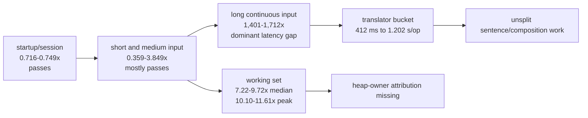

# Yune vs upstream librime performance dashboard

Date: 2026-06-25

This report is the current performance dashboard for native Yune versus upstream
librime `1.17.0`. It intentionally keeps history short. Older milestone detail
lives in completed plans and evidence folders.

## Current Evidence

Primary current benchmark:

- Post-M38 long-input baseline:
  [`evidence/post-m38-long-input-baseline/baseline-native/`](./evidence/post-m38-long-input-baseline/baseline-native)
- Summary:
  [`long-input-baseline.md`](./evidence/post-m38-long-input-baseline/baseline-native/long-input-baseline.md)
- 59-character stress baseline:
  [`evidence/post-m38-long-input-baseline/stress-59-native/`](./evidence/post-m38-long-input-baseline/stress-59-native)
- 59-character stress summary:
  [`stress-59-baseline.md`](./evidence/post-m38-long-input-baseline/stress-59-native/stress-59-baseline.md)
- Command:

```powershell
powershell -ExecutionPolicy Bypass -File scripts\benchmark-native-rime-inprocess.ps1 -OutputRoot docs\reports\evidence\post-m38-long-input-baseline\baseline-native -Iterations 9 -SessionIterations 20 -KeyIterations 50 -TrackAInputs "ni,hao,zhongguo,ceshiyixiachangjushuruxingnengzenyang" -DeployProductBeforeBenchmark
```

Important supporting evidence:

- M38 final gates:
  [`evidence/m38-engine-performance-parity/final-gates.md`](./evidence/m38-engine-performance-parity/final-gates.md)
- M38 final native Track A:
  [`evidence/m38-engine-performance-parity/phase-5-final-native/`](./evidence/m38-engine-performance-parity/phase-5-final-native)
- M38 product redeploy sanity check:
  [`evidence/m38-engine-performance-parity/phase-5-final-native-product-redeploy-check/`](./evidence/m38-engine-performance-parity/phase-5-final-native-product-redeploy-check)
- Completed M38 plan:
  [`../plans/completed/m38-plan-engine-performance-parity.md`](../plans/completed/m38-plan-engine-performance-parity.md)

## Optimization Strategy So Far

Yune has already applied several librime-shaped optimization methods:

- same-run native in-process benchmarking against upstream librime instead of
  stale or application-shaped numbers;
- mmap-backed selected table/prism bytes and zero selected table/prism heap
  mirrors on the M38 Track A hot path;
- real `rsmarisa` table lookup in the runtime hot path, with positive exact and
  prefix lookup counters;
- page-bounded first-page candidate production and page-sized context export for
  the original short/medium rows;
- startup/session lifecycle attribution and fast paths that brought the current
  Track A startup/session rows below same-run librime;
- owner counters for lookup, translation, materialization, context export,
  allocation, and working-set/peak memory.

The next round must optimize the whole engine shape, not one headline number.
Closeout should block regressions in all of these dimensions at once:
startup/session, short-input latency (`hao`, `ni`, `zhongguo`), long continuous
input latency, mmap/`rsmarisa` hot-path activation, page-bounded output,
working-set and peak memory, and upstream-observable behavior.

## Current Verdict

M38 solved the original short/medium upstream `luna_pinyin` target rows. Startup
and session are faster than same-run librime, `hao` and `ni` are within the
accepted `5x` gate, and `zhongguo` is faster than librime in the current run.

Broader typing parity is not solved. The newly measured 37-character continuous
pinyin row `ceshiyixiachangjushuruxingnengzenyang` is Yune `412,192.727 us`
versus librime `294.151 us`, or `1,401.296x` slower. A follow-up controlled
59-character stress row
`zhegeyinqingqishiyinggaizhichichaochangjuzishurucainengyong` is Yune
`1,202,404.588 us` versus librime `702.212 us`, or `1,712.310x` slower.

Memory parity is also not solved. Across the current baseline and 59-character
stress row, Track A Yune median working set is `107,839,488-114,728,960 B`
versus librime `11,091,968-15,884,288 B` (`7.22-9.72x`). Yune max peak is
`163,057,664-163,119,104 B` versus librime `14,045,184-16,154,624 B`
(`10.10-11.61x`).

These are native in-process engine results. They do not claim browser, WASM,
frontend, package, deployment, or product-delivery performance wins.

## Latency Dashboard

| Row | Yune median | librime median | Ratio | Read |
| --- | ---: | ---: | ---: | --- |
| startup/runtime-ready | `23,478.800 us` | `32,805.100 us` | `0.716x` | Yune faster in this run. |
| session create/select/destroy | `24,202.100 us` | `32,302.200 us` | `0.749x` | Yune faster in this run. |
| `hao` | `38.967 us` | `11.733 us` | `3.321x` | Within the M38 key gate. |
| `ni` | `56.200 us` | `14.600 us` | `3.849x` | Within the M38 key gate. |
| `zhongguo` | `62.025 us` | `172.950 us` | `0.359x` | Yune faster in this run. |
| `ceshiyixiachangjushuruxingnengzenyang` | `412,192.727 us` | `294.151 us` | `1,401.296x` | 37-character long-input gap. |
| `zhegeyinqingqishiyinggaizhichichaochangjuzishurucainengyong` | `1,202,404.588 us` | `702.212 us` | `1,712.310x` | 59-character required stress gate. |

Latency ratio visual, with librime as `1.0x` and lower better:

```text
Short/medium panel, capped at 5x

startup/runtime-ready       0.716x |###.................| faster than librime
session create/select       0.749x |###.................| faster than librime
zhongguo                    0.359x |#...................| faster than librime
hao                         3.321x |#############.......| slower, within M38 gate
ni                          3.849x |###############.....| slower, within M38 gate

Long-input panel, separate scale because it dwarfs every other row

ceshiyixiachang...       1401.296x |##################################################| dominant open gap
zhegeyinqing...          1712.310x |#############################################################| required 59-char gate
```

The visual shape is important: startup/session and the original short/medium
rows are no longer the main performance story. Continuous long input is the
outlier and should lead the next optimization round. The 59-character row was
run with a one-iteration stress configuration because one full Yune sample is
already about `70.942 s`; the stronger startup/session numbers above still come
from the higher-sample baseline.

## Memory Dashboard

| Row | Yune median working set | librime median working set | Ratio | Yune max peak | librime max peak | Ratio |
| --- | ---: | ---: | ---: | ---: | ---: | ---: |
| startup/runtime-ready | `111,583,232 B` | `11,558,912 B` | `9.65x` | `163,057,664 B` | `14,045,184 B` | `11.61x` |
| session create/select/destroy | `107,839,488 B` | `11,091,968 B` | `9.72x` | `163,057,664 B` | `14,135,296 B` | `11.54x` |
| `hao` | `111,878,144 B` | `12,308,480 B` | `9.09x` | `163,057,664 B` | `14,229,504 B` | `11.46x` |
| `ni` | `111,644,672 B` | `12,189,696 B` | `9.16x` | `163,057,664 B` | `14,135,296 B` | `11.54x` |
| `zhongguo` | `112,160,768 B` | `13,332,480 B` | `8.41x` | `163,057,664 B` | `14,299,136 B` | `11.40x` |
| `ceshiyixiachangjushuruxingnengzenyang` | `114,610,176 B` | `15,638,528 B` | `7.33x` | `163,057,664 B` | `15,659,008 B` | `10.41x` |
| `zhegeyinqingqishiyinggaizhichichaochangjuzishurucainengyong` | `114,728,960 B` | `15,884,288 B` | `7.22x` | `163,119,104 B` | `16,154,624 B` | `10.10x` |

Memory ratio visual, with librime as `1.0x`, lower better, and bars scaled to
`12x`:

```text
Median working set

startup/runtime-ready       9.65x |###################.....|
session create/select       9.72x |###################.....|
hao                         9.09x |##################......|
ni                          9.16x |##################......|
zhongguo                    8.41x |#################.......|
ceshiyixiachang...          7.33x |###############.........|
zhegeyinqing...             7.22x |##############..........|

Max peak working set

startup/runtime-ready      11.61x |#######################.|
session create/select      11.54x |#######################.|
hao                        11.46x |#######################.|
ni                         11.54x |#######################.|
zhongguo                   11.40x |#######################.|
ceshiyixiachang...         10.41x |#####################...|
zhegeyinqing...            10.10x |####################....|
```

This is a working-set and peak-memory baseline. It is not heap-owner
attribution. Memory optimization should not start until the next plan records
heap owners.

## Current Bottleneck Shape



The desired post-next-round shape is not "faster by moving output around." It is
closer to librime's shape: mapped shared storage, cheap page export, and lazy or
bounded long-composition work so the long row does not spend hundreds of
milliseconds inside translator internals.

## Long Row Owner Snapshots

The long rows are not marisa activation failures.

| Signal | 37-character row | 59-character row |
| --- | ---: | ---: |
| selected storage | `rsmarisa_byte_backed` | `rsmarisa_byte_backed` |
| table mapping | `mmap` | `mmap` |
| prism mapping | `mmap` | `mmap` |
| raw prism median | `0.000 us` | `0.100 us` |
| raw table median | `33.400 us` | `57.500 us` |
| raw table candidates | `0` | `0` |
| translator median | `412,162.427 us` | `1,202,364.464 us` |
| context export median | `5.500 us` | `6.400 us` |
| full-input Yune sample | `15.251 s` | `70.942 s` |
| full-input librime sample | `10.883 ms` | `41.431 ms` |

Median Yune counters per operation for the 37-character row:

| Counter | Value |
| --- | ---: |
| process key | `412,107.941 us` |
| translator | `412,078.328 us` |
| exact lookup time | `27.254 us` |
| prefix lookup time | `33.077 us` |
| lookup views visited | `4.973` |
| owned candidates materialized | `3.108` |
| candidates sorted/stored | `76.054` |
| filter pipeline | `9.415 us` |
| ABI get context | `0.149 us` |
| candidate request bounded calls | `1.000` |
| candidate request unbounded calls | `0.000` |
| full-list fallback count | `0.730` |
| rsmarisa exact lookup calls | `1.730` |
| rsmarisa prefix lookup calls | `1.703` |

The 59-character stress row has the same shape: `99.997%` of process-key sample
time is translator time; exact+prefix lookup is about `0.00777%`; bounded
candidate requests are used; `rsmarisa` exact/prefix counters are positive; and
full-list fallback fires `52` times in one 59-key sample.

The measured owner is translator time. Raw table/prism lookup, output bounding,
candidate materialization, filtering, sorting, and context export are not large
enough to explain the gap. The next plan should split the translator bucket,
especially long-composition sentence/full-list fallback and
`StaticTableTranslator::sentence_candidate`.

## Current Optimization Priorities

| Priority | Target | Evidence | Required next step |
| --- | --- | --- | --- |
| 1 | Long `luna_pinyin` composition latency | 37-character row is `1,401.296x` slower; 59-character row is `1,712.310x` slower and takes about `70.942 s` for one full input sample. Translator owns almost all time. | Add inner spans for sentence/full-list fallback, segmentation, substring lookup loops, path cloning, sorting, and context/export, then optimize the measured owner. |
| 2 | Track A memory | Median working set `7.33-9.72x`; peak `10.41-11.61x`. | Run heap-owner profiling before selecting memory work. |
| 3 | Preserve M38 short/medium wins | Startup/session pass; `hao`/`ni` pass; `zhongguo` is faster. | Keep these rows in every benchmark and block regressions. |

## Short History

- M33-M35 removed unfair comparison noise and large upstream
  `luna_pinyin` storage costs.
- M36-M37 made the product-style path measurable and reduced product
  materialization/storage waste.
- M38 activated the real upstream `luna_pinyin` `rsmarisa` hot path with mmaped
  table/prism bytes and closed the original short/medium native latency gates.
- The post-M38 baseline added the missing 37-character and 59-character long
  input rows and exposed the current top engine gap.

Historical detail remains available in:

- [`../plans/completed/`](../plans/completed)
- [`evidence/m33-2026-06-23/`](./evidence/m33-2026-06-23)
- [`evidence/m34-queryable-table-prism/`](./evidence/m34-queryable-table-prism)
- [`evidence/m35-compact-table-prism-storage/`](./evidence/m35-compact-table-prism-storage)
- [`evidence/m36-product-path/`](./evidence/m36-product-path)
- [`evidence/m37-engine-hyper-optimization/`](./evidence/m37-engine-hyper-optimization)
- [`evidence/m38-engine-performance-parity/`](./evidence/m38-engine-performance-parity)

## Safe Public Claim

Safe:

> Yune's native upstream `luna_pinyin` path now uses mmap-backed deployed
> table/prism bytes and an active `rsmarisa` table hot path. Startup, session,
> `hao`, `ni`, and `zhongguo` meet the M38 same-run native benchmark gates.
> A later long-input baseline shows broader typing parity is still open:
> `ceshiyixiachangjushuruxingnengzenyang` is `1,401.296x` slower than librime,
> and the 59-character
> `zhegeyinqingqishiyinggaizhichichaochangjuzishurucainengyong` stress row is
> `1,712.310x` slower. Yune still has a `7.22-9.72x` median working-set gap
> plus a `10.10-11.61x` peak-memory gap.

Not safe:

> Yune has matched librime for all typing latency, Yune has matched librime
> memory, the long-input gap is caused by marisa not being used, or native
> engine results prove browser/frontend/product-delivery speed.
