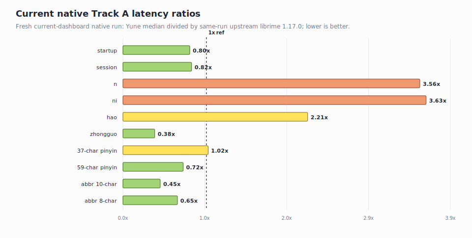
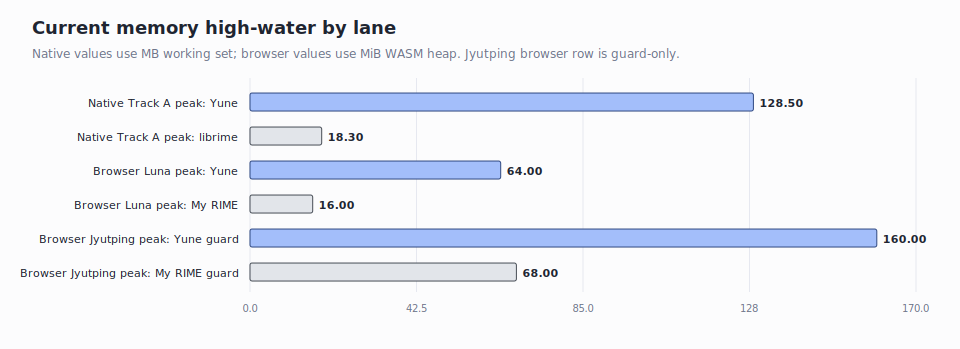
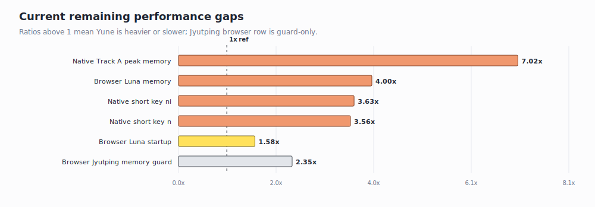

# Current Yune Performance Dashboard

Date: 2026-06-28

This dashboard shows the current benchmark state only. Milestone closeout
narrative and older benchmark rows have been moved to
[`history/2026-06-28-yune-vs-librime-performance-pre-current-dashboard.md`](./history/2026-06-28-yune-vs-librime-performance-pre-current-dashboard.md).

## Technical Summary

- **Native fair lane (`luna_pinyin`)**: Yune is faster than upstream librime
  1.17.0 on startup/session, `zhongguo`, the 59-character pinyin row, and both
  abbreviation rows. The current misses are still the short prefixes `n`
  (`3.557x`) and `ni` (`3.632x`) versus same-run librime; the 37-character
  pinyin row is now a watch row at `1.021x`.
- **Native memory**: Track A still has a real high-water gap: Yune peaks at
  `128.5 MB` working set versus librime's `18.3 MB` max observed peer peak.
  Steady resident rows are lower, but this dashboard keeps the peak visible.
- **Browser fair lane (`luna_pinyin`)**: current Yune public demo uses
  `64.0 MiB` WASM peak versus My RIME `16.0 MiB` (`4.0x`). Yune is slower to
  ready (`1000 ms` vs `634 ms`), but faster on first input in the current
  comparator (`74 ms` vs `95 ms`).
- **Browser Jyutping**: current Yune public demo is byte-backed and stays at
  `160.0 MiB` WASM peak. This row is a guard, not a fair peer comparison,
  because My RIME's Jyutping uses a different Cantonese-only dictionary.

## Current Evidence Bundle

The normalized dashboard source is
[`evidence/current-performance-dashboard-2026-06-28/`](./evidence/current-performance-dashboard-2026-06-28/).

Source inputs:

- Native Track A: fresh same-run `luna_pinyin` evidence captured for this
  dashboard pass with product deploy enabled:
  [`evidence/current-performance-dashboard-2026-06-28/native-current-benchmark/summary.csv`](./evidence/current-performance-dashboard-2026-06-28/native-current-benchmark/summary.csv).
- Browser peer comparator: fresh `current-dashboard` Playwright run under
  [`../../apps/yune-web/e2e/results/yune-web-vs-my-rime-baseline/current-dashboard/`](../../apps/yune-web/e2e/results/yune-web-vs-my-rime-baseline/current-dashboard/).
- Browser input-latency suite: latest rebuilt public-demo WEB-03 latency bundle
  under
  [`../../apps/yune-web/e2e/results/web03-latency-regression-fix/local-browser-latency/`](../../apps/yune-web/e2e/results/web03-latency-regression-fix/local-browser-latency/).

## Native Track A

| Dimension | Yune median | librime median | Yune / librime | Current read |
| --- | ---: | ---: | ---: | --- |
| startup | `23,024.800 us` | `28,737.400 us` | `0.801x` | Yune faster |
| session | `24,179.000 us` | `29,380.100 us` | `0.823x` | Yune faster |
| `n` | `71.500 us` | `20.100 us` | `3.557x` | blocker |
| `ni` | `50.300 us` | `13.850 us` | `3.632x` | blocker |
| `hao` | `25.233 us` | `11.400 us` | `2.213x` | watch |
| `zhongguo` | `62.188 us` | `163.175 us` | `0.381x` | Yune faster |
| 37-char pinyin | `292.373 us` | `286.422 us` | `1.021x` | watch |
| 59-char pinyin | `489.776 us` | `678.215 us` | `0.722x` | Yune faster |
| abbreviation 10-char | `547.380 us` | `1,224.350 us` | `0.447x` | Yune faster |
| abbreviation 8-char | `565.190 us` | `865.370 us` | `0.653x` | Yune faster |

## Memory High-Water

| Lane | Yune | Peer | Current read |
| --- | ---: | ---: | --- |
| Native Track A peak working set | `128.5 MB` | librime max peer peak `18.3 MB` | Yune still materially heavier |
| Browser `luna_pinyin` WASM peak | `64.0 MiB` | My RIME `16.0 MiB` | fair browser gap is now `4.0x` |
| Browser Jyutping WASM peak | `160.0 MiB` | My RIME `68.0 MiB` | guard only, dictionary-confounded |

## Browser Peer Dashboard

| Scenario | Schema | Ready | Input -> candidate | Commit | WASM peak | Unique encoded resources | Validity |
| --- | --- | ---: | ---: | ---: | ---: | ---: | --- |
| Yune public demo | `luna_pinyin` | `1000 ms` | `74 ms` | `107 ms` | `64.0 MiB` | `29.5 MiB` | fair |
| My RIME live | `luna_pinyin` | `634 ms` | `95 ms` | `119 ms` | `16.0 MiB` | `8.5 MiB` | fair |
| Yune public demo | Jyutping | `1347 ms` | `103 ms` | `108 ms` | `160.0 MiB` | `72.2 MiB` | guard only |
| My RIME live | Jyutping | `998 ms` | `99 ms` | `114 ms` | `68.0 MiB` | `24.9 MiB` | guard only |

## Yune Browser Input-Latency Suite

| Schema | Input | Exact keydown-to-paint | Max during input | WASM peak | First candidate |
| --- | --- | ---: | ---: | ---: | --- |
| `luna_pinyin` | `hao` | `40 ms` | `40 ms` | `64.0 MiB` | `好` |
| `luna_pinyin` | `ni` | `22 ms` | `22 ms` | `64.0 MiB` | `你` |
| `luna_pinyin` | `zhongguo` | `19 ms` | `30 ms` | `64.0 MiB` | `中國大陸` |
| `luna_pinyin` | `ceshiyixiachangjushuruxingnengzenyang` | `43 ms` | `45 ms` | `64.0 MiB` | `測是一下長據書如行能怎樣` |
| `luna_pinyin` | `zhegeyinqingqishiyinggaizhichichaochangjuzishurucainengyong` | `75 ms` | `78 ms` | `64.0 MiB` | `這個因請其是應該之喫差哦長據子書如才能用` |
| `luna_pinyin` | `cszysmsrsd` | `26 ms` | `29 ms` | `64.0 MiB` | placeholder row |
| `luna_pinyin` | `zybfshmsru` | `34 ms` | `47 ms` | `64.0 MiB` | placeholder row |
| `jyut6ping3_mobile` | `hai` | `47 ms` | `47 ms` | `160.0 MiB` | `係` |
| `jyut6ping3_mobile` | `ngo` | `23 ms` | `24 ms` | `160.0 MiB` | `我` |
| `jyut6ping3_mobile` | `caksi` | `89 ms` | `90 ms` | `160.0 MiB` | `測時` |
| `jyut6ping3_mobile` | `ngogokdak` | `22 ms` | `33 ms` | `160.0 MiB` | `我覺得` |
| `jyut6ping3_mobile` | `sihaacoenggeoisyujapgecukdou` | `130 ms` | `136 ms` | `160.0 MiB` | `試下場據輸入嘅速都` |
| `jyut6ping3_mobile` | `taihaajyugwodaahoucoenggegeoizigosingnangwuidimjoeng` | `74 ms` | `74 ms` | `160.0 MiB` | `睇下如果打好場嘅據自個責會點樣` |

## Remaining Current Gaps

| Rank | Gap | Current value | Next diagnostic target |
| ---: | --- | --- | --- |
| 1 | Native Track A peak memory | `128.5 MB` vs librime max peer peak `18.3 MB` | allocator/transient/private-byte attribution for the high-water peak |
| 2 | Browser `luna_pinyin` memory | `64.0 MiB` vs My RIME `16.0 MiB` | WASM runtime floor and public-demo resource/heap split |
| 3 | Native `ni` latency | `50.300 us` vs `13.850 us` | short-prefix translator/prefix constant factor |
| 4 | Native `n` latency | `71.500 us` vs `20.100 us` | same short-prefix owner, separately from sentence and abbreviation paths |
| 5 | Browser `luna_pinyin` startup | `1000 ms` vs My RIME `634 ms` | startup asset/runtime phases after current public-demo build |

## History

Older milestone closeout detail remains in:

- [`history/2026-06-28-yune-vs-librime-performance-pre-current-dashboard.md`](./history/2026-06-28-yune-vs-librime-performance-pre-current-dashboard.md)
- [`plans/completed/`](../plans/completed/)
- [`ledgers/milestone-history.md`](../ledgers/milestone-history.md)
