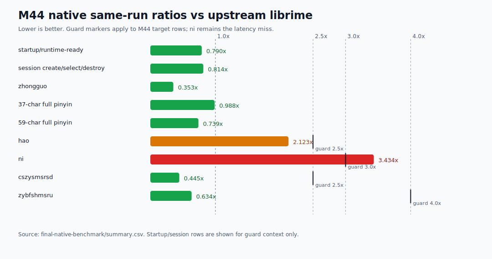
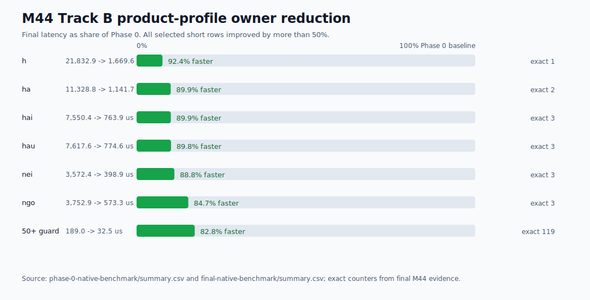
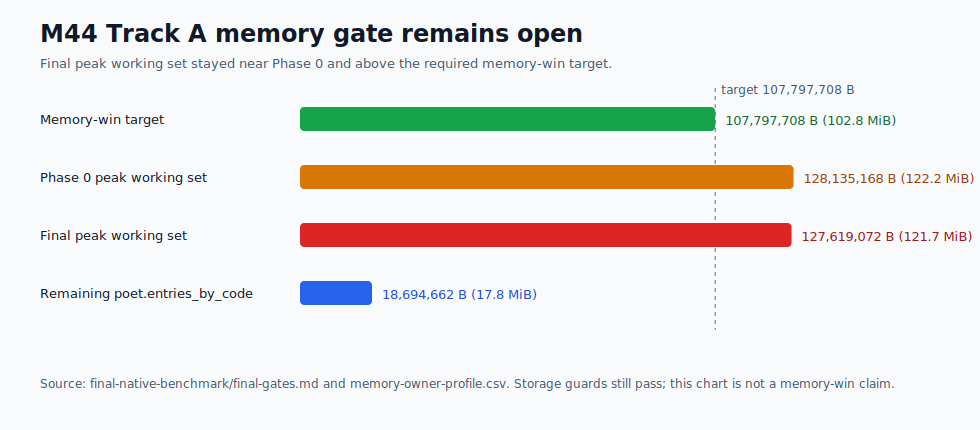

# Yune vs upstream librime performance dashboard

Date: 2026-06-26

This report is native-engine evidence only. It does not claim browser,
frontend, product-delivery, packaging, public-demo, or TypeDuck-profile speed
wins.

Browser startup remains tracked separately. M41 closed the `apps/yune-web`
startup-harness milestone with production-browser evidence under
[`../../apps/yune-web/e2e/results/m41-yune-web-startup-optimization/`](../../apps/yune-web/e2e/results/m41-yune-web-startup-optimization/).

## Current Verdict

M44 closes as a partial native/profile performance reduction, not as a full
performance success.

Three target families produced material wins:

- Track A `hao`: `39.600us` -> `24.700us`, final ratio `2.123x`, target met.
- Track A abbreviation rows: `cszysmsrsd` `4,201.280us` -> `545.020us`
  (`0.445x` same-run librime), and `zybfshmsru` `4,303.820us` -> `540.970us`
  (`0.634x`), targets met while preserving the M42 candidate-output guard.
- Track B deployed profile short rows: `h`, `ha`, `hai`, `hau`, `nei`, and
  `ngo` improved by `84.7-92.4%`, and selected exact-lookup counters dropped
  from thousands of probes per processed key to bounded single-digit probes per
  input sequence.

Two target families remain measured blockers:

- Track A `ni`: final `49.450us` and `3.434x` same-run librime, missing
  `<=41.813us` and `<=3.0x`.
- Track A peak memory: final `127,619,072 B`, missing the
  `<=107,797,708 B` memory-win target.

M44 therefore does not claim full performance success, browser speed,
frontend speed, packaging/deployment speed, public-demo speed, or broad
product-delivery speed.

## M44 Visual Dashboard

The checked-in M44 visuals below summarize the same native/profile evidence as
the CSV and Markdown bundle under
[`./evidence/m44-native-performance-owner-reduction/`](./evidence/m44-native-performance-owner-reduction/).
They are native-engine evidence only and preserve the partial-closeout result:
`hao`, abbreviation, and Track B owner targets improved, while `ni` latency and
Track A memory remain measured blockers.

## Prior Visual Dashboard

The checked-in visuals below are M43 visuals, retained as historical context for
the predecessor native/memory owner-reduction milestone.

## M44 Final Native Dashboard

Same-run oracle: upstream `rime/librime 1.17.0` with `luna_pinyin`.

| Row | Yune median | librime median | Ratio / guard | M44 result |
| --- | ---: | ---: | ---: | --- |
| startup/runtime-ready | `24,367.100 us` | `30,845.200 us` | `0.790x` | Pass; no startup claim |
| session create/select/destroy | `23,431.200 us` | `28,775.300 us` | `0.814x` | Pass; no session claim |
| `hao` | `24.700 us` | `11.633 us` | `2.123x` | Target met |
| `ni` | `49.450 us` | `14.400 us` | `3.434x` | Misses target; measured blocker |
| `zhongguo` | `60.338 us` | `170.812 us` | `0.353x` | Pass |
| `ceshiyixiachangjushuruxingnengzenyang` | `291.546 us` | `294.995 us` | `0.988x` | Pass; no abbreviation expansion |
| `zhegeyinqingqishiyinggaizhichichaochangjuzishurucainengyong` | `502.766 us` | `680.368 us` | `0.739x` | Pass; no abbreviation expansion |
| `cszysmsrsd` | `545.020 us` | `1,224.850 us` | `0.445x` | Target met; behavior guard pass |
| `zybfshmsru` | `540.970 us` | `853.120 us` | `0.634x` | Target met; behavior guard pass |

The M42 abbreviation rows remain behavior guards as well as M44 performance
targets. Final native oracle-vs-Yune candidate output still matches for
candidate text, comments, order, context preedit, commit preview, and
first-page metadata.

## M44 Memory And Storage

| Metric | Phase 0 | Final | Result |
| --- | ---: | ---: | --- |
| `poet.entries_by_code` retained bytes | `18,694,662 B` | `18,694,662 B` | Remaining retained owner; no new memory reduction. |
| Track A peak working set | `128,135,168 B` | `127,619,072 B` | Still misses memory target. |
| Historical M42 `+5%` ceiling | n/a | `125,763,994 B` | Still breached; M44 is flat versus M43/M44 noise, not a new memory win. |
| Whole-process memory-win target | n/a | `<=107,797,708 B` required | Not met. |
| Track B deployed peak | `504,934,400 B` | `505,122,816 B` | Stable; no browser/product memory claim. |

The M42 single-run peak `119,775,232 B` remains historical evidence. The
current comparable M43/M44 repeated benchmark band is around `127-128 MB`, so
M44 records memory as an open blocker rather than treating the old single run as
the active closeout baseline.

Track A final storage/status:

- `selected_storage=rsmarisa_byte_backed`
- table/prism mapping mode: `mmap`
- selected table/prism heap mirror bytes: `0`
- `source_fallback=false`
- `rsmarisa_status=ok`
- `rsmarisa_mapping_mode=mmap`
- positive `rsmarisa` exact/prefix counters remain present in target rows
- first-page output and `RimeGetContext` stay page-bounded

## M44 Short-Key And Track B Owner Profile

M44 bounded Track A first-page refresh work enough for `hao`, but `ni` remains
above target. Sample-0 counters show the residual `ni` owner is still the
single-letter `n` prefix lookup and translator path:

| Row | Short-key rows scanned | Materialized | Sentence-model calls | Result |
| --- | ---: | ---: | ---: | --- |
| `hao` | `21` | `21` | `0` | Target met |
| `ni` | `14` | `14` | `0` | Target missed; residual prefix owner |

Track B product-profile exact probes dropped from thousands per key to bounded
single-digit counts on the selected short rows:

| Row | Phase 0 median | Final median | Improvement | Final exact probes/input sequence |
| --- | ---: | ---: | ---: | ---: |
| `h` | `21,832.900 us` | `1,669.600 us` | `92.4%` | `1` |
| `ha` | `11,328.800 us` | `1,141.650 us` | `89.9%` | `2` |
| `hai` | `7,550.433 us` | `763.933 us` | `89.9%` | `3` |
| `hau` | `7,617.567 us` | `774.600 us` | `89.8%` | `3` |
| `nei` | `3,572.400 us` | `398.933 us` | `88.8%` | `3` |
| `ngo` | `3,752.900 us` | `573.333 us` | `84.7%` | `3` |

## Evidence Bundle

Primary evidence root:
[`./evidence/m44-native-performance-owner-reduction/`](./evidence/m44-native-performance-owner-reduction/)

Key artifacts:

- Phase 0 benchmark:
  [`phase-0-native-benchmark/`](./evidence/m44-native-performance-owner-reduction/phase-0-native-benchmark/)
- Final benchmark bundle:
  [`final-native-benchmark/`](./evidence/m44-native-performance-owner-reduction/final-native-benchmark/)
- Final candidate-output comparison for the two abbreviation rows only:
  [`oracle-vs-yune-candidate-output.md`](./evidence/m44-native-performance-owner-reduction/final-native-benchmark/oracle-vs-yune-candidate-output.md)
- Final gates:
  [`final-gates.md`](./evidence/m44-native-performance-owner-reduction/final-native-benchmark/final-gates.md)

## Remaining Gaps

| Rank | Gap | Evidence | Next diagnostic action |
| ---: | --- | --- | --- |
| 1 | Track A `ni` short-key residual | Final `49.450us`, `3.434x`; `upstream_sentence_model_calls=0`, but the `n` prefix path remains expensive. | Isolate the single-letter prefix/ranking owner without widening long-row or abbreviation fast paths. |
| 2 | Track A whole-process memory | Final peak `127,619,072 B`; `poet.entries_by_code` remains `18,694,662 B`; compact table storage is mmap-backed. | Profile allocator/private/RSS owners; do not claim a memory win without moving peak toward `<=107,797,708 B`. |
