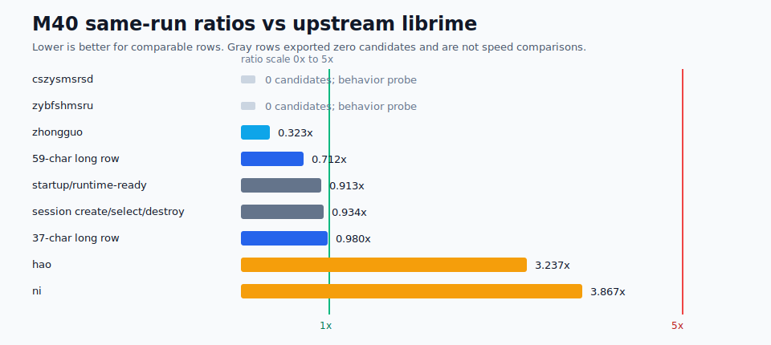
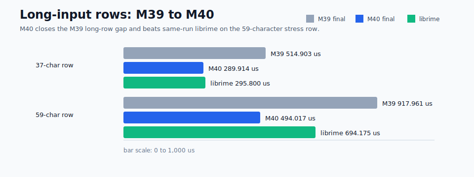
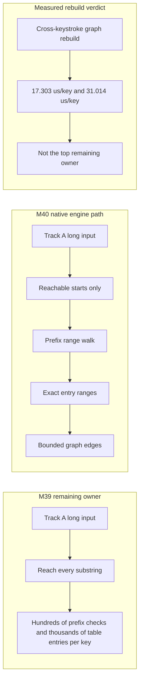

# Yune vs upstream librime performance dashboard

Date: 2026-06-26

This report is native-engine evidence only. It does not claim browser,
frontend, product-delivery, packaging, or public-demo speed wins.

## Current Verdict

M40 closes the compiled sentence lookup index milestone for Track A
`luna_pinyin`. Yune now beats or matches same-run upstream librime on the two
required long continuous pinyin rows while preserving the M39 mmap/`rsmarisa`
selected-storage path, startup/session guards, short/medium row guards,
bounded output/context behavior, and memory no-regression.

The M40 change is intentionally narrow. It combines exact range indexing,
reachable-vertex pruning, prefix filtering, and a librime-shaped phrase-index
walk inside the native `UpstreamSentenceModel`. It does not optimize or claim
`yune-web`, browser startup, product delivery, packaging, or frontend speed.

## Achievement Snapshot

| Dimension | M40 outcome | Why it matters |
| --- | --- | --- |
| Startup/runtime-ready | `23.934 ms`, `0.913x` same-run librime | Startup remains at librime level and improves from M39 `25.048 ms`. |
| Session create/select/destroy | `23.994 ms`, `0.934x` same-run librime | Schema/session lifecycle remains at librime level and improves from M39 `25.256 ms`. |
| Track A short/medium typing | `hao` `3.237x`, `ni` `3.867x`, `zhongguo` `0.323x` | The short/medium guard rows remain inside `5x` and do not regress more than `5%` from M39. |
| Track A 37-character long input | M39 `514.903 us` -> M40 `289.914 us`, `0.980x` same-run librime | The remaining M39 long-row gap is closed. |
| Track A 59-character stress input | M39 `917.961 us` -> M40 `494.017 us`, `0.712x` same-run librime | The 50+ character Track A row is now faster than same-run librime. |
| Incomplete pinyin behavior probes | `cszysmsrsd` `24.820 us`, `zybfshmsru` `26.350 us`, `abi_candidates_exported=0` | These rows stay bounded, but the same-run ratio is not a speed win because Yune exports no candidates. They require a follow-up oracle output check for abbreviation behavior. |
| Track B 50+ profile row | `196.387 us/op` median, `605.125 us/op` p95 | Guard row included; median is +`4.0%` vs M39, while p95 has two measured Windows scheduling outliers recorded as a caveat. |
| Track A peak working set | `123,957,248 B` | Slightly below M39 final `123,985,920 B`; selected table/prism heap mirrors stay `0`. |

## Visual Dashboard

## Final Same-Run Ratios

Lower is better. `##########` is roughly librime parity (`1.0x`); the M40 long
row gate is `1.25x`, and the short/medium guard is `5.0x`. Rows that export no
candidates are excluded from this comparable-ratio table.

| Row | Ratio | Visual |
| --- | ---: | --- |
| `zhongguo` | `0.323x` | `###` |
| `zhegeyinqingqishiyinggaizhichichaochangjuzishurucainengyong` | `0.712x` | `#######` |
| startup/runtime-ready | `0.913x` | `#########` |
| session create/select/destroy | `0.934x` | `#########` |
| `ceshiyixiachangjushuruxingnengzenyang` | `0.980x` | `##########` |
| `hao` | `3.237x` | `################################` |
| `ni` | `3.867x` | `#######################################` |

Non-comparable behavior probes:

| Row | Yune median | librime median | Exported candidates | Status |
| --- | ---: | ---: | ---: | --- |
| `cszysmsrsd` | `24.820 us` | `1,237.820 us` | `0` | Behavior probe; not a performance ratio. |
| `zybfshmsru` | `26.350 us` | `866.720 us` | `0` | Behavior probe; not a performance ratio. |

## Final Native Dashboard

| Row | Yune median | librime median | Ratio / guard | M40 result |
| --- | ---: | ---: | ---: | --- |
| startup/runtime-ready | `23,934.200 us` | `26,218.400 us` | `0.913x` | Pass |
| session create/select/destroy | `23,994.000 us` | `25,700.000 us` | `0.934x` | Pass |
| `hao` | `38.200 us` | `11.800 us` | `3.237x` | Pass |
| `ni` | `56.850 us` | `14.700 us` | `3.867x` | Pass |
| `zhongguo` | `60.275 us` | `186.400 us` | `0.323x` | Pass |
| `ceshiyixiachangjushuruxingnengzenyang` | `289.914 us` | `295.800 us` | `0.980x` | Pass |
| `zhegeyinqingqishiyinggaizhichichaochangjuzishurucainengyong` | `494.017 us` | `694.175 us` | `0.712x` | Pass |
| `cszysmsrsd` | `24.820 us` | `1,237.820 us` | N/A: `0` exported candidates | Behavior probe; oracle parity unverified |
| `zybfshmsru` | `26.350 us` | `866.720 us` | N/A: `0` exported candidates | Behavior probe; oracle parity unverified |

## Before And After

| Row | M40 baseline Yune | M40 final Yune | Same-run librime | Final ratio |
| --- | ---: | ---: | ---: | ---: |
| startup/runtime-ready | `25,456.100 us` | `23,934.200 us` | `26,218.400 us` | `0.913x` |
| session create/select/destroy | `25,421.500 us` | `23,994.000 us` | `25,700.000 us` | `0.934x` |
| `hao` | `38.033 us` | `38.200 us` | `11.800 us` | `3.237x` |
| `ni` | `56.300 us` | `56.850 us` | `14.700 us` | `3.867x` |
| `zhongguo` | `59.525 us` | `60.275 us` | `186.400 us` | `0.323x` |
| `ceshiyixiachangjushuruxingnengzenyang` | `500.249 us` | `289.914 us` | `295.800 us` | `0.980x` |
| `zhegeyinqingqishiyinggaizhichichaochangjuzishurucainengyong` | `898.641 us` | `494.017 us` | `694.175 us` | `0.712x` |
| `cszysmsrsd` | `29.270 us` | `24.820 us` | `1,237.820 us` | N/A: `0` exported candidates |
| `zybfshmsru` | `32.370 us` | `26.350 us` | `866.720 us` | N/A: `0` exported candidates |

Compared with M39 final evidence, the 37-character row moved from
`514.903 us` to `289.914 us`, and the 59-character row moved from
`917.961 us` to `494.017 us`.

The incomplete-pinyin rows are kept because they are useful boundedness probes,
but they are not counted as performance wins. The final metrics show
`abi_candidates_exported=0` for both rows, so a future oracle-output check must
decide whether Yune is correctly returning empty output or missing
`luna_pinyin` abbreviation expansion.

## Sentence Lookup Strategy Gates

| Strategy | Final proof | Result |
| --- | --- | --- |
| A exact range index | Long rows record exact-range hits: `22.189` hits/key on the 37-character row and `31.186` hits/key on the 59-character row. | Pass |
| B reachable-vertex pruning | Long rows skip unreachable starts: `7.919` skips/key and `13.508` skips/key. | Pass |
| C prefix filtering | Long rows record prefix hits, misses, and early breaks; prefix checks drop by `75.7%` and `85.9%` from baseline. | Pass |
| D phrase-index walk | Long rows record phrase-index walks, nodes, and emitted ranges; table entries considered drop by `96.9%` and `97.1%`. | Pass |
| Old partition fallback | Final partition-point fallback calls are `0.000` per key on both long rows. | Pass |

## Bottleneck Shape

M40-ENGINE-12 is recorded: after A/B/C/D, graph rebuild is measured at
`17.303 us/key` on the 37-character row and `31.014 us/key` on the
59-character row. It is not the top remaining long-row owner, so M40 records a
measured no-incrementality verdict rather than adding a cache path.

## Track B Profile Guard

| Row | M39 median | M40 final median | M39 p95 | M40 final p95 | Result |
| --- | ---: | ---: | ---: | ---: | --- |
| `neigojangingkeisatjinggoiziwunciucoenggeoizisyujapsinhojijung` | `188.857 us/op` | `196.387 us/op` | `194.910 us/op` | `605.125 us/op` | Guard included; median is +`4.0%`, p95 has two measured Windows scheduling outliers. |

Track B is not compared against upstream `rime/librime 1.17.0` because it is a
TypeDuck-HK/librime `v1.1.2` profile surface. The M40 Track B row is a native
Yune profile guard, not a Track A optimization target.

## Storage And Bounded Output

Track A final status:

- `selected_storage=rsmarisa_byte_backed`
- table/prism mapping mode: `mmap`
- selected table/prism heap mirror bytes: `0`
- `source_fallback=false`
- `rsmarisa_status=ok`
- `rsmarisa_mapping_mode=mmap`
- `rsmarisa_num_keys=463586`
- positive `rsmarisa` exact and prefix counters on every target row
- no selected table/prism heap mirror
- bounded first-page reads and no full-list fallback becoming the owner

## Memory

| Track | M39 / baseline | M40 final | Result |
| --- | ---: | ---: | --- |
| Track A max peak | M39 `123,985,920 B` | `123,957,248 B` | Slightly lower than M39; below the 5% guard. |
| Track A 37-character working set | M40 baseline `112,103,424 B` | `114,704,384 B` | Higher row working set, but peak guard passes. |
| Track A 59-character working set | M40 baseline `113,012,736 B` | `115,441,664 B` | Higher row working set, but peak guard passes. |
| Track B long-row working set | M40 baseline `438,132,736 B` | `441,098,240 B` | Higher guard row working set. |
| Track B peak | M40 baseline `504,537,088 B` | `504,881,152 B` | Slightly higher than baseline, still within normal Track B guard-band noise. |

Memory remains a major absolute gap versus librime. M40 does not claim memory
parity; it proves the sentence lookup index does not regress the M39 Track A
peak and does not add a selected table/prism heap mirror.

## Parked Follow-Ups

The native engine report is now parked after M40. The remaining engine-side
items are whole-process memory owner profiling, stricter short-key parity if a
new target requires it, and incomplete-pinyin output parity for `cszysmsrsd` and
`zybfshmsru` because the final M40 rows export `0` candidates.

The next active optimization is M41 `yune-web` startup under
[`plans/active/m41-plan-yune-web-startup-optimization.md`](../plans/active/m41-plan-yune-web-startup-optimization.md).
That work requires separate real-browser evidence for the browser harness,
public-demo dist, worker/WASM lifecycle, cache/persistence, schema deploy/reuse,
typing after ready, and Chromium memory. Native M40 numbers are baseline context
only; they are not browser startup or public-demo speed claims.

## Evidence

- M40 final gates:
  [`reports/evidence/m40-compiled-sentence-lookup-index/final-gates.md`](./evidence/m40-compiled-sentence-lookup-index/final-gates.md)
- Final native benchmark:
  [`reports/evidence/m40-compiled-sentence-lookup-index/phase-4-final-native/`](./evidence/m40-compiled-sentence-lookup-index/phase-4-final-native/)
- Baseline:
  [`reports/evidence/m40-compiled-sentence-lookup-index/phase-0-baseline/`](./evidence/m40-compiled-sentence-lookup-index/phase-0-baseline/)
- Memory attribution:
  [`reports/evidence/m40-compiled-sentence-lookup-index/phase-3-memory/memory-owner-summary.md`](./evidence/m40-compiled-sentence-lookup-index/phase-3-memory/memory-owner-summary.md)
- Completed plan:
  [`plans/completed/m40-plan-compiled-sentence-lookup-index.md`](../plans/completed/m40-plan-compiled-sentence-lookup-index.md)

## Quality Gates

Final closeout gates:

- `cargo fmt --check`
- `cargo clippy --workspace --all-targets -- -D warnings`
- `cargo test --workspace`
- final native benchmark with required Track A and Track B rows
- `git diff --check`
