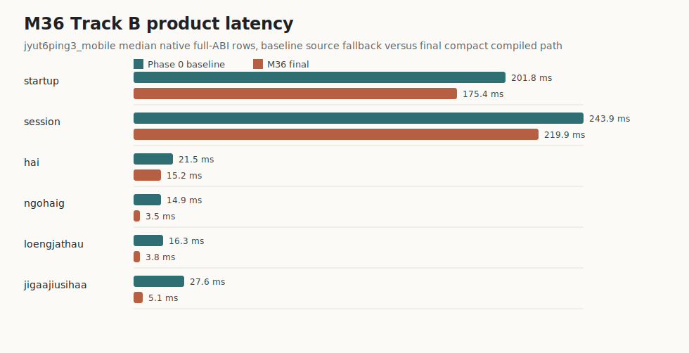
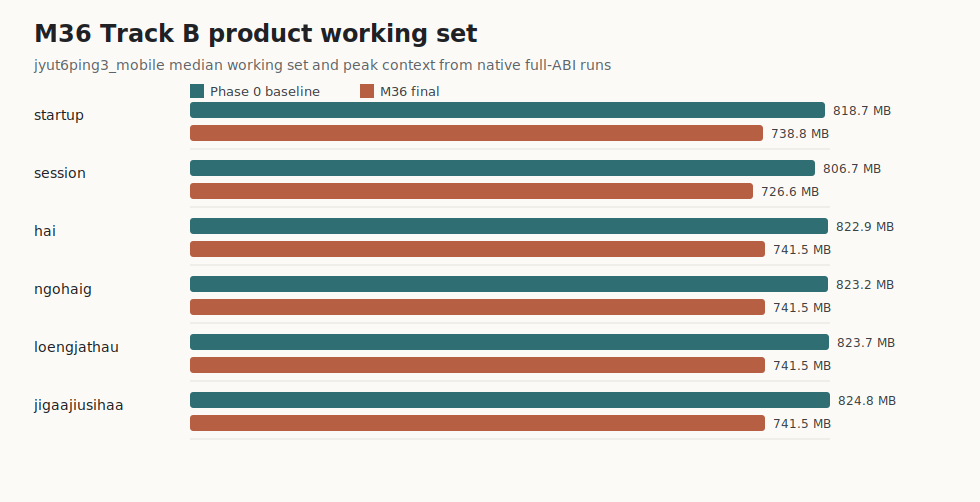
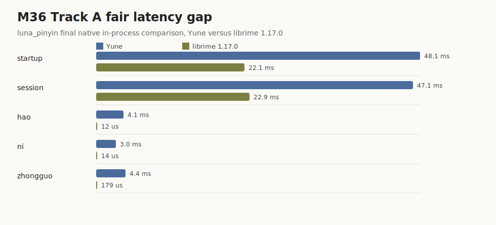
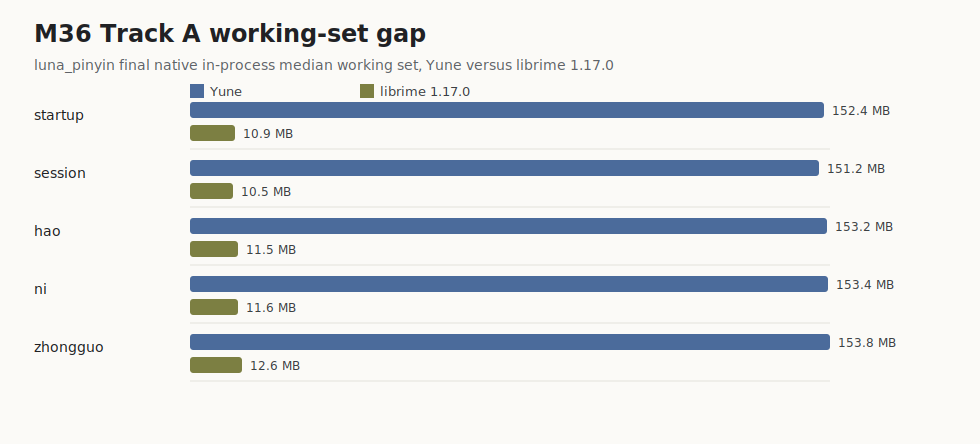

# Yune vs upstream librime performance report

Date: 2026-06-24

Evidence:

- M33 fairness/cache evidence: [`evidence/m33-2026-06-23/`](./evidence/m33-2026-06-23/)
- M34 before cross-engine rerun: [`evidence/m34-queryable-table-prism/baseline-yune-vs-librime/`](./evidence/m34-queryable-table-prism/baseline-yune-vs-librime/)
- M34 after cross-engine rerun: [`evidence/m34-queryable-table-prism/after-yune-vs-librime/`](./evidence/m34-queryable-table-prism/after-yune-vs-librime/)
- M34 native logs: [`evidence/m34-queryable-table-prism/frontend-baselines-before.txt`](./evidence/m34-queryable-table-prism/frontend-baselines-before.txt) and [`evidence/m34-queryable-table-prism/frontend-baselines-after-final.txt`](./evidence/m34-queryable-table-prism/frontend-baselines-after-final.txt)
- Historical M34 visualizations: [`m34-cross-engine-gap.svg`](./evidence/m34-queryable-table-prism/m34-cross-engine-gap.svg), [`m34-native-improvement.svg`](./evidence/m34-queryable-table-prism/m34-native-improvement.svg), and [`m34-working-set-gap.svg`](./evidence/m34-queryable-table-prism/m34-working-set-gap.svg)
- M35 native before/after logs: [`evidence/m35-compact-table-prism-storage/frontend-baselines-before.txt`](./evidence/m35-compact-table-prism-storage/frontend-baselines-before.txt) and [`evidence/m35-compact-table-prism-storage/frontend-baselines-after.txt`](./evidence/m35-compact-table-prism-storage/frontend-baselines-after.txt)
- M35 fair cross-engine before/after reruns: [`evidence/m35-compact-table-prism-storage/baseline-yune-vs-librime/`](./evidence/m35-compact-table-prism-storage/baseline-yune-vs-librime/) and [`evidence/m35-compact-table-prism-storage/after-yune-vs-librime/`](./evidence/m35-compact-table-prism-storage/after-yune-vs-librime/)
- M35 visualizations: [`m35-native-improvement.svg`](./evidence/m35-compact-table-prism-storage/m35-native-improvement.svg), [`m35-cross-engine-gap.svg`](./evidence/m35-compact-table-prism-storage/m35-cross-engine-gap.svg), and [`m35-memory-story.svg`](./evidence/m35-compact-table-prism-storage/m35-memory-story.svg)
- M35 task evidence: [`evidence/m35-compact-table-prism-storage/`](./evidence/m35-compact-table-prism-storage/)
- M36 product-path evidence: [`evidence/m36-product-path/`](./evidence/m36-product-path/)
- M36 final native in-process rerun: [`evidence/m36-product-path/phase-4-final/`](./evidence/m36-product-path/phase-4-final/)
- M36 visualizations: [`m36-product-latency-before-after.svg`](./evidence/m36-product-path/m36-product-latency-before-after.svg), [`m36-product-memory-before-after.svg`](./evidence/m36-product-path/m36-product-memory-before-after.svg), [`m36-track-a-latency-gap.svg`](./evidence/m36-product-path/m36-track-a-latency-gap.svg), and [`m36-track-a-working-set-gap.svg`](./evidence/m36-product-path/m36-track-a-working-set-gap.svg)
- Upstream librime `1.17.0` source references: [`MappedFile`](https://github.com/rime/librime/blob/33e78140250125871856cdc5b42ddc6a5fcd3cd4/src/rime/dict/mapped_file.cc), [`Table`](https://github.com/rime/librime/blob/33e78140250125871856cdc5b42ddc6a5fcd3cd4/src/rime/dict/table.cc), [`Prism`](https://github.com/rime/librime/blob/33e78140250125871856cdc5b42ddc6a5fcd3cd4/src/rime/dict/prism.cc), [`Dictionary`](https://github.com/rime/librime/blob/33e78140250125871856cdc5b42ddc6a5fcd3cd4/src/rime/dict/dictionary.cc), [`TableTranslator`](https://github.com/rime/librime/blob/33e78140250125871856cdc5b42ddc6a5fcd3cd4/src/rime/gear/table_translator.cc), and [`ReverseLookupTranslator`](https://github.com/rime/librime/blob/33e78140250125871856cdc5b42ddc6a5fcd3cd4/src/rime/gear/reverse_lookup_translator.cc)

## Public summary

M33 corrected the unfair `luna_pinyin` comparison by lazy-loading the `stroke`
reverse lookup and sharing built dictionary translators across compatible schema
selects. M34 then landed a narrower first-page candidate-pipeline optimization.
M35 replaced the upstream `luna_pinyin` heap-expanded spelling-algebra storage
hot path with compact table storage plus prism canonical-code lookup. M36 then
separated fair upstream comparison from the shipped TypeDuck product path and
made `jyut6ping3_mobile` run from rebuilt Yune-readable compiled table/prism
assets instead of the stale unsupported shipped marisa blobs.

The safe public claim is still conservative:

- Yune is no longer measuring luna-plus-stroke startup against luna-only librime.
- M35 materially improved the upstream `luna_pinyin` compact-storage path.
- M36 is the TypeDuck product-path result: `jyut6ping3_mobile` final rows run
  from fresh compiled Yune table/prism/reverse artifacts with `compiled_ready =
  true`, not `SourceFallback`.
- Track B product typing rows improve materially: `ngohaig` `14,943.043 us` ->
  `3,465.057 us` (`-76.8%`), `loengjathau` `16,309.045 us` -> `3,754.855 us`
  (`-77.0%`), and `jigaajiusihaa` `27,633.869 us` -> `5,065.308 us`
  (`-81.7%`).
- Track B product median working set drops by about `80-83 MB` on the measured
  rows; max peak working set drops from `1000.4 MB` to `885.3 MB`.
- Track A upstream `luna_pinyin` still trails librime widely on fair per-key
  comparison rows and working-set gap. These ratios are not the TypeDuck product
  typing headline.
- No browser startup, browser typing, WASM, React, Cloudflare, or TypeDuck-Web
  delivery win is claimed from M36 because runtime/browser-visible files did not
  change.

Final M36 Track A fair upstream comparison:

- `hao`: Yune `4,072.000 us`, librime `11.700 us`; Yune is `348.03x` slower.
- `ni`: Yune `2,977.300 us`, librime `14.450 us`; Yune is `206.04x` slower.
- `zhongguo`: Yune `4,403.738 us`, librime `178.600 us`; Yune is `24.66x` slower.
- Session create/select/destroy: Yune `47,112.900 us`, librime `22,852.100 us`; Yune is `2.06x` slower.
- Warm startup/runtime-ready: Yune `48,144.900 us`, librime `22,105.300 us`; Yune is `2.18x` slower.
- Median working set: Yune `158-161 MB` on the Track A rows, librime about
  `10-13 MB`; Yune max peak is `171.8 MB` versus librime about `14.1 MB`.

M35's memory win was dictionary-specific, not whole-process peak. M36's product
path reduces TypeDuck product working set, but Track A still shows a large
whole-process gap versus librime.

## Diagnosis After M36

The remaining gap is not one bug and it is not "Rust is slow." M33-M36 removed
several large, real costs, but Yune is still a hybrid design: some paths now use
compact table/prism lookup, while other compatibility paths still allocate owned
candidate payloads, enumerate full lists, sort/filter full lists, clone context
snapshots, and read compiled assets into owned memory before parsing them. By
contrast, librime's mature classic path is built around mapped deployed assets,
shared dictionary/table objects, lazy translation iterators, page-oriented
candidate production, and lazy reverse lookup.

The final M36 evidence therefore has two very different shapes:

| Surface | Current result | Interpretation |
| --- | --- | --- |
| Track A startup/session | Yune is `2.06-2.18x` slower than librime | M33 cache/fairness and M35 compact storage moved schema lifecycle into the same order of magnitude. |
| Track A short keys | Yune is `206.04x` slower on `ni` and `348.03x` slower on `hao` | The remaining hot path is no longer just dictionary load; it is frontend-shaped key processing plus full candidate/context work. |
| Track A `zhongguo` | Yune is `24.66x` slower | Longer input benefits more from M35 compact storage, but still pays full-list and owned-output costs. |
| Track A working set | Yune is about `12-14x` larger by median working-set rows | Compact storage reduced dictionary-local work, but whole-process memory still includes owned table strings, owned candidates, Rust/ABI runtime state, and non-borrowed compiled data. |
| Track B product path | Product typing rows improve `-29.2%` to `-81.7%` | M36 fixed a product-path waste: stale unsupported TypeDuck blobs forced source fallback before fresh Yune-readable compiled artifacts were rebuilt. |
| Track B `hai` residual | `hai` remains `15,241.000 us`, about `3x` slower than the other final product key rows | This is the sharpest residual latency clue: the shortest, common, ambiguous product input is now the worst row, so completion-set materialization, global sort/filter, userdb merge, and context export are more urgent suspects than long-composition sentence DP. |
| Browser delivery | No M36 claim | Native engine improvements do not automatically reduce TypeDuck-Web startup, WASM memory, React render, or Cloudflare/cache costs. |

The `hai` row should lead the next diagnosis. It improved only `-29.2%` while
`ngohaig`, `loengjathau`, and `jigaajiusihaa` improved `-76.8%` to `-81.7%`.
Because `hai` is the shortest measured product input and still the slowest final
product key row, it contradicts a naive "long input is the bottleneck" story.
The strongest inference is that short ambiguous input still drives a large
completion/homophone set through the eager candidate/context path. That remains
an inference until per-stage Track B attribution proves the exact owner.

### What Is Already Solved

- The old unfair comparison that loaded `stroke` reverse lookup for Yune but not
  for librime is gone. Reverse lookup is now lazy in Yune too.
- Re-selecting compatible schemas no longer rebuilds immutable dictionary
  translators from scratch.
- The upstream `luna_pinyin` path can avoid heap-expanded spelling-algebra alias
  storage when compiled table/prism assets are safe.
- The TypeDuck `jyut6ping3_mobile` product path can now run from fresh
  Yune-readable table/prism/reverse artifacts with `compiled_ready=true`.
- The newer M36 native in-process harness avoids the older managed `.NET` host
  confound for the final Track A/Track B evidence.

### Remaining Root Causes

1. **Compiled assets are still copied into owned memory.** Yune loads compiled
   table, prism, and reverse bytes with `fs::read`, then parses them into owned
   Rust structures. Current `CompactTableStore` still owns `String` codes and
   candidate text. librime opens table and prism files through mapped-file
   machinery, then points its table/prism accessors into that deployed image.
   This is the largest structural reason the Track A working-set rows remain
   about `12-14x` larger than librime.

2. **Compact storage is not yet byte-backed storage.** M35/M36 compact storage
   is a better in-memory representation, not a direct borrowed view of the
   deployed table. It removes the worst expanded-alias heap path, but it still
   copies code/text payloads, builds grouping vectors, and materializes owned
   `Candidate` values at the public engine/API boundary.

3. **The bounded candidate path is deliberately narrow.** Yune's first-page
   bounded refresh is guarded to safe `luna_pinyin` short inputs with no rankers,
   no userdb entries, and only bounded-safe filters. The translator bounded path
   also rejects correction, dynamic lookup, prediction, prefix fallback,
   sentence behavior, and other full-list-sensitive features. This preserves
   behavior, but it means many realistic rows still take the eager path.

4. **The eager path is still full-list shaped.** Outside the bounded subset,
   `Engine::refresh_candidates` collects translator output into a `Vec`, sorts
   the whole list by quality, merges predictive userdb rows, applies filters,
   runs rankers, and stores owned candidates. librime's table translator instead
   exposes lazy translations and fetches more table/user phrases by expanding
   limits only when needed.

5. **Context reads still pay owned-output costs.** The benchmarked key rows are
   frontend-shaped: process each key, then read and free context. Yune stores
   owned `Candidate` values in the context, clones the snapshot for ABI reads,
   then allocates C strings for the visible page. Even when dictionary lookup is
   faster, this output path can dominate short inputs where librime returns one
   page through mature iterator/menu machinery.

6. **TypeDuck-specific correctness features block naive bounding.** Dynamic
   correction can scan all codes; rich dictionary comments are rebuilt per
   candidate; prefix fallback, prediction limits, sentence-over-completion,
   partial selection, default-confirm recomposition, and userdb learning all
   have whole-list or ordering implications. They cannot be bounded by truncating
   results unless first-page, paging, selection, commit, and learning behavior
   are proven byte-identical.

7. **Schema selection still does repeated lifecycle work.** Translator sharing
   removed the largest repeated dictionary rebuild, but schema selection still
   clears and reinstalls processors, translators, filters, and userdb wiring.
   Some engine mutation helpers refresh immediately while selection is still
   assembling state. This is smaller than the old dictionary rebuild but still
   visible in the `2x` startup/session gap.

8. **M36 fixed the product compiled path, not the browser delivery path.** The
   product rows improved because Yune stopped falling back to stale unsupported
   TypeDuck product blobs. That does not change WASM initial memory, selected
   schema asset fetch, worker/main-thread serialization, browser cache behavior,
   or React paint. Those remain M31/public-demo delivery work.

### What Librime Teaches Yune

The useful lessons are data-path lessons, not a mandate to clone librime's C++
component architecture:

- librime's `Table` and `Prism` load deployed files read-only through
  `MappedFile`; their metadata, syllabary, double-array image, table index, and
  string table are used in place rather than copied into a new heap model.
- librime's dictionary component reuses table/prism objects by dictionary and
  prism name, so repeated schema creation shares loaded deployed data.
- librime's table translator uses lazy translation objects. With completion on,
  `LazyTableTranslation` fetches an initial bounded number of user/table entries
  and grows the limit only when the frontend asks for more.
- librime's reverse lookup translator initializes its reverse dictionary on
  first query, not during ordinary no-reverse typing startup.
- librime's table storage uses a string table and compact indexes so repeated
  text/code payloads are not cloned into every runtime candidate.

Yune has adopted the last two ideas partly and the sharing idea partly. The
remaining optimization work is to make the whole hot path page-bounded and
byte-backed without weakening Yune's oracle-driven behavior guarantees.

## Comprehensive Optimization Strategy

The next performance track should be treated as a multi-owner closeout, not a
single trick. Each phase must start from fresh Track A/Track B evidence and
close with either a measured win or a measured no-go.

### Phase 0 - Re-attribute Before Editing

- Keep the M36 native in-process harness as the main native comparison surface.
- Add owner spans for process-key, translator lookup, candidate materialization,
  engine sort/filter/userdb/ranker merge, context snapshot clone, ABI C-string
  allocation/free, and schema-selection mutation/refresh.
- Start with the Track B `hai` row. Split its `15,241.000 us` median across
  lookup, completion enumeration, candidate materialization, global sort, filter
  pipeline, predictive userdb merge, context snapshot, and ABI export before
  touching representation or bounded-pipeline code.
- Add memory attribution that separates mapped/file bytes, parsed table storage,
  candidate/context storage, userdb, sentence model, reverse lookup, ABI
  buffers, and allocator high-water.
- Keep Track A (`luna_pinyin` Yune vs librime) and Track B (`jyut6ping3_mobile`
  Yune before/after) separate in every chart and public claim.

Exit gate: do not start a broad rewrite until the top latency and memory owners
are named per track, and do not generalize from long-input rows until `hai` is
explained. If the top owner is context export rather than lookup, optimize
context export first.

### Phase 1 - Low-Risk Lifecycle And Allocation Wins

- Batch schema-selection mutations so processors/translators/filters/userdb are
  installed first and candidate refresh happens once at the end.
- Avoid context-snapshot and candidate-list cloning when `RimeGetContext` only
  needs the current page.
- Cache formatted dictionary-lookup comment fragments by stable text/code
  inputs where TypeDuck rich-comment bytes are already fixture-locked.
- Replace hot boxed iterator dispatch in `TableStorage` with concrete enum
  iterators if attribution shows dispatch overhead matters.

Exit gate: byte-identical upstream and TypeDuck fixture output, no ABI change,
and measured improvement on the owner that justified the phase.

### Phase 2 - Byte-Backed Compiled Storage

- Build a Yune-owned byte-backed table/prism store that can answer exact,
  prefix, all-code, correction, and lookup-record queries directly from compact
  deployed bytes or a single arena.
- Intern or arena-store repeated code/text/comment payloads so compact entries
  carry ids or offsets, not owned `String` copies.
- Keep public `Candidate` owned at the boundary, but materialize it only for the
  selected page or for explicit full-list APIs.
- Revisit native mmap only after the hot query path can actually borrow from the
  mapped bytes. Mapping bytes and then rebuilding owned heap tables is not a
  win.
- Revisit `rsmarisa` only as a complete table/reverse/prism product strategy,
  not as a table-only shortcut that loses byte-identical TypeDuck semantics.

Exit gate: compact-active schemas must not retain a parallel heap table; memory
evidence must show dictionary/process working-set movement; deploy/rebuild file
lifetime must be safe on Windows.

### Phase 3 - Generalize Page-Bounded Candidate Production

- Expand the bounded request contract past the current `luna_pinyin` short-input
  gate one behavior class at a time.
- For each filter/ranker/userdb feature, classify it as page-safe, surplus-safe,
  or full-list-only. Full-list-only behavior should use measured eager fallback
  rather than a silent behavior change.
- Replace full sort with stable top-K or k-way merge only where first-page and
  paging order are proven byte-identical.
- Make `RimeGetContext` export only the requested page unless a caller uses a
  full-list iterator API.

Exit gate: first page, paging, numbered selection, click selection, deletion,
space/default confirm, partial selection, userdb learning, and debug/inspector
views all remain byte-identical for the target schema.

### Phase 4 - Index The Remaining Full-List Correctness Features

- Replace TypeDuck dynamic-correction all-code scans with length/syllable
  buckets plus restricted-distance scratch reuse.
- Replace sentence/path DP `Vec<String>` path cloning with backpointers or piece
  ids where the sentence path is a measured owner.
- Precompute or index prefix-fallback and prediction-limit metadata so those
  features do not require materializing the whole candidate list just to decide
  the first page.
- Keep `prediction_never_first`, `assign_ordered_candidate_qualities`, and
  sentence-over-completion as explicit stop gates. If their semantics require a
  whole list, the report should say so and leave them eager.

Exit gate: these changes must move long-input or correction-heavy rows without
regressing short ordinary typing or TypeDuck profile fixtures.

### Phase 5 - Browser Delivery Separately

- Treat TypeDuck-Web and future `yune-web` delivery as a separate public-demo
  track. Native mmap does not imply browser demand paging in WASM.
- Measure selected-schema-only asset fetch, content-addressed cache behavior,
  worker startup, WASM memory sizing, response serialization, main-thread state
  application, and React paint separately.
- Claim browser startup or typing wins only after real browser evidence from
  rebuilt release WASM and current app assets.

Exit gate: browser evidence must identify the browser-side owner and show
before/after movement. Native Track B wins alone are not browser wins.

### Near-Term Priority

The next best slice is not another comparison-only micro-optimization. The
highest-leverage order is:

1. Attribute final M36 Track A/Track B per-key rows down to lookup,
   materialization, engine merge, context export, and ABI allocation, starting
   with the Track B `hai` row.
2. If context export or candidate ownership dominates short keys, make the
   current-page export path page-bounded before changing storage again.
3. If dictionary storage still dominates memory, build byte-backed Yune-native
   table/prism storage with offsets/ids and no retained heap mirror.
4. If TypeDuck long-input or correction rows dominate, add correction/sentence
   indexes before generalizing bounded TypeDuck candidate windows.
5. Only after native product rows move should M31-style browser delivery work
   translate those gains into a public web experience.

Safe public wording after this diagnosis:

> Yune has closed several self-inflicted startup and product-path costs, but it
> is still not architecturally as lazy or byte-backed as librime. The remaining
> gap is primarily full-list and owned-output work on top of owned compact
> storage, not a single missing cache. The next optimization track should make
> the hot path page-bounded and byte-backed while preserving oracle-locked
> candidate behavior.

## M36 Product-Path Results

Track B `jyut6ping3_mobile` product before/after medians:

| Row | Baseline median | M36 final median | Change | Baseline working set | Final working set | Working-set change |
| --- | ---: | ---: | ---: | ---: | ---: | ---: |
| startup ready | `201,811.100 us` | `175,424.800 us` | `-13.1%` | `818.7 MB` | `738.8 MB` | `-79.9 MB` |
| session create/select/destroy | `243,946.900 us` | `219,919.200 us` | `-9.8%` | `806.7 MB` | `726.6 MB` | `-80.2 MB` |
| `hai` key sequence | `21,541.967 us` | `15,241.000 us` | `-29.2%` | `822.9 MB` | `741.5 MB` | `-81.4 MB` |
| `ngohaig` key sequence | `14,943.043 us` | `3,465.057 us` | `-76.8%` | `823.2 MB` | `741.5 MB` | `-81.7 MB` |
| `loengjathau` key sequence | `16,309.045 us` | `3,754.855 us` | `-77.0%` | `823.7 MB` | `741.5 MB` | `-82.2 MB` |
| `jigaajiusihaa` key sequence | `27,633.869 us` | `5,065.308 us` | `-81.7%` | `824.8 MB` | `741.5 MB` | `-83.2 MB` |

Product path status changed from stale/unsupported shipped blobs to fresh
Yune-readable compiled assets:

| Dictionary | Baseline status | M36 final status |
| --- | --- | --- |
| `jyut6ping3` with prism `jyut6ping3_mobile` | stale product `.table.bin`, unsupported `marisa string_table`, unsupported prism/reverse, `compiled_ready=false` | fresh rebuilt table, `jyut6ping3_mobile.prism.bin`, reverse, all parse `ok`, `compiled_ready=true` |
| `jyut6ping3_scolar` | stale product `.table.bin`, unsupported `marisa string_table`, unsupported prism/reverse, `compiled_ready=false` | fresh rebuilt table, prism, reverse, all parse `ok`, `compiled_ready=true` |

The selected M36 product strategy is the no-marisa re-emitted asset fallback.
The `rsmarisa` strategy stays closed by measured no-go because the actual
product blobs must preserve table, reverse, and prism semantics together; using
the original unsupported marisa table alone does not give Yune a byte-identical
runtime path. Native mmap/borrowed storage and browser byte-backed loading stay
future work because compact owned product storage is now active and the remaining
browser/delivery claims need their own real-browser evidence.

## M35 Compact-Storage Results

Native watched rows:

| Row | M35 baseline median | M35 after median | Change |
| --- | ---: | ---: | ---: |
| `per_key_real_luna_pinyin_hao_full_abi` | `2,034.769 us` | `1,411.302 us` | `-30.6%` |
| `per_key_real_luna_pinyin_hao_engine_only` | `1,092.879 us` | `750.517 us` | `-31.3%` |
| `per_key_real_luna_pinyin_ni_full_abi` | `1,535.097 us` | `1,252.294 us` | `-18.4%` |
| `per_key_real_luna_pinyin_ni_engine_only` | `891.791 us` | `697.044 us` | `-21.8%` |
| `per_key_real_luna_pinyin_zhongguo_full_abi` | `14,759.755 us` | `1,527.055 us` | `-89.7%` |
| `per_key_real_luna_pinyin_zhongguo_engine_only` | `740.966 us` | `485.482 us` | `-34.5%` |
| `per_key_real_jyut6ping3_mobile_hai_full_abi` | `18,900.742 us` | `18,450.767 us` | `-2.4%` |
| `per_key_real_jyut6ping3_mobile_jigaajiusihaa_full_abi` | `28,836.874 us` | `26,953.441 us` | `-6.5%` |
| `per_key_real_jyut6ping3_mobile_jigaajiusihaa_correction_full_abi` | `24,811.675 us` | `26,707.480 us` | `+7.6%` |

Startup/storage rows:

| Row | M35 baseline median | M35 after median | Baseline memory delta | After memory delta |
| --- | ---: | ---: | ---: | ---: |
| `startup_trace_luna_pinyin_spelling_algebra_expand` | `148,570.200 us` | `122.200 us` | `17,784,832` | `0` |
| `startup_trace_luna_pinyin_translator_install` | `233,169.800 us` | `55,155.800 us` | `37,556,224` | `9,822,208` |
| `startup_trace_luna_pinyin_select_schema_total` | `295,027.400 us` | `104,363.600 us` | `25,026,560` | `-2,613,248` |

Fair cross-engine M35 movement:

| Workload | Yune baseline | Yune after | Change | librime after |
| --- | ---: | ---: | ---: | ---: |
| `hao` key sequence | `15,906.800 us` | `12,547.200 us` | `-21.1%` | `35.400 us` |
| `ni` key sequence | `9,225.100 us` | `5,678.500 us` | `-38.4%` | `28.700 us` |
| `zhongguo` key sequence | `45,608.600 us` | `35,848.500 us` | `-21.4%` | `1,452.800 us` |
| session create/select/destroy | `67,119.100 us` | `47,806.600 us` | `-28.8%` | `30,977.000 us` |
| startup/runtime-ready | `66,709.400 us` | `46,516.200 us` | `-30.3%` | `31,052.200 us` |

M35 does not use the `354x` / `198x` fair-harness per-key ratios as the main
typing headline. Native engine-only/full-ABI rows are the primary M35 engine
movement evidence.

## Visual summary

These charts are generated from the final M36 native in-process evidence bundle,
not from a browser/runtime run. They support native engine-performance,
product-path, and fair cross-engine comparison claims only.



The product latency chart is the M36 achievement view. The shipped
`jyut6ping3_mobile` path no longer depends on the unsupported stale product
marisa blobs at runtime after schema-scoped deploy rebuilds fresh Yune-readable
compiled assets. The strongest typing rows improve by `-76.8%` to `-81.7%`.



The product memory chart is the native product-path footprint view. Median
working set drops by roughly `80-83 MB` on measured Track B rows, and max peak
working set drops by `115.0 MB`.



The Track A latency chart keeps the unresolved upstream comparison gap visible.
Yune is still `348.03x` slower on `hao`, `206.04x` slower on `ni`, and `24.66x`
slower on `zhongguo` in the fair `luna_pinyin` comparison.



The Track A working-set chart is the caveat view. M36 records a product-path
working-set reduction, but it does not solve the fair upstream whole-process
memory gap versus librime.

## Methodology

M33-M35 cross-engine evidence used the same librime-shaped C API harness:
[`../../scripts/yune-vs-librime-benchmark.cs`](../../scripts/yune-vs-librime-benchmark.cs),
driven by [`../../scripts/benchmark-yune-vs-librime.ps1`](../../scripts/benchmark-yune-vs-librime.ps1).
M36 adds a native Rust in-process harness to remove managed/PInvoke overhead
from the product before/after evidence:
[`../../crates/yune-rime-api/benches/native_inprocess_benchmark.rs`](../../crates/yune-rime-api/benches/native_inprocess_benchmark.rs),
driven by
[`../../scripts/benchmark-native-rime-inprocess.ps1`](../../scripts/benchmark-native-rime-inprocess.ps1).

Cross-engine command:

```powershell
powershell -ExecutionPolicy Bypass -File scripts\benchmark-yune-vs-librime.ps1 -OutputRoot <evidence-dir> -Iterations 9 -SessionIterations 9 -KeyIterations 25
```

M36 native in-process command:

```powershell
powershell -ExecutionPolicy Bypass -File scripts\benchmark-native-rime-inprocess.ps1 -OutputRoot docs\reports\evidence\m36-product-path\phase-4-final -Iterations 5 -SessionIterations 20 -KeyIterations 20 -DeployProductBeforeBenchmark
```

Native benchmark command:

```powershell
cmd /c "cargo bench -p yune-rime-api --bench frontend_baselines > target\m35-frontend-baselines-*.txt 2>&1"
```

The cross-engine rows use the same upstream `luna_pinyin` schema id, the same
shared/user data roots, and the same default module list. M36 Track A keeps that
comparison-only shape. M36 Track B measures Yune before/after for the shipped
TypeDuck `jyut6ping3_mobile` product path and records product asset status. None
of these native rows measure TypeDuck-Web delivery, browser paint, Cloudflare
cache behavior, or public-demo startup.

## Results

### Historical M34 Cross-engine Summary

| Workload | Engine | Baseline median | M34 after median | After p95 | Peak working set |
| --- | --- | ---: | ---: | ---: | ---: |
| `hao` key sequence | Yune | `13,336.800 us` | `12,216.900 us` | `13,688.700 us` | `182,333,440 bytes` |
| `hao` key sequence | librime | `35.200 us` | `35.100 us` | `35.900 us` | `22,507,520 bytes` |
| `ni` key sequence | Yune | `5,858.800 us` | `5,693.900 us` | `5,822.400 us` | `182,333,440 bytes` |
| `ni` key sequence | librime | `28.300 us` | `28.700 us` | `58.500 us` | `22,495,232 bytes` |
| `zhongguo` key sequence | Yune | `36,451.100 us` | `35,909.100 us` | `39,995.800 us` | `182,333,440 bytes` |
| `zhongguo` key sequence | librime | `1,503.400 us` | `1,379.400 us` | `1,446.800 us` | `22,585,344 bytes` |
| session create/select/destroy | Yune | `48,329.000 us` | `46,743.400 us` | `51,333.100 us` | `182,333,440 bytes` |
| session create/select/destroy | librime | `30,778.900 us` | `28,121.800 us` | `30,889.900 us` | `22,470,656 bytes` |
| startup/runtime-ready | Yune | `50,065.200 us` | `47,126.800 us` | `885,728.100 us` | `182,333,440 bytes` |
| startup/runtime-ready | librime | `31,804.000 us` | `30,315.200 us` | `75,034.500 us` | `22,392,832 bytes` |

Yune baseline-to-M34-after movement in the fair cross-engine harness:

| Workload | Change |
| --- | ---: |
| `hao` key sequence | `-8.4%` |
| `ni` key sequence | `-2.8%` |
| `zhongguo` key sequence | `-1.5%` |
| session create/select/destroy | `-3.3%` |
| startup/runtime-ready | `-5.9%` |

These rows are mixed. They are safe to publish only with the unresolved per-key
gap visible.

### Historical M34 Native Watched Rows

| Row | Before median | M34 after median | Change |
| --- | ---: | ---: | ---: |
| `per_key_real_luna_pinyin_ni_full_abi` | `1,760.250 us` | `1,132.950 us` | `-35.6%` |
| `per_key_real_luna_pinyin_ni_engine_only` | `569.700 us` | `575.250 us` | `+1.0%` |
| `per_key_real_luna_pinyin_zhongguo_full_abi` | `12,697.600 us` | `12,119.013 us` | `-4.6%` |
| `per_key_real_luna_pinyin_zhongguo_engine_only` | `532.575 us` | `515.713 us` | `-3.2%` |
| `per_key_real_jyut6ping3_mobile_hai_full_abi` | `18,389.567 us` | `19,446.467 us` | `+5.7%` |
| `per_key_real_jyut6ping3_mobile_jigaajiusihaa_full_abi` | `29,937.777 us` | `28,155.585 us` | `-6.0%` |
| `per_key_real_jyut6ping3_mobile_jigaajiusihaa_correction_full_abi` | `29,649.146 us` | `28,032.915 us` | `-5.5%` |
| `startup_trace_luna_pinyin_select_schema_total` | `240,094.000 us` | `227,901.000 us` | `-5.1%` |
| `startup_trace_luna_pinyin_translator_install` | `188,404.000 us` | `176,787.000 us` | `-6.2%` |
| `startup_trace_luna_pinyin_spelling_algebra_expand` | `121,609.000 us` | `112,475.000 us` | `-7.5%` |
| `startup_trace_luna_pinyin_translator_index_build` | `11,657.000 us` | `11,289.000 us` | `-3.2%` |

`per_key_real_luna_pinyin_hao_*` is a new native row added in M34; it has no
same-harness before value. Final after medians are `1,378.800 us` full ABI and
`761.667 us` engine-only.

Engine-only before/after rows are attribution-only because M34 fixed the native
engine-only benchmark to set the real schema id. Full-ABI rows and the
cross-engine harness are the public compare surfaces.

## Interpretation

M34 landed Lever A only:

- internal `CandidateRequest` / `TranslationResult`
- bounded `StaticTableTranslator` request path for the safe subset
- lazy engine candidate-window completion on out-of-window access
- full-list reader preservation for candidate-list iterator APIs
- internal `TableLookup` abstraction implemented for the current heap map

M34 deliberately did not land:

- compiled table query storage
- prism-backed candidate lookup
- mmap/borrowed storage
- browser/runtime delivery work
- TypeDuck profile behavior changes

The remaining performance gap is now better split:

- Native first-page short-prefix context work can be bounded and improved.
- Engine-only lookup is still not close to librime.
- Cold startup and peak memory still need a queryable table/prism representation
  before mmap can pay off.

## Safe public claim

It is safe to say:

> Yune's performance reports now separate native engine work from browser
> delivery, fair upstream comparison from TypeDuck product evidence, and memory
> footprint from latency. M35 removed the upstream `luna_pinyin` heap-expanded
> spelling-algebra owner. M36 makes the shipped TypeDuck `jyut6ping3_mobile`
> path run from fresh Yune-readable compiled table/prism assets and improves the
> measured product typing rows by up to `81.7%`, with median product working set
> down by about `80-83 MB`. Yune still trails librime widely on fair Track A
> `luna_pinyin` per-key comparison rows and working set.

It is not safe to say:

> Yune is faster than librime, Yune uses less memory than librime, Yune browser
> startup or browser typing improved, or the Track A whole-process memory gap is
> solved.
