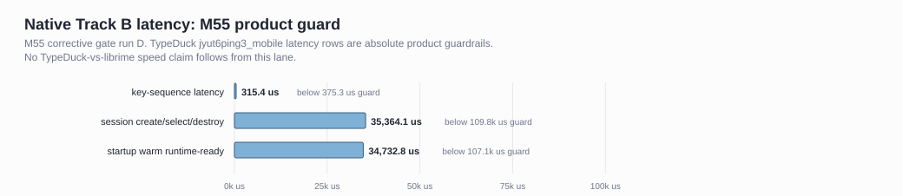

# Yune Performance Dashboard

Date: 2026-07-13 (M59 final acceptance plus historical diagnostics)

> **M59 supersession:** final Windows behavior source `443cc636` preserves the
> named `/3` behavior, matches the accepted Lane A/Lane B/Cangjie and deployed
> 37/59 surfaces, and passes the unchanged signed ratchet at `32/32` aggregate
> rows and `160/160` individual observations in the source-current follow-up
> packet. `5fa986d8` records the accepted 60-asset REACH-03 registry and
> `07845e02` makes full-tree reconciliation bidirectional. Every `afb7079b`
> macOS table, `6/17` read, `n`/`zh` diagnosis, and `/3` zero-candidate statement
> below is a historical, source-bound diagnostic—not current-main acceptance or
> a current optimization claim. No exact-current cross-platform rerun has
> replaced it. Final evidence:
> [`evidence/m59-canonical-jyutping-reachability-parity/`](./evidence/m59-canonical-jyutping-reachability-parity/).

This dashboard preserves the standing gate and historical diagnostic context.
Older milestone closeout narrative and superseded benchmark rows remain in
[`history/2026-06-28-yune-vs-librime-performance-pre-current-dashboard.md`](./history/2026-06-28-yune-vs-librime-performance-pre-current-dashboard.md).

**Measurement note (load-bearing):** as of the 2026-07-04 corrective series the
native benchmark reads the context after **every keypress** inside the timed
loop, for Yune and librime alike — the shape every real frontend has. All
earlier `key_sequence_process_with_context` numbers (M52, the pre-corrective
M55 rows) were batch-shaped (one context read per sequence) and are **not
comparable** to the rows below. The pre-corrective M55 closeout numbers
(`0.237x`/`0.086x` long rows, `0.286x` startup) were artifacts of a since-
reverted key deferral and config cache measured under that batch shape; see
[`evidence/m55-native-match-or-beat/corrective-2026-07-04/`](./evidence/m55-native-match-or-beat/corrective-2026-07-04/).

**macOS verification note:** M57 fixed a macOS-only Yune sentence-model
construction defect in the Track A verification bundle. The macOS
`rime_deployer`-compiled upstream Luna MARISA table uses checksum pair
`0xb3d4e98e` / `0x29d56c89`; after M57, Yune accepts that target-scoped pair,
keeps compact storage active, and restores the expected model shape
(`332,604` compact codes, `513,353` expanded sentence entries, 11-row
abbreviation vocabulary). Evidence:
[`evidence/m57-macos-track-a-sentence-model-parity/`](./evidence/m57-macos-track-a-sentence-model-parity/).

> **Historical macOS diagnostic:** the M57 cross-platform table formerly
> carried by this dashboard is historical. The five-round `afb7079b` packet
> supersedes its performance interpretation. Current Mac Yune is 37-53% slower
> than near-code Windows on `n`/`ni`/`hao`, while current long aggregate wins
> are dominated by intermediate prefixes with different candidate text. Final
> 37/59 page text/order is repaired, but no complete long-prefix snapshot is
> oracle-exact. See
> [`evidence/m59-post-fix-root-cause-20260711/`](./evidence/m59-post-fix-root-cause-20260711/).
> This is diagnostic only and changes no signed Windows gate.

**M58 Jyutping/profile note:** M58 completed the upstream Jyutping oracle
rebase at `f780410c`. Canonical `jyut6ping3` candidate behavior now uses
upstream `rime/librime 1.17.0` plus pinned `rime/rime-cantonese`; the
user-specified `zijiguk` / `諮議局` capture returns `諮議局` first, so no
canonical candidate bug was reproduced and no canonical fix was derived. The
shipped `yune-web` TypeDuck/profile lane had separate reachability bugs:
`beingo` / `畀` at TypeDuck/profile index 6 and `zi` / `諮` at index 27. Those
were fixed by restoring `畀	bei2	200000`, retaining one TypeDuck/profile page
for short `jyut6ping3_mobile` reported/profile inputs, and widening prefix
fallback only on that short-input path, without first-page promotion. No schema
id split, profile predicate change, userdb migration, or ABI widening landed;
`jyut6ping3_typeduck` remains the preferred future TypeDuck profile id pending
explicit sign-off.

## Technical Summary

- **Historical Mac diagnostic (`afb7079b`)**: Yune wins 6/17 aggregate Track A rows and
  loses 11. The 37/59 aggregate ratios (`0.399x`/`0.205x`) are not behavior-
  normalized; text-matched prefix sensitivity is `1.420x`/`1.204x`. `n`/`zh`
  use `8.682x`/`4.092x` librime's instructions. Allocator/platform effects are
  partial rather than a complete explanation.

- **Signed Windows Track A (`luna_pinyin`)**: M55 closes with real, honestly
  measured improvements and corrected claims. Versus the pre-M55 record the long
  sentence rows improved ~35% (37-char `3.05x -> 1.91x`, 59-char
  `2.25x -> 1.53x`), `ni`/`hao` improved (`3.14x -> 2.43x`,
  `2.15x -> 1.57x`), startup and session lifecycle are measured **faster than
  librime** (`0.90x`/`0.86x`, run-noisy), and the three win rows are kept and
  guarded `<1.00x`. Yune remains slower than librime on the short keys and
  both sentence rows.
- **Standing guardrail**: the corrective per-key
  [`m55-thresholds.csv`](./evidence/m55-native-match-or-beat/thresholds/m55-thresholds.csv)
  is the standing native gate (all dimensions ceilinged, wins locked
  `<1.00x`, Track B absolutes included), green twice consecutively
  (`gate-run-d/`, `gate-run-e/`) and re-run green at M56 closeout under
  [`m56-productization-hardening/final/ratchet-run/`](./evidence/m56-productization-hardening/final/ratchet-run/)
  and again at M58 closeout under
  [`m58-jyutping-exact-before-fuzzy/phase-2b/m55-product-ratchet-corrective-final-pass2/`](./evidence/m58-jyutping-exact-before-fuzzy/phase-2b/m55-product-ratchet-corrective-final-pass2/).
  The M56 and M58 runs are guard proofs, not performance rebaselines: some
  short-key and sentence-row ratios drift upward but remain inside the
  committed ceilings.
  The M52 artifact and the pre-corrective M55 artifact are batch-shaped
  history.
- **macOS verification repair**: M57 repaired the macOS Track A bundle so it is
  no longer a false contradiction of the M55 corrective record. The two full
  macOS passes now keep Luna on `rsmarisa_byte_backed` storage, report
  `compact_all_codes_count=332604` and
  `compact_expanded_table_entries=513353`, and match local librime first-page
  candidates for `cszysmsrsd` and `zybfshmsru`. This is a comparability repair,
  not a new cross-platform performance headline.
- **Native memory disposition**: the signed Windows gate retains the
  `185.7 MB` default / `113.2 MB` historical `/2` opt-in record. Current Mac
  max RSS is `11.5-18.3x` and peak footprint `23.5-26.4x` librime in the
  high-iteration controls. The deployed `/3` byte-backed lane emits zero
  candidates on all 99 prefixes, so it carries no speed or memory claim.
- **Candidate-output disclosure**: current reconciled evidence preserves the
  repaired final 37/59 text/order, but intermediate prefixes and preedit/
  comments still differ. Final-page text/order matches on 9/17 Track A rows;
  only two complete captured snapshots are exact. `n` and `zh` remain visibly
  different beyond their first candidates.
- **Browser fair lane (`luna_pinyin`, carried 2026-06-28)**: Yune public demo
  uses `64.0 MiB` WASM peak versus My RIME `16.0 MiB` (`4.0x`). Yune is slower
  to ready (`1000 ms` vs `634 ms`), but faster on first input (`74 ms` vs
  `95 ms`).

## Evidence Bundles

Corrective evidence root (decision runs, gate runs, README):
[`evidence/m55-native-match-or-beat/corrective-2026-07-04/`](./evidence/m55-native-match-or-beat/corrective-2026-07-04/).

M57 macOS verification repair evidence:
[`evidence/m57-macos-track-a-sentence-model-parity/`](./evidence/m57-macos-track-a-sentence-model-parity/).

M58 Jyutping/profile corrective closeout evidence:
[`evidence/m58-jyutping-exact-before-fuzzy/`](./evidence/m58-jyutping-exact-before-fuzzy/).

Historical source-bound post-fix macOS diagnostic:
[`evidence/m59-post-fix-root-cause-20260711/`](./evidence/m59-post-fix-root-cause-20260711/).

Standing gate artifact:
[`evidence/m55-native-match-or-beat/thresholds/m55-thresholds.csv`](./evidence/m55-native-match-or-beat/thresholds/m55-thresholds.csv).

Consecutive green gate runs: `gate-run-d/` and `gate-run-e/` under the
corrective root. Latest closeout proof:
[`evidence/m58-jyutping-exact-before-fuzzy/phase-2b/m55-product-ratchet-corrective-final-pass2/threshold-check.csv`](./evidence/m58-jyutping-exact-before-fuzzy/phase-2b/m55-product-ratchet-corrective-final-pass2/threshold-check.csv).
Browser rows are carried from
[`evidence/current-performance-dashboard-2026-06-29/`](./evidence/current-performance-dashboard-2026-06-29/).

## Native Track A — signed Windows standing gate

Corrective gate run D, same-run against upstream librime 1.17.0, context read
after every keypress:

| Dimension | Yune median | librime median | Yune / librime | Current read |
| --- | ---: | ---: | ---: | --- |
| startup | `22,428.100 us` | `25,061.500 us` | `0.895x` | faster; run-noisy, guarded at `1.091x` |
| session | `22,468.400 us` | `26,019.700 us` | `0.864x` | faster; guarded by absolute ceiling |
| `n` | `55.100 us` | `20.900 us` | `2.636x` | slower; +34 us absolute |
| `ni` | `42.450 us` | `17.450 us` | `2.433x` | slower; +25 us absolute |
| `hao` | `24.233 us` | `15.400 us` | `1.574x` | slower; +9 us absolute |
| 37-char pinyin | `571.684 us` | `298.859 us` | `1.913x` | slower; improved from `3.05x` pre-M55 |
| 59-char pinyin | `1,017.522 us` | `665.727 us` | `1.528x` | slower; improved from `2.25x` pre-M55 |
| `zhongguo` (common word) | `44.300 us` | `173.762 us` | `0.255x` | faster; win row, guarded `<1.00x` |
| `cszysmsrsd` (10-char abbr) | `454.040 us` | `1,190.230 us` | `0.381x` | faster; win row, guarded `<1.00x` |
| `zybfshmsru` (8-char abbr) | `469.340 us` | `832.090 us` | `0.564x` | faster; win row, guarded `<1.00x` |

The visualization below is regenerated from the corrective gate run D:


## Native Track A — historical Mac vs near-code Windows

The historical diagnostic compares Mac `afb7079b` with Windows Increment 4a at
`ca52ec42`. This is a machine/source/compiler comparison, not an OS-only
experiment: CPU, compiler, linker, allocator, OS, payload metadata, background
load, and the commits differ.

| Input | Mac Yune | Win 4a Yune | Mac vs Win Yune | Mac librime | Win 4a librime | Mac vs Win librime | Mac ratio | Win ratio |
| --- | ---: | ---: | ---: | ---: | ---: | ---: | ---: | ---: |
| `n` | `90.333 us` | `59.100 us` | `+52.8%` | `22.375 us` | `21.000 us` | `+6.5%` | `4.123x` | `2.804x` |
| `ni` | `50.041 us` | `34.800 us` | `+43.8%` | `16.916 us` | `17.450 us` | `-3.1%` | `2.978x` | `2.000x` |
| `hao` | `27.722 us` | `20.267 us` | `+36.8%` | `13.958 us` | `15.333 us` | `-9.0%` | `2.019x` | `1.328x` |
| 37-char | `66.940 us` | `68.062 us` | `-1.6%` | `166.470 us` | `298.692 us` | `-44.3%` | `0.399x` | `0.229x` |
| 59-char | `80.233 us` | `85.341 us` | `-6.0%` | `391.385 us` | `673.254 us` | `-41.9%` | `0.205x` | `0.126x` |

The short and long directions differ. On long rows, Yune's absolute cost is
close while librime is about 42-44% faster on the Mac. On `n`/`ni`/`hao`,
librime is similar while Yune is 37-53% slower on the Mac. Therefore a blanket
“Yune is not slower on macOS” or “only librime speeds up” conclusion is false.

The long aggregate ratios are also not same-behavior comparisons. Candidate
text matches librime on only 19/37 and 30/59 prefixes; text-different prefixes
consume 82.0%/90.1% of librime's reconstructed time. On text-matched prefixes,
Yune is `1.420x`/`1.204x`; final-key ratios are `1.713x`/`1.139x`. Comments and
preedit still differ, so even those are diagnostic sensitivity results.

Allocator controls identify one partial Mac component: Nano-off slows librime
more on stable medium/long rows and lowers the ratio around 6-14%. Hardware
counters identify a separate engine-path component: Yune executes 4-9x the
instructions on `n`/`zh` and has 1.24-1.41x worse CPI in the four inspected
lanes. Thermal/noise affects precision but cannot explain the stable work-
volume direction. Exact platform attribution remains open until the same
current commit and payload run on both systems.

**Memory is diagnostic only across platforms.** Current Mac high-iteration
controls report Yune max RSS `11.5-18.3x` and peak footprint `23.5-26.4x`
librime. These are whole-process peaks and are not interchangeable with the
signed Windows working-set/private counters.

**Track B remains a product guard, not a peer lane.** Its current candidate
page/comments/page state and checksums are byte-identical to M57. Median is
`264.941 us/key`, run-median spread 1.8%; internal materialization and bounded
selection increased, so exact behavior does not imply unchanged work shape.

## Native Track A Guardrails

Corrective gate run D against the standing artifact (run E and the M56
closeout ratchet repeat green):

| Guard | Observed | Ceiling | Status |
| --- | ---: | ---: | --- |
| `n` latency ratio | `2.636x` | `2.890x` | pass |
| `ni` latency ratio | `2.433x` | `2.666x` | pass |
| `hao` latency ratio | `1.574x` | `1.731x` | pass |
| 37-char latency ratio | `1.913x` | `2.094x` | pass |
| 59-char latency ratio | `1.528x` | `1.625x` | pass |
| `zhongguo` win row | `0.255x` | `0.323x` (`<1.00x` locked) | pass |
| `cszysmsrsd` win row | `0.381x` | `0.474x` (`<1.00x` locked) | pass |
| `zybfshmsru` win row | `0.564x` | `0.695x` (`<1.00x` locked) | pass |
| startup ratio | `0.895x` | `1.091x` | pass |
| session median | `22,468.400 us` | `25,470.280 us` | pass |
| Track A peak working set | `185,749,504 B` | `195,028,378 B` | pass |
| Track B product long-row latency | `315.356 us` | `347.975 us` | pass |

Latest M58 closeout ratchet read: all `23` rows pass, but the short-key rows
and sentence rows still have limited headroom (`n` `2.770x` / `2.890x`, `ni`
`2.494x` / `2.666x`, `hao` `1.654x` / `1.731x`, 37-char `2.022x` / `2.094x`,
59-char `1.567x` / `1.625x`, Track B long row `335.823 us` / `347.975 us`).
This is guard proof, not a new performance headline; do not summarize it as
"no measurable performance cost."

Manual standing gate command shape:

```powershell
powershell -ExecutionPolicy Bypass -File scripts\benchmark-native-rime-inprocess.ps1 `
  -OutputRoot docs\reports\evidence\<new-run> `
  -Iterations 9 -SessionIterations 60 -KeyIterations 80 `
  -TrackAInputs n,ni,hao,zhongguo,ceshiyixiachangjushuruxingnengzenyang,zhegeyinqingqishiyinggaizhichichaochangjuzishurucainengyong,cszysmsrsd,zybfshmsru `
  -TrackBInputs neigojangingkeisatjinggoiziwunciucoenggeoizisyujapsinhojijung `
  -DeployProductBeforeBenchmark `
  -TrackAThresholds docs\reports\evidence\m55-native-match-or-beat\thresholds\m55-thresholds.csv `
  -FailOnRegression
```

## Native Track A Memory

The table below is the signed historical Windows `/2` gate context. Current
`YUNE-POET/3` does not inherit the opt-in claim: its deployed byte-backed
control emits zero candidates on all 99 prefixes and is rejected for behavior.
The behavior-valid fixture multiplies table, graph, and DP work, so future work
must recover behavior plus incremental/lazy indexing before re-deciding the
default.

| Measurement | Current value | Current read |
| --- | ---: | --- |
| Track A peak working set (shipping default, owned poet) | `185.7 MB` | latency ceilings bind; guarded at `195.0 MB` |
| Track A peak working set (`YUNE_POET_BYTE_BACKED=1` opt-in) | `113.2 MB` | real, parity-preserving, but fails the long-row latency ceilings (scratch not yet byte-backed) |
| librime max peer peak (same run) | `13.5 MB` | peer scale |
| `poet.vocabulary` / `poet.entries_by_code` (opt-in mode) | `25.5 MB` / `3.0 MB` | `mmap_file_backed` in the `YUNE-POET/2` artifact |

Native Track A `luna_pinyin` is kept as the upstream comparison lane. The
current native product target remains the TypeDuck/Jyutping profile lane, where
M47's lean probe reports the comments-intact keyboard profile at about `67 MB`
working set / `22 MB` private. These are separate lanes and are not
interchangeable memory claims.


## Native Track B (TypeDuck Profile Product Path)

Track B is the native TypeDuck/Jyutping profile product path and regression
guard lane (no librime peer). Current evidence uses historical
`jyut6ping3_mobile` asset names; it should be read as TypeDuck profile evidence
and future schema-split work should present that lane as
`jyut6ping3_typeduck` only after explicit sign-off. M58 completed the
blast-radius audit and did not implement the split.
It is mode-independent for the poet default (sentence is off in the mobile
profile). Standing Windows M58 final-pass ratchet:

| Dimension | Observed | Ceiling | Status |
| --- | ---: | ---: | --- |
| 50+ key-sequence latency | `335.823 us` | `347.975 us` | pass (pre-M55 source baseline `341.139 us`) |
| key-sequence median working set | `79,511,552 B` | `88,012,390 B` | pass |
| key-sequence max peak working set | `510,885,888 B` | `562,033,050 B` | pass (deploy/compile transient) |
| key-sequence median private bytes | `35,426,304 B` | `39,460,045 B` | pass |
| session create/select/destroy | `36,098.200 us` | `39,289.800 us` | pass (~3x better than the Phase 0-era `99.8 ms` source baseline) |
| startup warm runtime-ready | `35,459.000 us` | `38,825.050 us` | pass (~3x better than the Phase 0-era `97.4 ms` source baseline) |

The visualizations below are carried from the 2026-07-04 standing-gate
dashboard and remain directional; the M58 table above is the current Track B
ratchet read.




## Browser Peer Dashboard

Carried forward from the 2026-06-28 Playwright run.

| Scenario | Schema | Ready | Input -> candidate | Commit | WASM peak | Unique encoded resources | Validity |
| --- | --- | ---: | ---: | ---: | ---: | ---: | --- |
| Yune public demo | `luna_pinyin` | `1000 ms` | `74 ms` | `107 ms` | `64.0 MiB` | `29.5 MiB` | fair |
| My RIME live | `luna_pinyin` | `634 ms` | `95 ms` | `119 ms` | `16.0 MiB` | `8.5 MiB` | fair |
| Yune public demo | Jyutping | `1347 ms` | `103 ms` | `108 ms` | `160.0 MiB` | `72.2 MiB` | guard only |
| My RIME live | Jyutping | `998 ms` | `99 ms` | `114 ms` | `68.0 MiB` | `24.9 MiB` | guard only |

Browser visuals are carried unchanged from the 2026-06-28 Playwright run under
[`current-performance-dashboard-2026-06-29/visuals/`](./evidence/current-performance-dashboard-2026-06-29/visuals/).

## Remaining Current Gaps

| Rank | Gap | Current value | Next diagnostic target |
| ---: | --- | --- | --- |
| 1 | Incremental native behavior comparability | No complete 37/59 prefix snapshot is exact; `n`/`zh` pages differ | lock candidate/order/comments/preedit/pagination/selection to the governing oracle |
| 2 | Native translator residual | Translation is ~90-99% of inspected Track A time; producer/direct-family work is incompletely attributed | lower-perturbation producer and translator-residual attribution |
| 3 | Native eager page work | Yune owns/filters/sorts surplus candidates while librime drains lazy streams | behavior-locked, filter-aware, resumable page-fill prototype |
| 4 | Native short-key work | `n`/`zh` use `8.682x`/`4.092x` librime's instructions | remove duplicate MARISA/abbreviation work after behavior lock |
| 5 | Native Track A memory | Mac max RSS `11.5-18.3x`; deployed `/3` byte-backed lane is behavior-invalid | recover correct byte-backed behavior, then measure memory and CPU separately |
| 6 | Exact-current cross-platform attribution | Mac/Windows source, build, CPU, OS, and allocator remain confounded | same commit, payload, iterations, hashes, and allocator declarations on both systems |
| 7 | Track B overfetch | Exact M57 behavior, but materialization +95.2% and bounded selection +110.9% | preserve product page/comments/checksums while reducing work |
| 8 | Browser `luna_pinyin` memory/startup | `64.0 MiB` vs `16.0 MiB`; `1000 ms` vs `634 ms` (carried) | separate browser runtime-floor/startup plan |

## History

Older milestone closeout detail remains in:

- [`history/2026-06-28-yune-vs-librime-performance-pre-current-dashboard.md`](./history/2026-06-28-yune-vs-librime-performance-pre-current-dashboard.md)
- [`plans/completed/`](../plans/completed/)
- [`ledgers/milestone-history.md`](../ledgers/milestone-history.md)
- The pre-corrective 2026-07-04 dashboard state (batch-shaped M55 closeout
  numbers) is preserved in git history at commit `531dbcf2` and analyzed in
  [`evidence/m55-native-match-or-beat/corrective-2026-07-04/README.md`](./evidence/m55-native-match-or-beat/corrective-2026-07-04/README.md).
- M57 macOS Track A verification repair:
  [`evidence/m57-macos-track-a-sentence-model-parity/`](./evidence/m57-macos-track-a-sentence-model-parity/).
