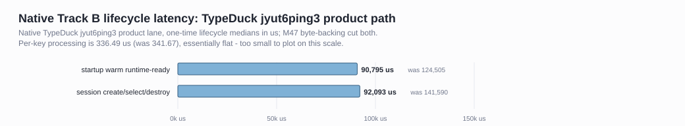
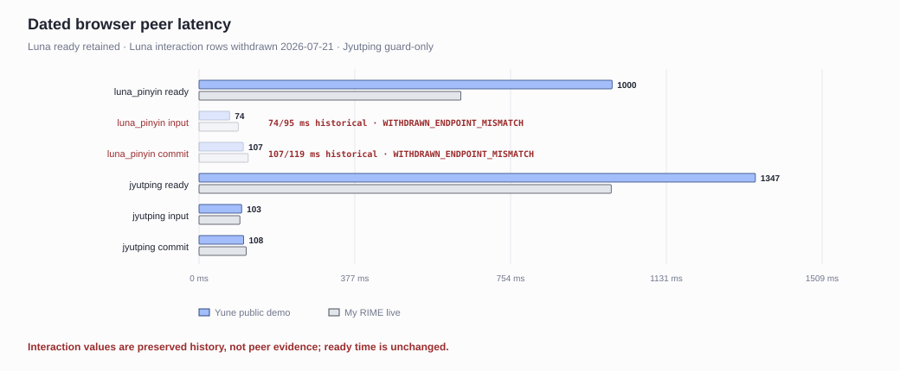

# Current Yune Performance Dashboard

Date: 2026-07-04

This dashboard shows the current benchmark state only. Older milestone closeout narrative and superseded benchmark rows remain in [`history/2026-06-28-yune-vs-librime-performance-pre-current-dashboard.md`](./history/2026-06-28-yune-vs-librime-performance-pre-current-dashboard.md).

The native Track A lane was refreshed by the M55 partial closeout ratchet on 2026-07-04. The browser lane is carried forward from the 2026-06-28 Playwright run and was not re-measured in M55.

## Technical Summary

- **Native Track A (`luna_pinyin`)**: M55 closes partial/no-go at Phase 2. The byte-backed poet storage work reduces native Track A peak working set to `110,542,848 B` in the final closeout run, down from the M52-era `188,383,232 B`, but the full M55 ratchet is red on the 37-character row, the 59-character row, and one Track B product latency guard.
- **Standing guardrail**: M52 remains the repo's standing green native Track A regression gate. M55's `m55-thresholds.csv` is retained as research/no-go evidence and does not supersede M52.
- **Native latency disposition**: short rows and current win rows remain inside the M55 guard in the final closeout run. The two long pinyin rows regress under byte-backed poet access (`5.964x` and `4.030x`), so M55 does not claim Tier M, match-or-beat, or a new public performance bar.
- **Browser fair lane (`luna_pinyin`, carried 2026-06-28)**: Yune public demo uses `64.0 MiB` WASM peak versus My RIME `16.0 MiB` (`4.0x`). Yune is slower to ready (`1000 ms` vs `634 ms`), but faster on first input (`74 ms` vs `95 ms`).
- **Browser Jyutping (carried 2026-06-28)**: Yune public demo is byte-backed at `160.0 MiB` WASM peak. This remains a guard row, not a fair peer comparison, because My RIME's Jyutping uses a different Cantonese-only dictionary.

## Current Evidence Bundle

Fresh native source:
[`evidence/m55-native-match-or-beat/final/verification-ratchet-no-go-2026-07-04/`](./evidence/m55-native-match-or-beat/final/verification-ratchet-no-go-2026-07-04/).

M55 partial closeout:
[`evidence/m55-native-match-or-beat/final/partial-closeout-2026-07-04.md`](./evidence/m55-native-match-or-beat/final/partial-closeout-2026-07-04.md).

M55 research/no-go threshold artifact:
[`evidence/m55-native-match-or-beat/thresholds/m55-thresholds.csv`](./evidence/m55-native-match-or-beat/thresholds/m55-thresholds.csv).

Standing green M52 guardrail source:
[`evidence/m52-track-a-guardrails-and-disposition/track-a-thresholds.csv`](./evidence/m52-track-a-guardrails-and-disposition/track-a-thresholds.csv).

Standing green M52 proof:
[`evidence/m52-track-a-guardrails-and-disposition/final-native-benchmark/threshold-check.csv`](./evidence/m52-track-a-guardrails-and-disposition/final-native-benchmark/threshold-check.csv).

The normalized dashboard source from the previous browser-inclusive dashboard is still available under [`evidence/current-performance-dashboard-2026-06-29/`](./evidence/current-performance-dashboard-2026-06-29/); browser rows in this file are carried from that evidence.

## Native Track A

M55 final closeout run, same-run against upstream librime 1.17.0:

| Dimension | Yune median | librime median | Yune / librime | Current read |
| --- | ---: | ---: | ---: | --- |
| startup | `26,822.900 us` | `48,466.400 us` | `0.553x` | passes M55 guard; startup is noisy |
| session | `25,261.600 us` | `27,631.800 us` | `0.914x` | passes M55 absolute guard |
| `n` | `58.300 us` | `21.000 us` | `2.776x` | M55 guard pass |
| `ni` | `43.800 us` | `14.300 us` | `3.063x` | M55 guard pass; not match-or-beat |
| `hao` | `24.867 us` | `11.633 us` | `2.138x` | M55 guard pass |
| 37-char pinyin | `1,764.127 us` | `295.800 us` | `5.964x` | M55 guard fail |
| 59-char pinyin | `2,710.963 us` | `672.759 us` | `4.030x` | M55 guard fail |
| `zhongguo` (common word) | `45.312 us` | `171.438 us` | `0.264x` | Yune faster; M55 win-row guard pass |
| `cszysmsrsd` (10-char abbr) | `594.790 us` | `1,213.090 us` | `0.490x` | Yune faster; M55 win-row guard pass |
| `zybfshmsru` (8-char abbr) | `595.470 us` | `857.600 us` | `0.694x` | Yune faster; M55 win-row guard pass |

The byte-backed poet storage work changes the shape of the native lane: memory improves substantially, but the long-row poet access path is too slow to satisfy the M55 ratchet. Candidate output parity is preserved by the Phase 2 product-path parity evidence, but latency remains a no-go.

The older 2026-06-30 visualization below is retained as a historical visual for row shape, not as the current numeric source:


## Native Track A Guardrails

M55 final closeout gate:

| Guard | Observed | Ceiling | Status |
| --- | ---: | ---: | --- |
| `n` latency ratio | `2.776x` | `3.050x` | pass |
| `ni` latency ratio | `3.063x` | `3.223x` | pass |
| `hao` latency ratio | `2.138x` | `2.287x` | pass |
| 37-char latency ratio | `5.964x` | `3.267x` | fail |
| 59-char latency ratio | `4.030x` | `2.447x` | fail |
| `zhongguo` latency ratio | `0.264x` | `0.325x` | pass |
| `cszysmsrsd` latency ratio | `0.490x` | `0.532x` | pass |
| `zybfshmsru` latency ratio | `0.694x` | `0.770x` | pass |
| Track A peak working set | `110,542,848 B` | `198,000,000 B` | pass |
| Track B product long-row latency | `414.059 us` | `375.253 us` | fail |

Because this gate is red, M55 does not hand over its threshold artifact. The active standing guard remains M52:

```powershell
powershell -ExecutionPolicy Bypass -File scripts\benchmark-native-rime-inprocess.ps1 `
  -OutputRoot docs\reports\evidence\<new-run> `
  -Iterations 9 -SessionIterations 60 -KeyIterations 80 `
  -TrackAInputs n,ni,hao,ceshiyixiachangjushuruxingnengzenyang,zhegeyinqingqishiyinggaizhichichaochangjuzishurucainengyong `
  -SkipTrackB `
  -TrackAThresholds docs\reports\evidence\m52-track-a-guardrails-and-disposition\track-a-thresholds.csv `
  -FailOnRegression
```

## Native Track A Memory

| Measurement | Current value | Current read |
| --- | ---: | --- |
| M55 final Track A peak working set | `110.5 MB` | byte-backed poet storage research result; M55 gate still red |
| M52 Track A peak working set | `188.4 MB` | previous standing dashboard value |
| M52 librime max peer peak | `17.3 MB` | same-run peer scale from the M52 standing guard |
| M55 diagnostic steady post-typing working set | `100.1 MB` | diagnostic native probe, not release ratchet |
| M55 diagnostic steady post-typing private bytes | `62.8 MB` | diagnostic native probe, not iOS `phys_footprint` |
| `poet.vocabulary` after Phase 2 | `25.5 MB` | `mmap_file_backed` poet artifact bytes in diagnostic probe |
| `poet.entries_by_code` after Phase 2 | `3.0 MB` | `mmap_file_backed` poet artifact bytes in diagnostic probe |
| Final named heap-owned owner bytes | `826,679 B` | diagnostic native Luna probe |

Native Track A `luna_pinyin` is kept as the upstream comparison lane. The current native product target remains the TypeDuck/Jyutping profile lane, where M47's lean probe reports the comments-intact keyboard profile at about `67 MB` working set / `22 MB` private. These are separate lanes and are not interchangeable memory claims.

The older memory visualization remains historical:


## Native Track B (TypeDuck `jyut6ping3` product)

Track B is the native TypeDuck/Jyutping product path. It has no librime peer lane, because TypeDuck is a fork rather than upstream librime, so the read is absolute memory cost and the M47 byte-backing trajectory, not a same-run ratio. M55 uses Track B only as a regression guard.

M55 final closeout Track B guard:

| Dimension | Observed | Ceiling | Status |
| --- | ---: | ---: | --- |
| 50+ key-sequence latency | `414.059 us` | `375.253 us` | fail |
| key-sequence median working set | `79,675,392 B` | `280,518,656 B` | pass |
| key-sequence max peak working set | `510,038,016 B` | `564,065,075 B` | pass |
| key-sequence median private bytes | `35,639,296 B` | `200,620,851 B` | pass |
| session create/select/destroy | `37,497.500 us` | `109,795.290 us` | pass |
| startup warm runtime-ready | `36,590.200 us` | `107,085.000 us` | pass |

The Track B product latency guard is one reason M55 cannot hand over its ratchet as the standing gate.

Historical Track B visuals from the previous dashboard:




## Browser Peer Dashboard

Carried forward from the 2026-06-28 Playwright run.

| Scenario | Schema | Ready | Input -> candidate | Commit | WASM peak | Unique encoded resources | Validity |
| --- | --- | ---: | ---: | ---: | ---: | ---: | --- |
| Yune public demo | `luna_pinyin` | `1000 ms` | `74 ms` | `107 ms` | `64.0 MiB` | `29.5 MiB` | fair |
| My RIME live | `luna_pinyin` | `634 ms` | `95 ms` | `119 ms` | `16.0 MiB` | `8.5 MiB` | fair |
| Yune public demo | Jyutping | `1347 ms` | `103 ms` | `108 ms` | `160.0 MiB` | `72.2 MiB` | guard only |
| My RIME live | Jyutping | `998 ms` | `99 ms` | `114 ms` | `68.0 MiB` | `24.9 MiB` | guard only |




Browser visuals are carried unchanged from the 2026-06-28 Playwright run under [`current-performance-dashboard-2026-06-29/visuals/`](./evidence/current-performance-dashboard-2026-06-29/visuals/).

## Remaining Current Gaps

| Rank | Gap | Current value | Next diagnostic target |
| ---: | --- | --- | --- |
| 1 | Native Track A long-row poet access latency after byte-backing | 37-char `5.964x`, 59-char `4.030x` versus same-run librime | future owner-evidenced graph/access-path plan only |
| 2 | Track B product long-row latency guard | `414.059 us` vs `375.253 us` ceiling | separate product/profile guard investigation if needed |
| 3 | Browser `luna_pinyin` memory | `64.0 MiB` vs My RIME `16.0 MiB` | WASM runtime floor and public-demo resource/heap split |
| 4 | Browser `luna_pinyin` startup | `1000 ms` vs My RIME `634 ms` | startup asset/runtime phases after current public-demo build |
| 5 | Native Track A memory peer gap | M55 final `110.5 MB` vs M52 librime peer peak `17.3 MB` | only after latency guard has a viable no-regression path |


## History

Older milestone closeout detail remains in:

- [`history/2026-06-28-yune-vs-librime-performance-pre-current-dashboard.md`](./history/2026-06-28-yune-vs-librime-performance-pre-current-dashboard.md)
- [`plans/completed/`](../plans/completed/)
- [`ledgers/milestone-history.md`](../ledgers/milestone-history.md)
