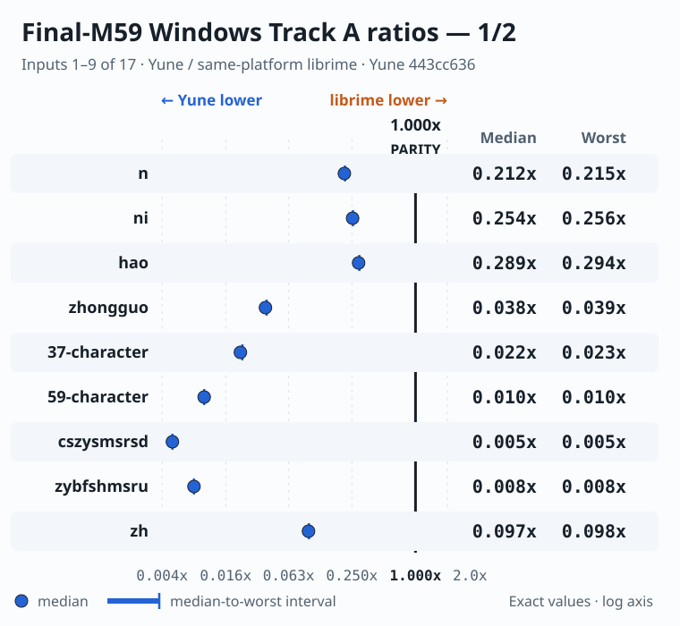
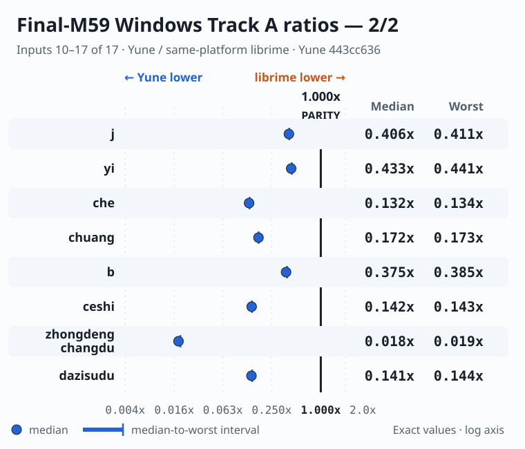
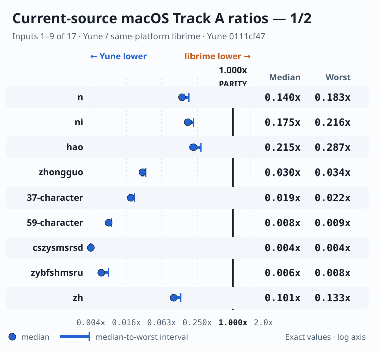
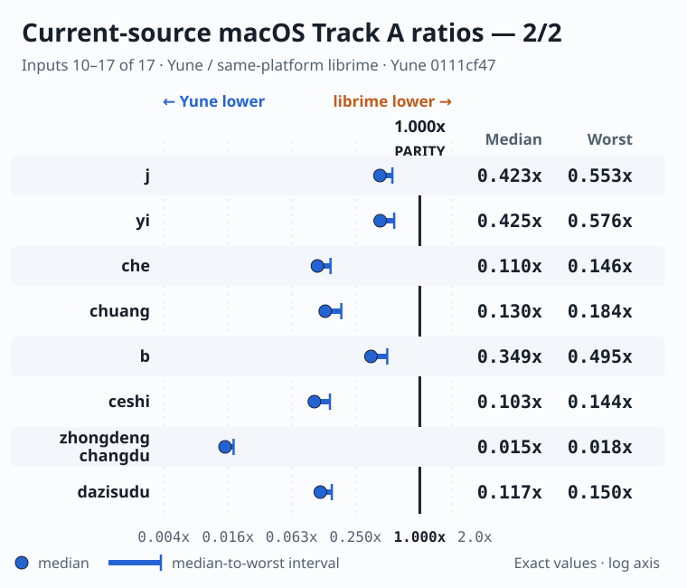

# Yune Performance Dashboard

Updated: 2026-07-15

This is the single current performance report for Yune. It covers native
Windows, native macOS, the Track B product guard, the browser peer lane, the
web interaction status, and the bottleneck disposition. Superseded
measurements and longer source-bound investigations are kept in
[`history/`](./history/), not mixed into the live scorecard.

## Technical summary

- **Native Track A latency is currently below librime parity.** All 17 Windows
  medians and worst observations are below `1.000x`; all 17 macOS medians and
  pooled worsts are also below `1.000x`.
- **Native memory is still the clearest native deficit.** Track A peak working
  set is about `8.9x` same-run librime on Windows and `11.8x` same-run librime
  RSS on macOS. The platform counters are not interchangeable.
- **The iOS-budget lane remains a Windows proxy, not an iOS result.** The
  comments-intact keyboard profile is `67.4 MB` steady / `80.1 MB` peak with
  `22.5 MB` private; on-device `phys_footprint` is still unmeasured.
- **The source-current web interaction gate passes.** Clean source `ef485b10`
  passed the local 8-scenario / 186-key binding 4x/4x profile, its Cloudflare
  deployment, and the source-pinned production canary. The deployed 47-key row
  measured `43 ms` p95 / `44 ms` max with zero worker queue wait.
- **Browser startup and footprint remain the clearest peer deficits.** In the
  latest fair same-schema peer run, Yune is `1.577x` on ready time, `4.000x` on
  WASM memory, and `3.471x` on unique encoded resources. First-input and commit
  latency are below peer parity at `0.779x` and `0.899x`.
- **One deterministic behavior difference remains in this 17-input diagnostic.**
  `zhongdengchangdu` differs at candidate positions 2–4 on both Windows and
  macOS, with all 15 cited Windows 4c/4d/4e observations preserved in the
  [cross-platform evidence table](./evidence/m59-current-source-macos-20260714/aggregate/windows-zhongdengchangdu-evidence.csv).
  Both 37- and 59-character pages are exact. The mismatch is not a demonstrated
  latency cause or a macOS-only defect.
- **No current platform-speed attribution is valid.** Windows measures Yune
  `443cc636`; macOS measures Yune `0111cf47`. The same pinned librime is used,
  but the Yune sources are not matched and the Mac run contains material UI
  noise.

## How to read the dashboard

For directly comparable peer rows:

`ratio = Yune metric / peer metric`

- below `1.000x`: Yune used less time, memory, or payload;
- exactly `1.000x`: parity;
- above `1.000x`: the peer used less.

A latency ratio of `0.250x` means Yune used 25% of the peer latency; it does
not mean “0.25x faster.” Track B has no librime peer and therefore reports
absolute values only. Windows working-set/private counters, macOS RSS, and
browser WASM heap are separate measurement systems and must not be combined.

The signed M59 Windows ceiling registry remains the acceptance authority. This
dashboard reports current observations without changing, re-baselining, or
reinterpreting those ceilings.

## Current evidence map

| Lane | Measured Yune source | Peer / source | Run shape | Current role |
| --- | --- | --- | --- | --- |
| Windows native | `443cc636862806e4f0dd1e12ab2e2e45f4189154` | librime `33e78140250125871856cdc5b42ddc6a5fcd3cd4` | 5 rounds; `9/60/80`; product deployment | final-M59 source-current guard; `32/32` aggregate and `160/160` individual observations pass |
| macOS native | `0111cf47c09bfe7a4a3d55a1832f35a55bc59435` | librime `33e78140250125871856cdc5b42ddc6a5fcd3cd4` | 5 fixed-binary rounds; `9/60/80`; product deployment | artifact/identity/completeness checks pass; quiet-machine condition was not continuous |
| Windows iOS-budget proxy | M47 RED-08, measured 2026-06-29 | no peer; 48/64 MB product targets | fresh-process native probe | portable optimization scope complete; on-device validation pending |
| Web interaction | `ef485b102b3a5e75359e547008b47ed89eb89c7e` | no peer | local full release-stress gate, Cloudflare deployment, and deployed canary | WEB03-11 source-current pass; no browser-peer ratio formed |
| Browser peer | measured 2026-06-28 | My RIME | same-schema `luna_pinyin` comparison | latest fair browser peer snapshot; Jyutping peer rows excluded as dictionary-confounded |
| Linux native | — | — | no current packet | unmeasured; no Linux performance claim |
| iOS device | — | — | no on-device packet | unmeasured; no Apple `phys_footprint` claim |

The measured Windows DLL hash is
`f829a14033c4cad5e594e50349ee40f104686159404628343bd7673a9467f49b`;
its librime DLL is
`86b4c7357d4c6d293ce5589b234d8859ca2ac30923a03bedfa3926eeaf97fb0b`.
The measured Mac dylib hashes are
`f3365aae19d15b9d7b57dcccd30ce1c77347b8ee96a20f09ab001468074b226c`
for Yune and
`1973349f4da44c5b71765f8d064ec30428a0fd42d66c9ae95bdb6dc27cd4eecc`
for librime. The recorded native source checkouts were clean, and the binary
hashes stayed fixed across all five Mac rounds.

The reviewed current-source Mac packet, complete 17-row table, fixed-binary
audit, portable HTML report, and Fable review resolution are tracked at
[`m59-current-source-macos-20260714/`](./evidence/m59-current-source-macos-20260714/).

## Native Track A latency

All four native panels use the same logarithmic ratio axis and print exact
three-decimal median/worst values beside the `1.000x` parity line. Each
platform is split 9/8 so the labels remain readable in narrow views. The
platforms intentionally remain separate because the measured Yune source
commits differ.

### Windows final-M59 source





### Latest measured macOS source





### Complete 17-input scorecard

| Input | Windows Yune/librime median | Windows Yune/librime worst | macOS Yune/librime median | macOS Yune/librime pooled worst | Complete-input page |
| --- | ---: | ---: | ---: | ---: | --- |
| `n` | `0.212x` | `0.215x` | `0.140x` | `0.183x` | exact |
| `ni` | `0.254x` | `0.256x` | `0.175x` | `0.216x` | exact |
| `hao` | `0.289x` | `0.294x` | `0.215x` | `0.287x` | exact |
| `zhongguo` | `0.038x` | `0.039x` | `0.030x` | `0.034x` | exact |
| `ceshiyixiachangjushuruxingnengzenyang` (37) | `0.022x` | `0.023x` | `0.019x` | `0.022x` | exact |
| `zhegeyinqingqishiyinggaizhichichaochangjuzishurucainengyong` (59) | `0.010x` | `0.010x` | `0.008x` | `0.009x` | exact |
| `cszysmsrsd` | `0.005x` | `0.005x` | `0.004x` | `0.004x` | exact |
| `zybfshmsru` | `0.008x` | `0.008x` | `0.006x` | `0.008x` | exact |
| `zh` | `0.097x` | `0.098x` | `0.101x` | `0.133x` | exact |
| `j` | `0.406x` | `0.411x` | `0.423x` | `0.553x` | exact |
| `yi` | `0.433x` | `0.441x` | `0.425x` | `0.576x` | exact |
| `che` | `0.132x` | `0.134x` | `0.110x` | `0.146x` | exact |
| `chuang` | `0.172x` | `0.173x` | `0.130x` | `0.184x` | exact |
| `b` | `0.375x` | `0.385x` | `0.349x` | `0.495x` | exact |
| `ceshi` | `0.142x` | `0.143x` | `0.103x` | `0.144x` | exact |
| `zhongdengchangdu` | `0.018x` | `0.019x` | `0.015x` | `0.018x` | differs at positions 2–4 on both platforms |
| `dazisudu` | `0.141x` | `0.144x` | `0.117x` | `0.150x` | exact |

The 37-character Mac medians are `3.118 µs/key` for Yune and
`167.895 µs/key` for librime. The 59-character medians are `3.208 µs/key` and
`392.011 µs/key`. These absolute values are same-Mac diagnostics, not portable
Windows comparisons.

## Native startup, session, and memory

| Platform / metric | Median | Worst | Interpretation |
| --- | ---: | ---: | --- |
| Windows startup Yune/librime ratio | `0.983x` | `1.009x` | near parity; one run slightly above parity |
| Windows session Yune/librime ratio | `0.984x` | `1.087x` | near parity and run-sensitive |
| Windows Yune session latency | `23,144.9 µs` | `23,659.6 µs` | absolute Yune observation |
| Windows Track A peak working set | `153,899,008 B` | `153,956,352 B` | about `8.9x` same-run librime lane peak; signed ceiling still passes |
| macOS startup Yune/librime ratio | `0.569x` | `0.750x` | same-Mac ratio; round 4 carries visible UI noise |
| macOS session Yune/librime ratio | `0.614x` | `0.772x` | same-Mac ratio; round 4 carries visible UI noise |
| macOS Track A peak RSS | `190,578,688 B` | `193,019,904 B` | about `11.8x` same-run librime lane peak |

The macOS counter is process RSS, not Apple `phys_footprint`; no iOS-memory
claim follows from it. The Windows and macOS memory ratios may identify the
same broad footprint problem, but their absolute byte counters are not a valid
cross-platform comparison.

## Track B product guard

Track B uses
`neigojangingkeisatjinggoiziwunciucoenggeoizisyujapsinhojijung` and has no
librime peer. Do not turn these observations into a Yune/librime or
Windows/macOS speed ratio.

| Platform / metric | Five-run observations or median | Worst |
| --- | ---: | ---: |
| Windows key latency | median `16.900 µs/key` | `16.952 µs/key` |
| Windows peak working set | median `253,415,424 B` | `254,001,152 B` |
| Windows private bytes | median `29,999,104 B` | `30,195,712 B` |
| macOS key latency | `5.483`, `5.253`, `5.607`, `5.663`, `6.445 µs/key`; median `5.607` | worst run median `6.445`; pooled sample `7.520 µs/key` |
| macOS peak RSS | median `490,782,720 B` | `494,501,888 B` |

The current Mac Track B candidate page is an exact M57 match. Its checksums,
compiled-ready status, byte-backed storage, and mmap table/prism modes remain
stable; only `byte_source_len` differs. Across the broader Mac owner comparison,
48 of 73 normalized owner shapes are exact, 23 are current-only, and 2 are
M57-only. Twenty-one additions are cache/provenance owners; the two mapping
replacements use smaller lookup indexes. This is shape evidence, not portable
absolute-memory evidence.

## iOS-budget product-memory proxy

M47's final portable measurements use a fresh Windows native process with one
active `jyut6ping3_mobile` schema. They are product-budget observations, not
librime ratios and not iOS measurements.

| Profile | Steady working set | Peak working set | Private bytes | Boundary |
| --- | ---: | ---: | ---: | --- |
| lean lower bound | `56.9 MB` | `61.3 MB` | `23.3 MB` | omits rich comments and reverse UI |
| comments-intact keyboard | `67.4 MB` | `80.1 MB` | `22.5 MB` | product-honest keyboard proxy; reverse UI omitted |
| full mobile | `78.8 MB` | `89.9 MB` | `28.1 MB` | includes grave-prefix reverse UI |

The comments-intact private counter is below the 48 MB target, but Windows
private bytes are only a dirty-memory proxy. The lean lower-bound peak is below
the 64 MB peak target while its steady value remains above 48 MB; the two
product-honest profiles exceed both working-set targets. Much of the remaining
resident bulk is clean/file-backed or shared/overlapping compiled data, and no
claim of an iOS budget pass is made. The load-bearing next measurement is
on-device Apple `phys_footprint`.

## Browser peer comparison

This is the latest fair browser peer snapshot. It compares `luna_pinyin` with
the same schema/dictionary family. Jyutping peer rows are omitted because the
dictionary sets differ.


| Metric | Yune | My RIME | Yune / peer | Reading |
| --- | ---: | ---: | ---: | --- |
| ready to input | `1,000 ms` | `634 ms` | `1.577x` | peer lower |
| input to candidate | `74 ms` | `95 ms` | `0.779x` | Yune lower |
| commit | `107 ms` | `119 ms` | `0.899x` | Yune lower |
| WASM ready | `64 MiB` | `16 MiB` | `4.000x` | peer lower |
| WASM peak | `64 MiB` | `16 MiB` | `4.000x` | peer lower |
| unique encoded resources | `29.5 MiB` | `8.5 MiB` | `3.471x` | peer lower |

This peer result was measured on 2026-06-28. It remains the latest direct peer
comparison, but it is not a source-current remeasurement of the later web
build. The `0111cf47` web receipts observe a `128 MiB` Yune WASM heap;
without a same-run My RIME result, no refreshed peer ratio is formed.

## Current WEB03-11 web interaction receipts

The measured clean `ef485b10` web build validates the hardened public typing
path and closes WEB03-11. It does not refresh the separate browser-peer startup,
memory, or payload ratios.

### Normal 47-key Jyutping input

Input:
`ngodeigungsijigaahaidoumaaigangeihaaijansougeoi`

| Surface | Keys | Median | p95 | Max | Worker queue max | Verdict |
| --- | ---: | ---: | ---: | ---: | ---: | --- |
| deployed `yune-web.pages.dev` | `47/47` | `41 ms` | `43 ms` | `44 ms` | `0 ms` | pass |
| local release preview | `47/47` | `46 ms` | `47 ms` | `48 ms` | `0 ms` | pass |

The deployed canary used a normal 100 ms typing cadence. The local receipt used
the same exact input and release build. Neither shows the earlier multi-second
queue amplification.

### Full local release-stress gate

This gate applies the release-grade `4x` stress profile and preserves every
scenario. Ceilings are `750 ms` p95 and `1,000 ms` max.

| Scenario | Schema | Keys | p95 | Max | Verdict |
| --- | --- | ---: | ---: | ---: | --- |
| `jyutping-short` | `jyut6ping3` | 3 | `84 ms` | `84 ms` | pass |
| `jyutping-historical-long-1` | `jyut6ping3` | 28 | `71 ms` | `102 ms` | pass |
| `jyutping-historical-long-2` | `jyut6ping3` | 52 | `39 ms` | `55 ms` | pass |
| `typeduck-learned-userdb-prefix` | `jyut6ping3` | 3 | `68 ms` | `68 ms` | pass |
| `luna-short` | `luna_pinyin` | 3 | `42 ms` | `42 ms` | pass |
| `luna-37` | `luna_pinyin` | 37 | `140 ms` | `190 ms` | pass |
| `luna-59` | `luna_pinyin` | 59 | `164 ms` | `180 ms` | pass |
| `cangjie-short` | `cangjie5` | 1 | `63 ms` | `63 ms` | pass |

Result: 8/8 scenarios, 186/186 keys, and 178/178 on-time cadence gaps;
threshold and release-grade verdicts pass. Cloudflare ran this exact entrypoint
successfully before publishing the same clean source. The deployed-origin lane
also passed 8/8 and 186/186, but is a canary with worker amplification disabled,
not a substitute for the binding loopback profile.

## Current bottleneck analysis

| Area | Current signal | Disposition | Next load-bearing measurement |
| --- | --- | --- | --- |
| Native Track A key latency | all Windows and Mac median/worst ratios below `1.000x` | not the current performance bottleneck | preserve the unchanged ratchet; investigate only if a real red appears |
| Native startup/session | Windows is around parity and run-sensitive; Mac is below parity but noisy | monitor; no platform conclusion | source-matched quiet-machine Windows/Mac run |
| Native memory | about `8.9x` peer on Windows and `11.8x` peer RSS on Mac | current native bottleneck; no memory-win claim | owner-level retained/mapped attribution plus Apple `phys_footprint` where relevant |
| iOS-budget product proxy | comments-intact `67.4 MB` steady / `80.1 MB` peak / `22.5 MB` private on Windows | portable scope complete; iOS budget unproven | on-device `phys_footprint` |
| Browser interaction | source-current local binding gate, Cloudflare deployment, and deployed canary pass at `ef485b10` | WEB03-11 closed; keep as maintenance | rerun only when the owning product path or gate contract changes |
| Browser startup | latest fair peer ratio `1.577x` | current peer deficit | refreshed same-run same-schema browser peer capture |
| Browser WASM/payload | latest fair peer ratios `4.000x` / `3.471x`; `0111cf47` Yune heap observed at `128 MiB` | clearest browser bottleneck | refreshed peer run plus resource/heap owner attribution |
| Candidate behavior | 16/17 exact; deterministic `zhongdengchangdu` difference | correctness discrepancy, not established performance cause | fix only under explicit behavior scope, then rerun the owning guard |
| Platform attribution | current native sources do not match; Mac includes UI noise | unproven | exact-source paired run on quiet machines |

The evidence does not support a new engine performance fix merely because a
ratio differs by platform. The current priorities are browser footprint and
startup, native memory ownership, and a source-matched platform run if causal
attribution becomes necessary.

## Evidence and reproducibility

- Windows current packet:
  [`source-current-performance-revalidation-2026-07-13/`](./evidence/m59-canonical-jyutping-reachability-parity/source-current-performance-revalidation-2026-07-13/)
- Standing signed Windows ceiling registry:
  [`m55-thresholds.csv`](./evidence/m55-native-match-or-beat/thresholds/m55-thresholds.csv)
- Reviewed current-source Mac packet and portable report:
  [`m59-current-source-macos-20260714/`](./evidence/m59-current-source-macos-20260714/)
- Latest measured Mac derived rows and reproducible chart source:
  [`current-ratio-visuals-2026-07-14/`](./evidence/current-ratio-visuals-2026-07-14/)
- External Mac/web receipt hashes and retry disposition:
  [`external-evidence-manifest.csv`](./evidence/current-ratio-visuals-2026-07-14/external-evidence-manifest.csv)
- Complete measured Mac raw packet (external; the curated tracked packet above
  contains its normalized 409-file manifest):
  `$HOME/yune-m59-current-macos-20260714/`
- M47 final portable product-memory proxy:
  [`m47-ios-budget-native-memory-reduction-red08-2026-06-29/`](./evidence/m47-ios-budget-native-memory-reduction-red08-2026-06-29/)
- Latest fair browser peer normalized rows:
  [`current-browser-peer-comparator.csv`](./evidence/current-performance-dashboard-2026-06-28/current-browser-peer-comparator.csv)
- Latest measured web release receipts (external):
  `$HOME/yune-cloudflare-gate-evidence-0111cf47/` and
  `$HOME/yune-web-deployed-0111cf47/setup-retry-1/evidence/`

The visualization bundle contains the exact CSV inputs and the deterministic
SVG generator. Regenerate with:

```text
python3 docs/reports/evidence/current-ratio-visuals-2026-07-14/build_visuals.py
```

## Limitations

- Windows and macOS current Yune sources differ, so this dashboard does not
  calculate or classify current platform deltas.
- macOS rounds were not continuously quiet; round 4 shows material UI noise.
- macOS RSS is not Apple `phys_footprint`, and Windows process counters are not
  portable to macOS.
- Track B is a Yune-only product guard with no librime peer.
- The browser peer snapshot is dated 2026-06-28 and needs a current refresh.
- No current Linux-native or on-device iOS performance packet exists.
- The full release-stress web receipt is local loopback; the durable Cloudflare
  full-gate artifact remains pending.
- Web interaction receipts bind to pre-hardening source `0111cf47`.
  `68df2d16` changes the fail-closed receipt contract and measured UI path; it
  requires a fresh local full gate and deployed canary before any current-main
  web result is claimed.
- Candidate equality is complete-input page-zero evidence for these 17 inputs,
  not universal all-prefix or all-schema equivalence.

## History

The consolidated dashboard supersedes these specialized live reports:

- [`macOS detail before consolidation`](./history/2026-07-14-yune-vs-librime-macos-performance-pre-consolidation.md)
- [`root-cause detail before consolidation`](./history/2026-07-14-yune-vs-librime-root-cause-analysis-pre-consolidation.md)
- [`browser detail before consolidation`](./history/2026-06-28-yune-web-vs-my-rime-browser-baseline-pre-consolidation.md)
- [`iOS-budget proxy detail before consolidation`](./history/2026-06-29-ios-memory-budget-pre-consolidation.md)

Those files preserve prior source-bound analysis. They are not part of the
current scorecard and do not override the evidence boundaries above.
