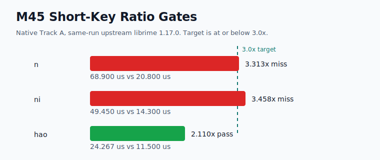
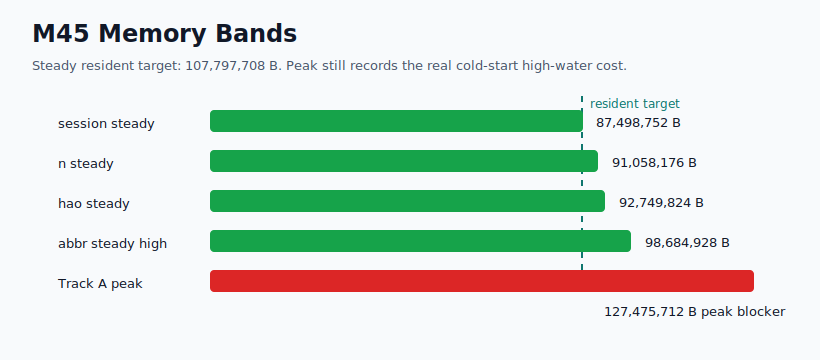

# Yune vs upstream librime root-cause dashboard

Date: 2026-06-27

This report explains current M45 native-engine evidence. It does not claim
browser, frontend, product-delivery, packaging, public-demo, deployment, WASM,
or broad product speed wins.

## Current Verdict

M45 closes as a partial native-engine root-cause milestone. It improves the
memory accounting and confirms the short-key behavior guard, but it does not
close the remaining `n`/`ni` short-prefix ratio gap or the real peak-memory
cost.

Measured outcomes:

- `hao` remains inside target at `24.267 us`, `2.110x` same-run upstream
  librime.
- `n` is now the clearest short-prefix blocker: `68.900 us`, `3.313x`.
- `ni` remains a blocker: `49.450 us`, `3.458x`.
- Short-key candidate output for `n`, `ni`, and `hao` matches upstream
  librime `1.17.0`.
- Steady Track A resident memory is below `107,797,708 B`, but first startup
  still records `127,475,712 B` peak working set, so peak memory is not solved.

## M45 Cause Map

| Area | Pre-M45 cause | M45 evidence | Current status |
| --- | --- | --- | --- |
| Track A `n` | Post-M44 diagnostic showed the one-letter row as the sharpest short-prefix owner. | Final `68.900 us`, `3.313x`; behavior guard passes; sentence model calls remain `0`. | Target missed; measured benchmark-parity blocker. |
| Track A `ni` | Same short-prefix translator/prefix path remained above target after M44. | Final `49.450 us`, `3.458x`; behavior guard passes; sentence model calls remain `0`. | Target missed; measured benchmark-parity blocker. |
| Track A `hao` | M44 had already reduced surplus short-key work enough to pass the ratio gate. | Final `24.267 us`, `2.110x`; behavior guard passes. | Target met. |
| Track A long rows | M40 full-pinyin sentence lookup path must stay isolated from short-key work. | Final ratios `0.939x` and `0.720x`; no M45 short-key or abbreviation regression recorded. | Guard passed. |
| Track A abbreviations | M42/M44 behavior and bounded-ranking improvements must remain intact. | Final `cszysmsrsd` `0.440x` and `zybfshmsru` `0.640x`, with candidate-output parity preserved. | Guard passed. |
| Track A memory | M43/M44 retained-owner reductions did not explain process peak. | Steady rows are `87-99 MB`; first startup and all rows retain `127,475,712 B` peak. | Resident target met; peak is a standing blocker. |

## Short-Key Root Cause

M45 proves the short-key gap is behavior-comparable: upstream librime and Yune
candidate output match for `n`, `ni`, and `hao`, including first-page text,
comments, order, preedit, commit preview, and page metadata.

The remaining root cause is not the sentence path. Final owner counters show
`upstream_sentence_model_calls=0` and small first-page materialization costs on
the short-key rows:

| Row | Yune median | Ratio | Prefix lookup | Rows scanned | First-page materialize | Read |
| --- | ---: | ---: | ---: | ---: | ---: | --- |
| `n` | `68.900 us` | `3.313x` | `35.100 us` | `7` | `1.700 us` | Prefix/translator constant factor still too high. |
| `ni` | `49.450 us` | `3.458x` | `35.600 us` | `14` | `5.200 us` | Prefix/translator constant factor still too high. |
| `hao` | `24.267 us` | `2.110x` | `9.300 us` | `21` | `8.600 us` | Ratio target met. |

M45 does not retain a short-key implementation branch because the explored
bounded table-range experiment did not move the measured target. The next slice
needs a narrower constant-factor owner before changing the translator path.
Because the misses are tens of microseconds, the blocker is recorded as
benchmark-parity work rather than a perceptible typing UX blocker.

## Memory Root Cause

M45 adds private-byte and peak-pagefile columns to the native benchmark harness
and uses them to split steady resident memory from high-water peak.

| Measurement | Final value | Read |
| --- | ---: | --- |
| Session steady working set | `87,498,752 B` | Below resident target. |
| Startup steady working set | `90,161,152 B` | Below resident target. |
| `n` steady working set | `91,058,176 B` | Below resident target. |
| Highest Track A steady row | `98,684,928 B` | Below resident target. |
| Track A max peak working set | `127,475,712 B` | Standing peak-cost blocker. |
| Track A max peak pagefile | `112,218,112 B` | Peak-cost signal. |

The first startup sample starts at `4,722,688 B`, reaches `90,161,152 B` after
ready, finalizes to `87,248,896 B`, and still records `127,475,712 B` peak
working set. That prevents M45 from classifying the high-water value as a pure
benchmark-cumulative artifact.

Retained owner evidence also does not name a new safe peak-moving rewrite:

| Owner | Class | Retained estimate | Read |
| --- | --- | ---: | --- |
| `poet.entries_by_code` | heap-owned reducible | `18,694,662 B` | Largest reducible owner, already reduced in M43. |
| `compact_table.storage` | mmap file-backed | `13,013,460 B` | File-backed selected storage, not a heap mirror. |
| `poet.lookup_index` | heap-owned guarded | `2,660,848 B` | Required by M40 performance. |
| Small reducible owners | heap-owned reducible | `30,875 B` | Too small to move process peak. |

M45 therefore closes memory as resident-target success with a standing peak
blocker, not as full memory success.

## Guardrails Preserved

| Gate | M45 final evidence |
| --- | --- |
| Startup/session | Startup `0.875x`, session `0.921x` same-run librime; no startup/session speed claim. |
| `zhongguo` | `61.225 us`, `0.373x` same-run librime. |
| M40 long rows | `0.939x` and `0.720x`; full-pinyin path remains separate. |
| M42/M44 abbreviations | `0.440x` and `0.640x`; candidate-output guard remains preserved. |
| Short-key output | `n`, `ni`, and `hao` match upstream candidate output. |
| Track A storage | `selected_storage=rsmarisa_byte_backed`, table/prism mmap, heap mirrors `0`, `source_fallback=false`, positive `rsmarisa` counters. |
| Track B storage | Deployed profile remains source-fallback-free; M45 makes no Track B speed claim. |

## Evidence

- M45 evidence root:
  [`./evidence/m45-native-short-key-memory-attribution/`](./evidence/m45-native-short-key-memory-attribution/)
- M45 phase-0 benchmark:
  [`./evidence/m45-native-short-key-memory-attribution/phase-0-native-baseline/`](./evidence/m45-native-short-key-memory-attribution/phase-0-native-baseline/)
- M45 phase-0 candidate oracle:
  [`./evidence/m45-native-short-key-memory-attribution/phase-0-short-key-oracle/`](./evidence/m45-native-short-key-memory-attribution/phase-0-short-key-oracle/)
- M45 phase-0 verdict:
  [`./evidence/m45-native-short-key-memory-attribution/phase-0-verdict.md`](./evidence/m45-native-short-key-memory-attribution/phase-0-verdict.md)
- M45 final benchmark:
  [`./evidence/m45-native-short-key-memory-attribution/final-native-benchmark/`](./evidence/m45-native-short-key-memory-attribution/final-native-benchmark/)
- M45 final candidate comparison:
  [`./evidence/m45-native-short-key-memory-attribution/final-candidate-comparison/oracle-vs-yune-candidate-output.md`](./evidence/m45-native-short-key-memory-attribution/final-candidate-comparison/oracle-vs-yune-candidate-output.md)
- M45 final memory attribution:
  [`./evidence/m45-native-short-key-memory-attribution/final-memory-attribution.md`](./evidence/m45-native-short-key-memory-attribution/final-memory-attribution.md)
- M45 visual evidence:
  [`./evidence/m45-native-short-key-memory-attribution/visuals/`](./evidence/m45-native-short-key-memory-attribution/visuals/)
- M45 final gates:
  [`./evidence/m45-native-short-key-memory-attribution/final-native-benchmark/final-gates.md`](./evidence/m45-native-short-key-memory-attribution/final-native-benchmark/final-gates.md)

Historical predecessor evidence remains under
[`./evidence/m44-native-performance-owner-reduction/`](./evidence/m44-native-performance-owner-reduction/).
