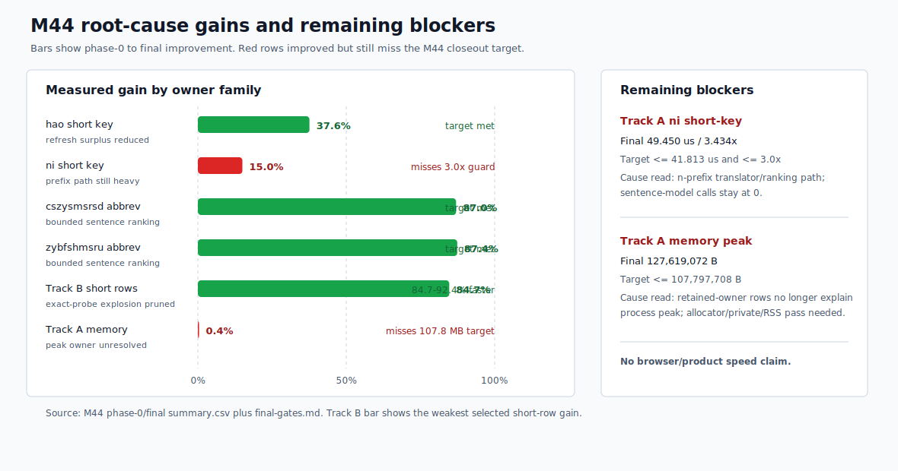

# Yune vs upstream librime root-cause dashboard

Date: 2026-06-27

This report explains current M44 native/profile-engine evidence. It does not
claim browser, frontend, product-delivery, packaging, public-demo, deployment,
or broad product speed wins.

## Current Verdict

M44 closes as a partial native/profile root-cause reduction. It removed two
large measured owners and one Track A short-key overhead, but it did not close
the memory problem or the remaining short-prefix problem.

Measured wins:

- Track A `hao`: `39.600 us` -> `24.700 us`, `37.6%` faster, final `2.123x`
  same-run librime, target met.
- Track A abbreviation rows: `cszysmsrsd` `4,201.280 us` -> `545.020 us`
  and `zybfshmsru` `4,303.820 us` -> `540.970 us`; both are about `87%`
  faster and now faster than same-run librime while preserving M42 candidate
  output.
- Track B deployed product-profile short rows: selected rows improved by
  `84.7-92.4%`, and exact-probe explosion dropped from thousands of probes per
  processed key to about one probe per processed key.

Measured blockers:

- Track A `ni`: `58.150 us` -> `49.450 us`, but final `3.434x` still misses
  the `<=41.813 us` and `<=3.0x` gates.
- Track A memory: peak moved only from `128,135,168 B` to `127,619,072 B`,
  still above the `<=107,797,708 B` memory-win target.

Post-M44 diagnostic profiling sharpens both blockers without changing the M44
closeout status. The short-key owner is broader than the final `ni` row: the
intermediate `n` row is now the clearest Track A short-prefix owner. The memory
owner is also still unresolved: repeated high-water peak stays around
`127 MB`, while steady after-ready working-set samples are lower and the
retained-owner profile explains only part of the process footprint.

## M44 Cause Map

| Area | Pre-M44 cause | M44 change | Measured gain | Current status |
| --- | --- | --- | ---: | --- |
| Track A `hao` | Short-key refresh asked for surplus first-page rows even when the final page only needed bounded output. | Restrict short-key surplus to the narrow `luna_pinyin` target set and keep only the filter cushion needed for output stability. | `37.6%` faster | Target met; `upstream_sentence_model_calls=0`. |
| Track A `ni` | The `n`/`ni` prefix path still spends too much time in bounded translator/ranking work. | Same surplus reduction helped, but did not remove the single-letter prefix owner. | `15.0%` faster | Target missed; residual short-prefix blocker. |
| Track A abbreviations | Sentence ranking expanded far past the bounded first page; candidate semantics were not the owner. | Bound abbreviation sentence ranking to the requested first page and keep M42 output parity as the guard. | `87.0-87.4%` faster | Targets met; candidate-output guard pass. |
| Track B short rows | `jyut6ping3_mobile` short-prefix alias expansion triggered thousands of exact lookup probes for one- and two-letter inputs. | Prune selected short-prefix alias exact probes in the deployed product profile. | `84.7-92.4%` faster | Targets met; 50+ guard stable. |
| Track A memory | The M43 retained owner reduction did not explain process peak; M44 found no new safe owner that moved RSS/working set materially. | Storage guards were preserved; no memory-win optimization landed. | `0.4%` peak movement | Target missed; memory remains open. |

The important split is that Track B's single-letter product row `h` is fixed
for M44, while Track A's single-letter/prefix family is not. M44 final evidence
uses `ni` as the measured blocker; the post-M44 diagnostic pass shows the
intermediate `n` row is the sharper short-prefix owner. The next Track A
short-key milestone should focus on the `n`/`ni` prefix and ranking path, not
the sentence model.

## Post-M44 Diagnostic Profiling

This pass is a bottleneck diagnostic, not a new milestone closeout. It reruns
native Track A with the intermediate `n` row added and records working-set
bands so high-water peak can be separated from steady after-ready resident
size.

Short-prefix latency:

| Row | Yune median | librime median | Ratio | Diagnostic read |
| --- | ---: | ---: | ---: | --- |
| `n` | `79.400 us` | `21.900 us` | `3.626x` | Clearest remaining Track A short-prefix owner. |
| `ni` | `53.750 us` | `15.050 us` | `3.571x` | Still misses parity; inherits the earlier `n` step. |
| `hao` | `25.667 us` | `12.100 us` | `2.121x` | M44 target remains met, but constant-factor gap remains. |

Short-prefix raw lookup evidence:

| Input | Prism completions | Table lookup codes | Raw candidates | Raw table median | Translator median | Read |
| --- | ---: | ---: | ---: | ---: | ---: | --- |
| `n` | `26` | `27` | `1,260` | `166.000 us` | `74.100 us` | Broad one-letter prefix expansion is visible before page export. |
| `ni` | `1` | `1` | `182` | `19.600 us` | `50.200 us` | Not explained by raw candidate count alone; sequence/downstream work remains. |
| `hao` | `1` | `1` | `139` | `15.500 us` | `22.533 us` | Relatively cheap after M44, but still above librime constant factors. |

Memory diagnostic:

| Measurement | Diagnostic value | Read |
| --- | ---: | --- |
| Yune Track A repeated high-water peak | `127,430,656 B` | Same max peak repeats across startup, session, short, long, and abbreviation rows. |
| Yune session after-ready median | `87,240,704 B` | Steady session sample is about `40 MB` below the high-water peak. |
| Yune `n` after-ready median | `90,714,112 B` | Short-prefix steady footprint is much lower than peak. |
| Yune longest diagnostic row after-ready median | `97,677,312 B` | Longest sampled row remains about `30 MB` below peak. |
| librime Track A max peak band | `13,897,728-18,186,240 B` | Large process-memory gap remains real. |
| Reducible retained owner still named | `18,694,662 B` | `poet.entries_by_code`; not enough to explain process peak. |
| Mapped table bytes | `13,013,460 B` | File-backed table storage; not a selected-table heap mirror. |

This supports a two-part next attack. For short-key latency, target a bounded
borrowed prefix path with early stop after the first-page order is proven, and
guard it with upstream candidate-output evidence for `n`, `ni`, and `hao`.
For memory, do not start with another structural storage rewrite. First split
private heap, file-backed mapped pages, allocator high-water behavior, and
steady after-ready resident size; only authorize a code change if that pass
names a reducible, peak-moving owner.

## Abbreviation Owner

M44 proves the abbreviation root cause was bounded ranking, not candidate-output
semantics. Phase 0 showed the abbreviation rows spending roughly four
milliseconds per processed key in sentence ranking. Final M44 drops ranking to
about four hundred microseconds per processed key while preserving the M42 guard.

| Row | Phase 0 median | Final median | Final ratio vs librime | M44 status |
| --- | ---: | ---: | ---: | --- |
| `cszysmsrsd` | `4,201.280 us` | `545.020 us` | `0.445x` | Target met; behavior guard pass. |
| `zybfshmsru` | `4,303.820 us` | `540.970 us` | `0.634x` | Target met; behavior guard pass. |

The behavior guard remains strict: final candidate output matches upstream for
candidate text, comments, order, context preedit, commit preview, and first-page
metadata. The known RimeGetInput segmentation caveat remains unchanged from the
M42/M43 evidence and is not a new M44 regression.

## Short-Key Owner

M44 reduced unnecessary first-page surplus work enough for `hao`, but `ni`
still exposes the prefix owner. The post-M44 diagnostic makes the owner more
specific: `n` is slower than `ni` in absolute time and expands to `27` table
lookup codes with `1,260` raw candidates before page export.

| Row | Phase 0 median | Final median | Same-run ratio | M44 status |
| --- | ---: | ---: | ---: | --- |
| `hao` | `39.600 us` | `24.700 us` | `2.123x` | Target met. |
| `ni` | `58.150 us` | `49.450 us` | `3.434x` | Target missed. |

The residual `ni` cause is not the upstream sentence model:
`upstream_sentence_model_calls=0` remains true. The next short-key optimization
should separate the `n` prefix lookup, candidate ranking, comment/quality
formatting, duplicate handling, and first-page export costs. It should stay
scoped to the short-prefix path and must not widen M40 long-row or M42
abbreviation behavior.

## Track B Product-Profile Owner

Track B had a different cause from Track A: short product-profile inputs were
exploding through alias spelling exact probes. M44 makes this explicit and
reduces the selected counters by far more than the 75% target.

| Row | Phase 0 median | Final median | Latency gain | Exact probes per processed key |
| --- | ---: | ---: | ---: | ---: |
| `h` | `21,832.900 us` | `1,669.600 us` | `92.4%` | `7,627.000` -> `1.000` |
| `ha` | `11,328.800 us` | `1,141.650 us` | `89.9%` | `3,814.000` -> `1.000` |
| `hai` | `7,550.433 us` | `763.933 us` | `89.9%` | `2,544.667` -> `1.000` |
| `hau` | `7,617.567 us` | `774.600 us` | `89.8%` | `2,544.667` -> `1.000` |
| `nei` | `3,572.400 us` | `398.933 us` | `88.8%` | `1,572.667` -> `1.000` |
| `ngo` | `3,752.900 us` | `573.333 us` | `84.7%` | `1,573.333` -> `1.000` |

The long Track B 50+ guard remains stable and source-fallback-free. This is a
native deployed-profile result only; it is not a browser or product-delivery
speed claim.

## Memory Owner

M44 did not solve memory. The final storage guard is good, but good storage
guards are not the same thing as a process memory win:

| Metric | Phase 0 | Final | Read |
| --- | ---: | ---: | --- |
| Track A peak working set | `128,135,168 B` | `127,619,072 B` | Only `516,096 B` movement; still above target. |
| Historical M42 `+5%` ceiling | n/a | `125,763,994 B` | Still breached; M44 is not a memory win. |
| M44 memory-win target | n/a | `<=107,797,708 B` | Not met. |
| `poet.entries_by_code` retained bytes | `18,694,662 B` | `18,694,662 B` | M43-packed owner remains; M44 did not reduce it further. |
| selected table/prism heap mirrors | n/a | `0 B` | Storage guard pass. |
| source fallback | n/a | `false` | Storage guard pass. |

The current root-cause read is that retained owner rows no longer explain the
whole-process peak. The next memory pass should profile allocator/private/RSS
owners and mapped page behavior before attempting another storage rewrite.
The old M42 single-run peak `119,775,232 B` remains useful historical context,
but the current comparable repeated M43/M44 band is around `127-128 MB`.

The post-M44 diagnostic strengthens that read. Every sampled Yune Track A
workload reports the same `127,430,656 B` high-water peak, but after-ready
medians sit much lower: session `87,240,704 B`, `n` `90,714,112 B`, and the
longest sampled abbreviation row `97,677,312 B`. That pattern looks more like a
high-water or transient residency question than a simple retained-structure
owner. The next memory milestone should therefore treat the `<=107,797,708 B`
target as blocked until private heap, mmap resident pages, and allocator
high-water behavior are measured separately.

## Guardrails Preserved

| Gate | M44 final evidence |
| --- | --- |
| Startup/session | Startup `0.790x`, session `0.814x` same-run librime; no startup/session speed claim. |
| `zhongguo` | `60.338 us`, `0.353x` same-run librime. |
| M40 long rows | `0.988x` and `0.739x`; no abbreviation or short-key fast-path counters on the long-row paths. |
| M42 abbreviations | Candidate text, comments, order, preedit, commit preview, and first-page metadata match upstream. |
| Track A storage | `selected_storage=rsmarisa_byte_backed`, table/prism mmap, heap mirrors `0`, `source_fallback=false`, positive rsmarisa counters. |
| Track B storage | deployed profile remains source-fallback-free. |

## Evidence

- M44 phase-0 benchmark:
  [`./evidence/m44-native-performance-owner-reduction/phase-0-native-benchmark/`](./evidence/m44-native-performance-owner-reduction/phase-0-native-benchmark/)
- M44 final benchmark:
  [`./evidence/m44-native-performance-owner-reduction/final-native-benchmark/`](./evidence/m44-native-performance-owner-reduction/final-native-benchmark/)
- M44 abbreviation candidate-output parity:
  [`./evidence/m44-native-performance-owner-reduction/final-native-benchmark/oracle-vs-yune-candidate-output.md`](./evidence/m44-native-performance-owner-reduction/final-native-benchmark/oracle-vs-yune-candidate-output.md)
- M44 final gates:
  [`./evidence/m44-native-performance-owner-reduction/final-native-benchmark/final-gates.md`](./evidence/m44-native-performance-owner-reduction/final-native-benchmark/final-gates.md)
- M44 visual evidence:
  [`./evidence/m44-native-performance-owner-reduction/visuals/`](./evidence/m44-native-performance-owner-reduction/visuals/)
- Post-M44 bottleneck diagnostic:
  [`./evidence/post-m44-bottleneck-profiling/phase-0-native-diagnostic/`](./evidence/post-m44-bottleneck-profiling/phase-0-native-diagnostic/)
- Post-M44 bottleneck diagnostic summary:
  [`./evidence/post-m44-bottleneck-profiling/phase-0-native-diagnostic/analysis-summary.md`](./evidence/post-m44-bottleneck-profiling/phase-0-native-diagnostic/analysis-summary.md)
- Post-M43 bottleneck provenance:
  [`./evidence/post-m43-bottleneck-analysis/`](./evidence/post-m43-bottleneck-analysis/)
- Historical M43 memory-owner evidence:
  [`./evidence/m43-native-memory-short-key-owner-reduction/`](./evidence/m43-native-memory-short-key-owner-reduction/)
