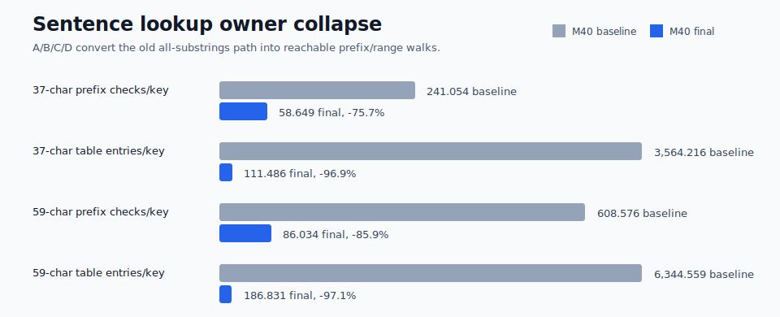
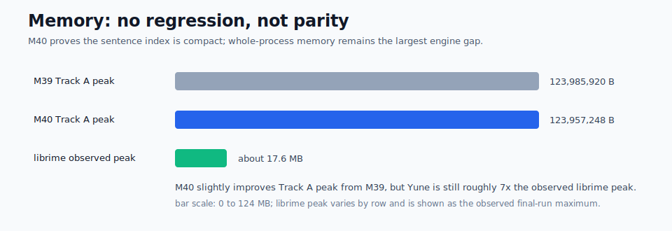

# Yune vs upstream librime root-cause dashboard

Date: 2026-06-26

This report explains M40 native-engine behavior. It does not claim browser,
frontend, product-delivery, packaging, or public-demo speed wins.

## Current Verdict

M39 removed the catastrophic Track A long-input failure, but it left one
remaining native owner: `UpstreamSentenceModel::word_graph_for_input` still had
an all-substrings lookup shape. The 59-character row still averaged about
`608.576` code-prefix checks/key and `6,344.559` table entries considered/key
in the M40 phase-0 baseline.

M40 changes that shape. The final native path now builds one compact
`SentenceLookupIndex` over existing sorted sentence-model entries, walks only
from reachable start vertices, narrows sorted ranges by prefix, emits bounded
edges from exact ranges, and records the cross-keystroke graph rebuild owner.
The result is native Track A long-row parity against same-run upstream librime:

- `ceshiyixiachangjushuruxingnengzenyang`: Yune `289.914 us`, librime
  `295.800 us`, ratio `0.980x`.
- `zhegeyinqingqishiyinggaizhichichaochangjuzishurucainengyong`: Yune
  `494.017 us`, librime `694.175 us`, ratio `0.712x`.

Track B remains a guard row, not an M40 optimization target. Its 50+ Cantonese
profile row reports `196.387 us/op` median, +`4.0%` versus M39
`188.857 us/op`. Its p95 is `605.125 us/op` because two measured Windows
scheduling outliers landed in the 20-sample row, so p95 is recorded as a
caveat rather than an M40 win.

## Native Bottleneck Map

| Area | M39 / M40 baseline finding | M40 final status |
| --- | --- | --- |
| Track A 37-character row | Baseline `500.249 us`, with `432.072 us/key` in the upstream sentence model, `241.054` prefix checks/key, and `3,564.216` table entries/key. | Final `289.914 us`, same-run librime `295.800 us`, ratio `0.980x`; prefix checks down `75.7%`, table entries down `96.9%`. |
| Track A 59-character row | Baseline `898.641 us`, with `806.622 us/key` in the upstream sentence model, `608.576` prefix checks/key, and `6,344.559` table entries/key. | Final `494.017 us`, same-run librime `694.175 us`, ratio `0.712x`; prefix checks down `85.9%`, table entries down `97.1%`. |
| Incomplete pinyin rows | Baseline rows stayed bounded, but still used the old prefix scan shape and exported `0` candidates. | Final `cszysmsrsd` `24.820 us` and `zybfshmsru` `26.350 us`; no table-entry explosion, but still `abi_candidates_exported=0`, so these are behavior probes rather than performance wins. |
| Cross-keystroke graph rebuild | Required M40 verdict after A/B/C/D. | Measured at `17.303 us/key` and `31.014 us/key`; not the top remaining long-row owner, so no incrementality path was added. |
| Storage | Track A hot path already used `rsmarisa_byte_backed` selected storage. | Preserved: table/prism `mmap`, selected heap mirrors `0`, source fallback `false`, positive `rsmarisa` counters. |
| Memory | M40 could not close by adding a large sentence-index heap mirror. | Final Track A peak `123,957,248 B`, below M39 `123,985,920 B`; sentence index stores numeric ranges into existing entries. |

## Owner Movement

| Row | Baseline owner | Final owner | Movement |
| --- | --- | --- | --- |
| `ceshiyixiachangjushuruxingnengzenyang` | `upstream_sentence_model_ns` `432.072 us/key`, `241.054` prefix checks/key, `3,564.216` table entries/key. | `upstream_sentence_model_ns` `222.072 us/key`, `58.649` prefix checks/key, `111.486` table entries/key. | The old all-substrings owner is replaced by an indexed reachable walk. |
| `zhegeyinqingqishiyinggaizhichichaochangjuzishurucainengyong` | `upstream_sentence_model_ns` `806.622 us/key`, `608.576` prefix checks/key, `6,344.559` table entries/key. | `upstream_sentence_model_ns` `399.215 us/key`, `86.034` prefix checks/key, `186.831` table entries/key. | The final row beats same-run librime despite the sentence model remaining the main native owner. |
| `cszysmsrsd` | `43.800` prefix checks/key, no table entries, and `0` exported candidates. | `3.600` prefix checks/key, no table entries, and `0` exported candidates. | Prefix early-breaks bound incomplete input; output parity is unverified. |
| `zybfshmsru` | `43.800` prefix checks/key, `22.800` table entries/key, and `0` exported candidates. | `3.600` prefix checks/key, no table entries, and `0` exported candidates. | Prefix early-breaks avoid the invalid table walk; output parity is unverified. |

## Strategy Bundle

M40 did not use four unrelated shortcuts. The final path is one data structure
and one graph walk:

1. Exact ranges: sorted code ranges into `entries_by_code` replace repeated
   partition-point lookup in the hot path.
2. Reachable vertices: `word_graph_for_input` starts at position `0` and skips
   start positions that have not been reached by a graph edge.
3. Prefix filtering: `SentenceLookupIndex::walk_from` narrows the sorted range
   for each prefix and breaks when the next substring is not a valid prefix.
4. Phrase-index walk: the range walk behaves like a compact phrase-index node
   walk without storing cloned strings or a separate heap trie.

Final counters prove all four are active:

| Counter family | 37-character row | 59-character row |
| --- | ---: | ---: |
| exact range hits/key | `22.189` | `31.186` |
| unreachable starts skipped/key | `7.919` | `13.508` |
| prefix hits/key | `51.162` | `72.305` |
| prefix early breaks/key | `7.486` | `13.729` |
| phrase-index walks/key | `9.595` | `16.017` |
| phrase-index nodes/key | `51.162` | `72.305` |
| phrase-index emitted ranges/key | `22.189` | `31.186` |
| partition fallback calls/key | `0.000` | `0.000` |

## M40-ENGINE-12 Verdict

The benchmark types every prefix of the long rows, so repeated graph rebuild
was a required second-order owner check. M40 records discarded rebuild
characters but does not reuse prior graphs:

| Row | Sentence model total | Graph rebuild | Translator median | Verdict |
| --- | ---: | ---: | ---: | --- |
| 37-character Track A row | `222.072 us/key` | `17.303 us/key` | `286.276 us` | Rebuild is not the top owner. |
| 59-character Track A row | `399.215 us/key` | `31.014 us/key` | `490.203 us` | Rebuild is not the top owner. |

Because graph rebuild is not the top remaining long-row owner after A/B/C/D,
M40 closes without a bounded incrementality implementation. That is a measured
verdict, not an assumption.

## Guardrails Preserved

- Startup/session remain within same-run librime: startup `0.913x`, session
  `0.934x`.
- `hao`, `ni`, and `zhongguo` remain inside the `5x` guard: `3.237x`,
  `3.867x`, and `0.323x`.
- Track A selected storage remains `rsmarisa_byte_backed`, with table/prism
  `mmap`, selected heap mirrors `0`, `source_fallback=false`, and positive
  runtime `rsmarisa` exact/prefix counters.
- Track A final peak working set is `123,957,248 B`, below M39
  `123,985,920 B`.
- Bounded output/context remains active; no full-list fallback becomes the
  Track A owner.
- Upstream-observable behavior and touched compatibility paths are covered by
  focused tests plus the full workspace test suite.

## Remaining Gaps Ranked

| Rank | Gap | Evidence | Next diagnostic action |
| ---: | --- | --- | --- |
| 1 | Whole-process memory | Track A final peak is `123,957,248 B`; same-run librime peaks are roughly `13-17 MB` depending row. | Run a heap-owner profile before changing storage again. M40 proves the new sentence index is not the regression owner. |
| 2 | Track A incomplete-pinyin output parity | `cszysmsrsd` and `zybfshmsru` are bounded but export `0` candidates while same-run librime spends substantially more time. | Capture librime output and decide whether this is a missing abbreviation-expansion behavior or an intentionally empty Yune result. Do not treat the low ratio as a speed win until output parity is known. |
| 3 | Track B profile/native enumeration | The protected 50+ row is guarded, but Track B remains on a separate no-marisa/profile path. | Open a separate TypeDuck-profile plan only if a named product row needs it. |
| 4 | Track A short-key ratios | `hao` and `ni` are `3.237x` and `3.867x`, but absolute medians are `38.200 us` and `56.850 us`. | Defer unless a future native parity milestone sets a stricter short-key target. |
| 5 | Browser/user-perceived startup | No M40 browser evidence was collected. | Requires a separate web plan and real-browser evidence. Native M40 evidence cannot close it. |

## Next Work Boundary

M40 closes the native Track A long-row owner it was scoped to close. The next
optimization milestone should not continue mining `luna_pinyin` long-row
latency unless a new native-engine target proves a fresh owner. The highest
near-term application-visible problem is now the `yune-web` harness startup
path, but that work must be measured and claimed separately from this native
engine report.

The web harness effort should start from real-browser startup evidence and
split browser shell, asset delivery, worker/WASM startup, filesystem/cache,
schema deploy/reuse, and engine schema selection. M40 native numbers are useful
as an engine baseline only; they do not prove web startup, browser typing, or
public-demo delivery speed.

## What Changed

- Added `crates/yune-core/src/poet/index.rs` with a compact
  `SentenceLookupIndex`.
- Built numeric exact-code ranges over existing sorted `ModelEntry` values.
- Routed `word_graph_for_input` through reachable starts and prefix range
  walks.
- Bounded graph edge emission from exact ranges before the later span-level
  truncation.
- Added M40 counters for index build, exact range hits/misses, prefix filter
  hits/misses/early breaks, reachable and skipped starts, phrase-index walks,
  phrase-index nodes/emitted ranges, partition fallback calls, graph rebuild
  time, and discarded rebuild characters.
- Added incomplete-pinyin rows to the native benchmark defaults as boundedness
  and behavior probes, not comparable performance wins.

## Remaining Caveats

Yune still has a larger whole-process memory footprint than librime in absolute
terms. M40 does not claim memory parity; it proves no Track A peak regression
while avoiding cloned-string or trie-shaped sentence-index mirrors.

Track B remains profile-specific. The final M40 evidence includes the 50+
`jyut6ping3_mobile` guard row, but M40 does not optimize or claim Track B
sentence lookup parity.

The incomplete-pinyin rows are also not a parity claim. M40 bounds their lookup
work, but both rows export `0` candidates. A future oracle-output check must
decide whether Yune is missing upstream `luna_pinyin` abbreviation behavior or
correctly returning no candidates for those probes.

Future browser or product-delivery speed claims require separate rebuilt
runtime and real-browser evidence. M40 supplies no such claim.
