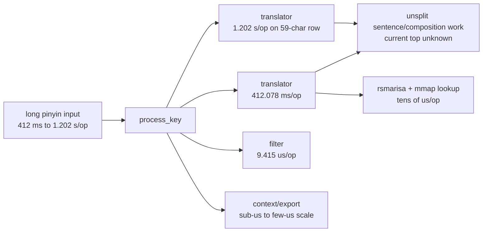
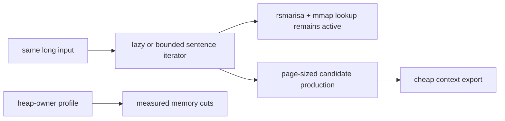
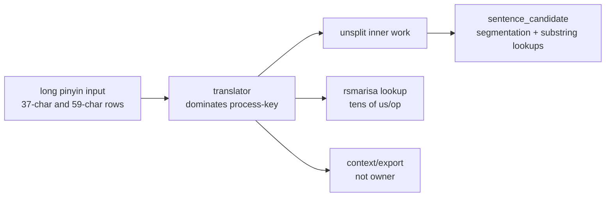

# Yune vs upstream librime root-cause dashboard

Date: 2026-06-25

Companion dashboard:
[`yune-vs-librime-performance.md`](./yune-vs-librime-performance.md).

This report describes the current bottleneck map. Historical milestone detail is
kept out of the main path and linked at the end.

## Optimization Strategy So Far

The engine has already moved through several optimization layers:

- measurement fairness: native in-process, same-run Yune/librime comparison;
- deployed-data shape: compact table/prism storage, mapped selected bytes, and
  no selected table/prism heap mirror;
- lookup backend: real `rsmarisa` table lookup on the upstream Track A hot path;
- output shape: bounded first-page candidate production and page-sized context
  export;
- lifecycle shape: startup/session attribution and same-schema fast paths;
- reporting shape: separate latency, memory, allocation, lookup, translation,
  context, and behavior claims.

The remaining work is not allowed to trade one dimension for another. M39 must
preserve the M38 startup/session gains, the short-input rows, mmap/`rsmarisa`
activation, page-bounded output, and behavior parity while fixing long-input
latency and measuring memory owners. A long-input win that regresses startup,
short keys, memory, or the storage backend is not a clean closeout.

## Current Verdict

M38 closed the original short/medium native `luna_pinyin` latency target. The
selected Track A path uses `rsmarisa_byte_backed` deployed table storage,
table/prism bytes are mmap-backed, and the target rows `hao`, `ni`, and
`zhongguo` are within the M38 gates.

The post-M38 long-input baseline shows broader typing parity is still open:

- `ceshiyixiachangjushuruxingnengzenyang`: Yune `412,192.727 us`, librime
  `294.151 us`, `1,401.296x` slower.
- `zhegeyinqingqishiyinggaizhichichaochangjuzishurucainengyong`: Yune
  `1,202,404.588 us`, librime `702.212 us`, `1,712.310x` slower. One full
  Yune input sample is about `70.942 s`; librime is about `41.431 ms`.
- Median working set: Yune `107,839,488-114,610,176 B`, librime
  `11,091,968-15,638,528 B`, `7.33-9.72x` in the higher-sample baseline; the
  59-character stress row is `7.22x`.
- Max peak: Yune `163,057,664 B`, librime `14,045,184-15,659,008 B`,
  `10.41-11.61x` in the higher-sample baseline; the 59-character stress row is
  `10.10x`.

The top current latency owner is not raw table lookup and not marisa activation.
It is unsplit translator time on long composition.

## Bottleneck Map

| Priority | Bottleneck | Confidence | Evidence | Next step |
| --- | --- | --- | --- | --- |
| 1 | Long-composition translator path | Hard-measured outer owner; inner owner not split | 37-character row is `1,401.296x` slower; 59-character row is `1,712.310x` slower. Translator is about `412 ms/op` to `1.202 s/op`; raw table lookup is only `33.400-57.500 us`; context export is `5.500-6.400 us`; storage is `rsmarisa_byte_backed` and mmap-backed. | Add fine spans inside sentence/full-list fallback, especially `StaticTableTranslator::sentence_candidate`, substring lookup loops, path cloning, and candidate assembly. |
| 2 | Whole-process memory | Measured gap; owner unknown | Median working set `7.33-9.72x`; peak `10.41-11.61x`. Selected table/prism heap mirrors are already `0`, so the remaining owner is elsewhere. | Run heap-owner profiling before choosing memory optimizations. |
| 3 | Short/medium row preservation | Measured pass | Startup/session pass; `hao` and `ni` remain under `5x`; `zhongguo` is faster than librime. | Keep these rows as regression gates during M39. |
| 4 | Product-style path | Secondary to current upstream comparison | M38 product redeploy check remains fresh, byte-backed, mmap-backed, and not source-fallback, but product rows are not the current Yune-vs-librime Track A target. | Keep product evidence separate from upstream Track A claims. |

## Bottleneck Visuals

Current long-row owner scale, using process-key time as the denominator. These
are not additive buckets; they show the relative size of measured signals.

```text
37-character row, Yune process-key time

translator bucket          99.99% |##################################################|
exact+prefix lookup time    0.01% |..................................................|
filter pipeline             0.00% |..................................................|
ABI/context export          0.00% |..................................................|

59-character row, Yune process-key time

translator bucket          99.997% |##################################################|
exact+prefix lookup time    0.008% |..................................................|
filter pipeline             0.001% |..................................................|
ABI/context export          0.000% |..................................................|
```

The current measured shape is therefore:



The target shape for the next round is evidence-driven, not assumed:



The key target is to move long composition from a full translator stall into a
lazy or bounded path while preserving the M38 storage facts: `rsmarisa` active,
table/prism mapped, and no selected table/prism heap mirrors.

## Long-Input Diagnosis

The long rows make the current performance story much sharper. The 59-character
row is a required real-user-range stress gate, not an optional edge case.

| Input | Length | Yune full-input sample | librime full-input sample | Ratio |
| --- | ---: | ---: | ---: | ---: |
| `ceshiyixiachangjushuruxingnengzenyang` | 37 | `15.251 s` | `10.883 ms` | `1,401.296x` |
| `zhegeyinqingqishiyinggaizhichichaochangjuzishurucainengyong` | 59 | `70.942 s` | `41.431 ms` | `1,712.310x` |

They rule out the main false leads:

| Hypothesis | Current read |
| --- | --- |
| `rsmarisa` is not being used | False for Track A. The row records positive `rsmarisa` exact and prefix counters. |
| mmap is not active | False for Track A. Table and prism mapping are `mmap`. |
| raw table lookup dominates | False. Raw table median is `33.400-57.500 us`, far below the `412 ms` to `1.202 s` translator cost. |
| context export dominates | False. Context export is `5.500-6.400 us` in raw rows and tiny in counters. |
| output materialization dominates | Not supported. Owned candidates are about `3.108/op`; ABI allocations are tiny. |
| translator internals dominate | Supported. Translator time is about `412,078.328 us/op` on the 37-character row and `1,202,364.464 us/op` on the 59-character row, nearly all process-key time. |

The leading code-inspection suspect is the long-composition sentence/full-list
fallback path, especially `StaticTableTranslator::sentence_candidate`. That path
performs dynamic substring segmentation and lookup work. The existing counters
do not yet split this work into enough inner owners, so M39 should instrument
before rewriting. The two long rows show unacceptable scaling, but they are not
enough to fit a trustworthy complexity curve by themselves.



## Memory Diagnosis

The benchmark already records a real memory baseline:

| Memory metric | Current result |
| --- | --- |
| Track A median working set | Yune `107,839,488-114,728,960 B`; librime `11,091,968-15,884,288 B`; `7.22-9.72x` across the current baseline plus 59-character stress row. |
| Track A max peak | Yune `163,057,664-163,119,104 B`; librime `14,045,184-16,154,624 B`; `10.10-11.61x`. |
| Selected table/prism heap mirrors | `0` bytes on the M38 Track A hot path. |
| Owner confidence | Working-set gap is measured; heap owners are not attributed. |

The key implication is that the remaining memory gap is no longer explained by
selected table/prism heap mirrors. M39 should not guess at a memory fix from
working-set rows alone. It needs heap-owner attribution first.

## What Librime Teaches Here

librime's useful lessons for the next round are narrow:

- long composition must be lazy or bounded inside the sentence/path logic, not
  only at candidate output;
- deployed table/prism bytes should stay mapped and shared;
- whole-process memory needs measured owners, not storage-shape assumptions;
- page export should remain cheap and page-sized.

Yune has already adopted several of these lessons for the short/medium Track A
path. The long row shows the sentence/composition path has not caught up.

## M39 Planning Implications

M39 should not start with a broad rewrite. It should start with attribution.

Hard gates for the next plan:

1. Keep the same-run Yune/librime rows: startup, session, `hao`, `ni`,
   `zhongguo`, `ceshiyixiachangjushuruxingnengzenyang`, and
   `zhegeyinqingqishiyinggaizhichichaochangjuzishurucainengyong`.
2. Preserve `rsmarisa_byte_backed`, table/prism `mmap`, zero selected
   table/prism heap mirror bytes, and positive rsmarisa counters.
3. Split long-row translator time into inner spans before optimizing.
4. Require heap-owner profiling before memory reduction claims.
5. Keep native engine claims separate from browser/frontend/product delivery.

Likely instrumentation to add:

- sentence/full-list fallback span;
- `StaticTableTranslator::sentence_candidate` total span;
- length-curve rows around short, medium, 37-character, 50+ character, and
  59-character uninterrupted input;
- substring segmentation loop count;
- segmentation/path count and beam/prune counters;
- exact/prefix lookup time inside sentence candidate generation;
- path clone/allocation count;
- candidate assembly count;
- filter/userdb/ranker contribution for long composition;
- heap-owner profile for Track A startup/session/key rows.

## Brief History

Yune has moved substantially since the early performance rounds:

- fairness and cache work removed obvious comparison noise;
- compact table/prism storage removed large upstream dictionary-local costs;
- product-path work made stale compiled artifacts, page-bounded output, and
  mapped product storage visible and testable;
- M38 activated the real upstream `luna_pinyin` marisa table through
  `rsmarisa` with mapped table/prism bytes and closed the original M38 target
  rows;
- the post-M38 long-input baseline exposed the next real engine gap.

Historical detail lives in completed plans and evidence:

- [`../plans/completed/m38-plan-engine-performance-parity.md`](../plans/completed/m38-plan-engine-performance-parity.md)
- [`../plans/completed/m37-plan-engine-hyper-optimization.md`](../plans/completed/m37-plan-engine-hyper-optimization.md)
- [`evidence/m38-engine-performance-parity/`](./evidence/m38-engine-performance-parity)
- [`evidence/m37-engine-hyper-optimization/`](./evidence/m37-engine-hyper-optimization)
- [`evidence/m36-product-path/`](./evidence/m36-product-path)
- [`evidence/m35-compact-table-prism-storage/`](./evidence/m35-compact-table-prism-storage)
- [`evidence/m34-queryable-table-prism/`](./evidence/m34-queryable-table-prism)
