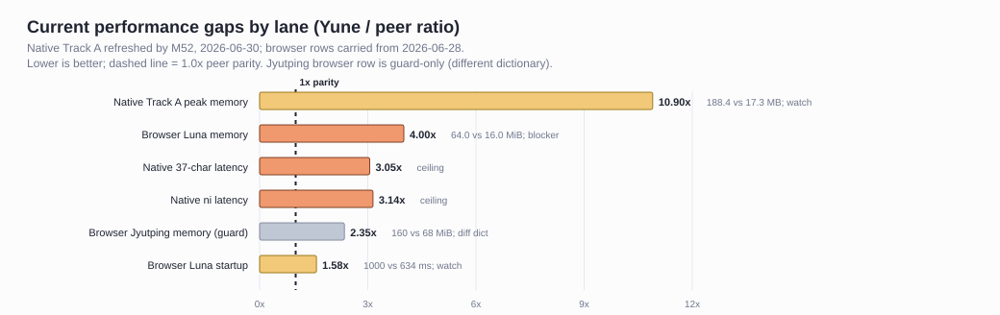
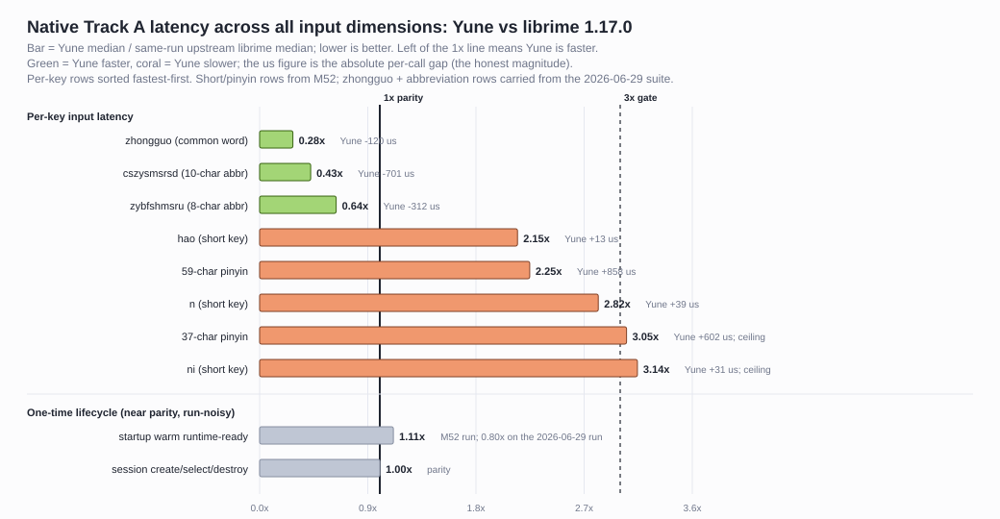
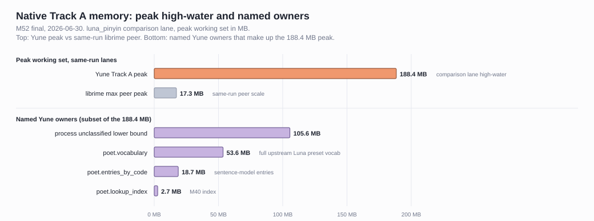
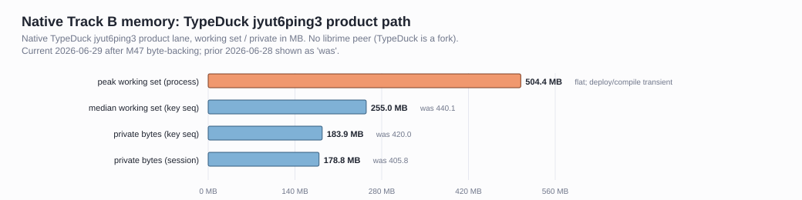

# Current Yune Root-Cause Dashboard

Date: 2026-07-04

This report keeps only the current root-cause read. Older milestone narratives, WEB-01/WEB-02/WEB-03 closeout detail, and superseded measurements remain in [`history/2026-06-28-yune-vs-librime-root-cause-analysis-pre-current-dashboard.md`](./history/2026-06-28-yune-vs-librime-root-cause-analysis-pre-current-dashboard.md).

The native lane was refreshed by the M55 partial closeout ratchet on 2026-07-04. Browser rows are carried forward from the 2026-06-28 Playwright run.

## Technical Summary

- **Current native guardrail owner**: M52 remains the standing green native Track A regression gate. M55 produced a broader ratchet artifact, but the final M55 gate is red and therefore does not supersede M52.
- **Current native memory disposition**: M55 byte-backed the large Luna poet payload owners. Diagnostic evidence moves `poet.vocabulary`, `poet.entries_by_code`, and the abbreviation vocabulary to `mmap_file_backed` poet artifact bytes, with final named heap-owned owner bytes at `826,679 B`. The fresh closeout benchmark reports Track A peak `110,542,848 B`.
- **Current native latency disposition**: the byte-backed storage access path is too slow for the current ratchet. The final closeout run fails the 37-character row at `5.964x` and the 59-character row at `4.030x`; Track B product long-row latency also fails at `414.059 us` against a `375.253 us` ceiling.
- **Current browser fair memory owner**: the fair `luna_pinyin` browser gap is `64.0 MiB` Yune public demo versus `16.0 MiB` My RIME (carried 2026-06-28).
- **Current Jyutping launch state**: the shipping public-demo Jyutping path is byte-backed at `160.0 MiB`, not the old `893.1 MiB` source-fallback shape.

## Current Gap Map

| Area | Current root cause | Evidence | Current status |
| --- | --- | --- | --- |
| Native Track A standing guardrail | The last green all-required standing guard is M52 | M52 `track-a-thresholds.csv`; final M52 `threshold-check.csv` all pass | standing guard |
| M55 ratchet handoff | Phase 2 byte-backed poet storage fails latency ceilings | M55 final `threshold-check.csv` fails 37-char, 59-char, and Track B product latency | partial/no-go; no handoff |
| Native Track A memory | Full Luna poet payload was heap-owned; M55 moves it to file-backed poet bytes | final peak `110,542,848 B`; diagnostic probe `poet.vocabulary` `25.5 MB` and `poet.entries_by_code` `3.0 MB` as `mmap_file_backed` | structural memory improvement, not a green gate |
| Native long-row latency | Byte-backed poet access and sentence graph constant factors dominate after storage rewrite | 37-char `1,764.127 us` vs librime `295.800 us`; 59-char `2,710.963 us` vs `672.759 us` | measured no-go |
| Track B product long-row guard | Shared storage/access changes leave product long-row latency above the absolute ceiling | `414.059 us` observed vs `375.253 us` ceiling | measured no-go |
| Browser `luna_pinyin` memory | Yune WASM/runtime floor still larger than My RIME | `64.0 MiB` vs `16.0 MiB`; same schema (carried) | blocker |
| Browser `luna_pinyin` startup | Yune public-demo startup still slower | `1000 ms` vs My RIME `634 ms` (carried) | watch |
| Browser Jyutping | Larger TypeDuck profile; not a peer-comparable lane | Yune `160.0 MiB`, My RIME Jyutping `68.0 MiB` on different dictionary (carried) | guard only |

## Native Track A Cause

M55 changed the storage model for the upstream Luna poet sentence model. The large retained heap payloads were real reduction owners, and the byte-backed artifact path is active on the native product path. That storage move, however, changes per-lookup access cost enough that the full latency ratchet fails.

Current native latency rows from the final M55 closeout run:

| Row | Yune median | librime median | Ratio | Current cause |
| --- | ---: | ---: | ---: | --- |
| `n` | `58.300 us` | `21.000 us` | `2.776x` | M55 guard pass; short-key gap remains |
| `ni` | `43.800 us` | `14.300 us` | `3.063x` | M55 guard pass; not match-or-beat |
| `hao` | `24.867 us` | `11.633 us` | `2.138x` | M55 guard pass |
| 37-char pinyin | `1,764.127 us` | `295.800 us` | `5.964x` | byte-backed poet access plus sentence graph cost |
| 59-char pinyin | `2,710.963 us` | `672.759 us` | `4.030x` | byte-backed poet access plus sentence graph cost |
| `zhongguo` (common word) | `45.312 us` | `171.438 us` | `0.264x` | Yune faster; win-row guard pass |
| `cszysmsrsd` (10-char abbr) | `594.790 us` | `1,213.090 us` | `0.490x` | Yune faster; win-row guard pass |
| `zybfshmsru` (8-char abbr) | `595.470 us` | `857.600 us` | `0.694x` | Yune faster; win-row guard pass |

M55 therefore does not claim native match-or-beat. The current root cause is no longer "large heap-owned poet payloads" alone; it is the memory/latency trade in the byte-backed poet access path plus the existing sentence graph constant factors. Any continuation needs a new owner-evidenced plan that can reduce this cost without loosening the ratchet, changing candidate output, or adding retained heap indexes.

## Native Memory Cause

Native Track A memory is improved but not handed over as a green M55 gate:

| Measurement | Current value | Read |
| --- | ---: | --- |
| M55 final Track A max peak working set | `110.5 MB` | release closeout ratchet; memory guard pass |
| M52 Track A max peak working set | `188.4 MB` | previous current dashboard value |
| M52 librime Track A max peer peak | `17.3 MB` | same-run peer scale from standing M52 guard |
| M55 diagnostic steady post-typing working set | `100.1 MB` | native diagnostic probe |
| M55 diagnostic steady post-typing private bytes | `62.8 MB` | Windows proxy, not iOS `phys_footprint` |
| `poet.vocabulary` | `25.5 MB` | `mmap_file_backed`, `poet_bin:mmap` |
| `poet.entries_by_code` | `3.0 MB` | `mmap_file_backed`, `poet_bin:mmap` |
| `poet.lookup_index` | `159,816 B` | guarded heap owner |
| final named heap-owned owner bytes | `826,679 B` | diagnostic native probe |

This does not invalidate M47. M47's comments-intact `jyut6ping3_mobile` keyboard profile remains the separate iOS-target lane and reports about `22 MB` private in the lean native probe. The M55 values are the full `luna_pinyin` Track A peer-comparison harness after M48 loaded the upstream preset vocabulary.

## Native Track B Cause (product lane)

Track B is the native TypeDuck `jyut6ping3` product path and is a separate lane from Track A: it has no librime peer, so the read is absolute cost plus the M47 byte-backing trajectory. M55 uses Track B only as a regression guard. The final M55 closeout run fails the Track B long-row latency guard:

| Row | Observed | Ceiling | Status |
| --- | ---: | ---: | --- |
| 50+ key-sequence latency | `414.059 us` | `375.253 us` | fail |
| key-sequence median working set | `79,675,392 B` | `280,518,656 B` | pass |
| key-sequence max peak working set | `510,038,016 B` | `564,065,075 B` | pass |
| key-sequence median private bytes | `35,639,296 B` | `200,620,851 B` | pass |

This failure prevents M55 from becoming the standing gate even though the memory rows pass.

## Browser Root Cause

Carried forward from the 2026-06-28 Playwright run.

The fair browser target is `luna_pinyin`, not Jyutping:

| Scenario | Ready | Input -> candidate | Commit | WASM peak | Resource payload | Read |
| --- | ---: | ---: | ---: | ---: | ---: | --- |
| Yune public demo `luna_pinyin` | `1000 ms` | `74 ms` | `107 ms` | `64.0 MiB` | `29.5 MiB` | fair Yune row |
| My RIME live `luna_pinyin` | `634 ms` | `95 ms` | `119 ms` | `16.0 MiB` | `8.5 MiB` | fair peer row |

The fair gap remains `4.0x`; startup and WASM memory are the browser-side blockers. Jyutping remains a launch guard lane, not a peer lane, because the dictionary families differ.

## Current Evidence

Key M55 tables:

- [`final/verification-ratchet-no-go-2026-07-04/summary-comparison.csv`](./evidence/m55-native-match-or-beat/final/verification-ratchet-no-go-2026-07-04/summary-comparison.csv)
- [`final/verification-ratchet-no-go-2026-07-04/threshold-check.csv`](./evidence/m55-native-match-or-beat/final/verification-ratchet-no-go-2026-07-04/threshold-check.csv)
- [`phase-2-poet-storage/memory-owner-proof-2026-07-03.md`](./evidence/m55-native-match-or-beat/phase-2-poet-storage/memory-owner-proof-2026-07-03.md)
- [`phase-2-poet-storage/product-path-parity-2026-07-03.md`](./evidence/m55-native-match-or-beat/phase-2-poet-storage/product-path-parity-2026-07-03.md)
- [`final/partial-closeout-2026-07-04.md`](./evidence/m55-native-match-or-beat/final/partial-closeout-2026-07-04.md)

Standing M52 gate:

- [`final-native-benchmark/threshold-check.csv`](./evidence/m52-track-a-guardrails-and-disposition/final-native-benchmark/threshold-check.csv)
- [`track-a-thresholds.csv`](./evidence/m52-track-a-guardrails-and-disposition/track-a-thresholds.csv)

Browser evidence remains under [`current-performance-dashboard-2026-06-29/`](./evidence/current-performance-dashboard-2026-06-29/).

## Next Diagnostic Order

| Rank | Work | Why this is next |
| ---: | --- | --- |
| 1 | Native long-row poet access/graph owner evidence | M55 proves memory movement but fails the two long-row latency ceilings. |
| 2 | Track B product long-row guard triage | The M55 final ratchet also fails the product long-row absolute latency guard. |
| 3 | Browser fair-lane memory floor on `luna_pinyin` | Same-schema browser gap is `64.0 MiB` vs `16.0 MiB`. |
| 4 | Browser startup phases | Yune public-demo `luna_pinyin` ready-to-input is `1000 ms` vs My RIME `634 ms`. |
| 5 | Native short-key exact-row scan, only with a tiny owner | M55 short-key rows pass the ratchet but remain above librime. |

## History

Archived milestone-style report:
[`history/2026-06-28-yune-vs-librime-root-cause-analysis-pre-current-dashboard.md`](./history/2026-06-28-yune-vs-librime-root-cause-analysis-pre-current-dashboard.md).
