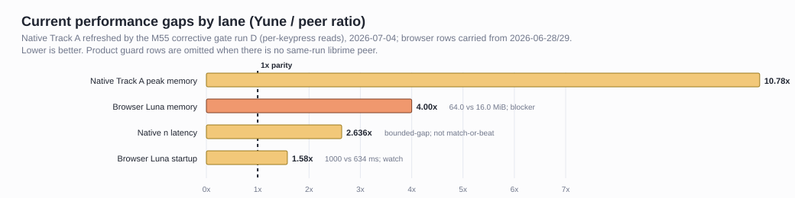
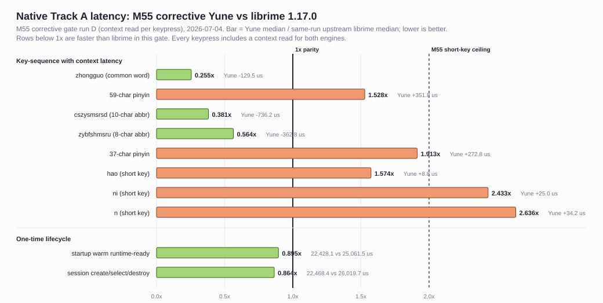
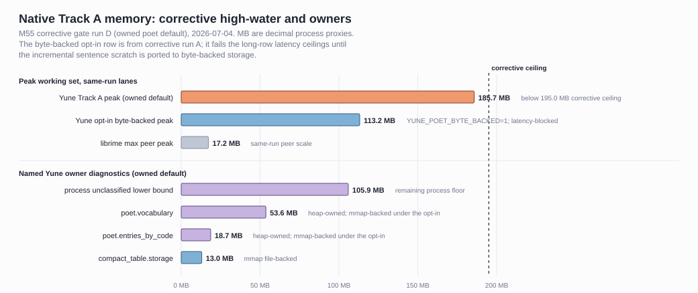
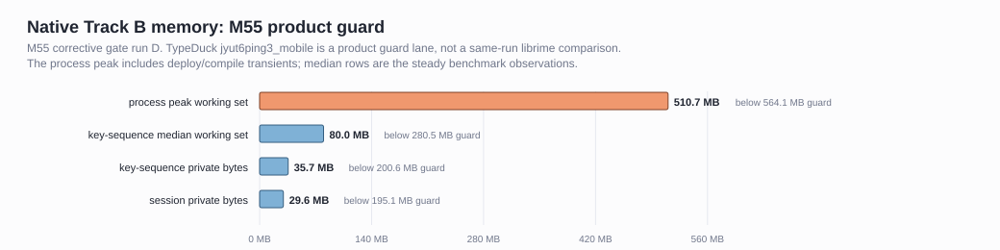

# Current Yune Root-Cause Dashboard

Date: 2026-07-11 (current-main post-fix macOS diagnosis at `afb7079b`;
standing gate remains the signed Windows corrective/M59 ratchet)

This report keeps only the current root-cause read. Older milestone narratives,
WEB-01/WEB-02/WEB-03 closeout detail, and superseded measurements remain in
[`history/2026-06-28-yune-vs-librime-root-cause-analysis-pre-current-dashboard.md`](./history/2026-06-28-yune-vs-librime-root-cause-analysis-pre-current-dashboard.md).

The native lane was re-baselined by the 2026-07-04 M55 **corrective series**:
the benchmark now reads context after every keypress (the interactive shape),
and three pre-corrective closeout mechanisms — a `luna_pinyin` key deferral, a
process-global config cache, and benchmark-input short-key aliases — were
identified as measurement artifacts and reverted. Full analysis:
[`evidence/m55-native-match-or-beat/corrective-2026-07-04/README.md`](./evidence/m55-native-match-or-beat/corrective-2026-07-04/README.md).
Browser rows are carried forward from the 2026-06-28 Playwright run.

M57 repaired a macOS-only Track A verification defect in Yune's compiled-table
sentence-model construction. The local macOS librime oracle was correct; Yune
was accepting the Windows upstream Luna MARISA checksum pair but not the macOS
pair (`0xb3d4e98e` / `0x29d56c89`), which pushed the macOS bundle into a
defective model shape. After M57, macOS Luna stays on compact
`rsmarisa_byte_backed` storage, reports `332,604` compact codes and `513,353`
expanded sentence entries, restores the 11-entry abbreviation vocabulary, and
matches librime page-1 candidates for `cszysmsrsd` and `zybfshmsru`. Evidence:
[`evidence/m57-macos-track-a-sentence-model-parity/`](./evidence/m57-macos-track-a-sentence-model-parity/).

M58 completed the upstream Jyutping oracle rebase and TypeDuck/profile
reachability disposition at `f780410c`. Canonical `jyut6ping3` candidate
behavior now uses upstream `rime/librime 1.17.0` plus pinned
`rime/rime-cantonese`; the user-specified `zijiguk` / `諮議局` capture returns
`諮議局` first, so no canonical candidate bug was reproduced and no canonical
fix was derived. The shipped `yune-web` TypeDuck/profile lane had separate
bounded reachability bugs: `beingo` / `畀` at TypeDuck/profile index 6 and
`zi` / `諮` at index 27. M58 fixed that product lane by restoring
`畀	bei2	200000`, retaining one TypeDuck/profile page for short
`jyut6ping3_mobile` reported/profile inputs, and widening prefix fallback only
on that scoped path, without first-page promotion. No schema id split, profile
predicate change, userdb migration, or ABI widening landed; `jyut6ping3_typeduck`
remains the preferred future TypeDuck profile id pending explicit sign-off.

The current-main M59 macOS post-fix packet changes the performance diagnosis
without changing the signed Windows gate. It supersedes the earlier `89875ee2`
performance read: the reconciled 37/59 aggregate ratios are `0.399x` and
`0.205x`, but almost all Yune-faster long prefixes emit different candidate
text. On candidate-text-matched prefixes Yune is `1.420x` and `1.204x`
librime, and comments/preedit still prevent full prefix equivalence. Current
main wins 6/17 aggregate Track A rows and loses 11. Short rows have a measured
work-volume deficit (`n` `8.682x`, `zh` `4.092x` librime's instructions).
Nano allocation contributes to the macOS ratio, but neither platform-only nor
thermal/noise-only explanations fit the full evidence. Full packet:
[`evidence/m59-post-fix-root-cause-20260711/`](./evidence/m59-post-fix-root-cause-20260711/).

## Technical Summary

- **Current M59 macOS root-cause read**: the long aggregate win is not
  behavior-normalized; the short deficit is real executed work; allocator and
  platform effects are partial; and librime's lazy demand-driven page pipeline
  is the leading design hypothesis, not yet a measured fix.

- **Current native guardrail owner**: the corrective per-key
  `m55-thresholds.csv` is the standing native Track A gate — startup, session,
  all eight key rows, Track A peak memory, win rows locked `<1.00x`, and
  Track B product absolutes. Green twice consecutively (`gate-run-d/`,
  `gate-run-e/`) and re-run green at M56 closeout under
  `m56-productization-hardening/final/ratchet-run/`, then re-run green at M58
  closeout under
  `m58-jyutping-exact-before-fuzzy/phase-2b/m55-product-ratchet-corrective-final-pass2/`.
  The M56 and M58 runs pass with limited short-key and sentence-row headroom
  and are guard proofs, not performance rebaselines. M52's artifact and the
  pre-corrective M55 artifact are batch-shaped history (the metric changed).
- **Current native latency disposition**: the signed Windows corrective/M59
  packet remains the gate. The current-main Mac packet is diagnostic: Yune
  wins 6/17 aggregate rows and loses 11. Its 37/59 aggregate wins
  (`0.399x`/`0.205x`) are not behavior-normalized; the text-matched prefix
  sensitivity is `1.420x`/`1.204x`. Short rows remain clear deficits, now
  backed by stable instruction/cycle evidence rather than ratio timing alone.
- **Current native memory disposition**: the signed Windows gate still owns
  the `185.7 MB` default / `113.2 MB` historical `/2` opt-in record. Current
  Mac whole-process controls show Yune max RSS `11.5-18.3x` and peak footprint
  `23.5-26.4x` librime. Reconciliation removes the former large POET vocabulary
  owner, but the deployed `/3` byte-backed timing lane is behavior-invalid
  (zero candidates on all 99 prefixes), so it carries no speed or memory claim.
- **Current correctness disclosure**: current reconciled evidence preserves the
  repaired final 37/59 candidate text/order, but the interactive benchmark contains behavior-
  different intermediate prefixes and preedit/comment differences. Final-page
  text/order matches on 9/17 Track A inputs; only two complete captured
  snapshots are exact. Incremental prefix/page authority is now the top native
  diagnostic prerequisite.
- **macOS verification disclosure**: the 2026-07-04 macOS rerun initially
  exposed a Yune-side construction defect, not a librime oracle contradiction.
  M57 fixed that platform-specific defect and produced two clean macOS native
  verification passes. This does not alter the standing Windows corrective gate.
- **Current browser fair memory owner**: the fair `luna_pinyin` browser gap is
  `64.0 MiB` Yune public demo versus `16.0 MiB` My RIME (carried 2026-06-28).
- **Current TypeDuck/profile reachability disposition**: M58 fixed the
  `beingo` / `畀` and `zi` / `諮` product-lane reachability bugs through
  short-input profile-ranked paging, not by page-one promotion and not by
  using fork v1.1.2 output as the canonical `jyut6ping3` candidate oracle.

## Current Gap Map

| Area | Current root cause | Evidence | Current status |
| --- | --- | --- | --- |
| Native Track A standing guardrail | Corrective per-key ratchet green twice, M56 closeout ratchet green, and M58 final-pass ratchet green | `corrective-2026-07-04/gate-run-d/`, `gate-run-e/`, `m56-productization-hardening/final/ratchet-run/`, and `m58-jyutping-exact-before-fuzzy/phase-2b/m55-product-ratchet-corrective-final-pass2/` | standing gate |
| Current-main macOS post-fix diagnostic | Aggregate long wins are concentrated in behavior-different prefixes; short rows execute 4-9x the instructions | `m59-post-fix-root-cause-20260711/` | mixed behavior/engine/platform gap; no new gate |
| macOS Track A verification bundle | M57 accepts the macOS upstream Luna MARISA checksum pair and restores compact sentence-model construction | `m57-macos-track-a-sentence-model-parity/full-pass-1/` and `full-pass-2/` | repaired comparability defect |
| Incremental Luna behavior divergence | Final 37/59 text/order is repaired, but no complete long-prefix snapshot is exact and `n`/`zh` pages still differ | 96-prefix behavior-strata trace and current candidate matrix | lock oracle behavior before speed claims |
| Native long-row latency | Current aggregate ratios (`0.399x`/`0.205x`) measure behavior-different work; text-matched sensitivity is `1.420x`/`1.204x` | current five-round prefix-stratified packet | aggregate win is not an implementation-speed claim |
| Native short keys | MARISA/table traversal plus abbreviation/sentence-model generation; eager surplus page work is the leading design hypothesis | `n` `8.682x`, `zh` `4.092x` instruction ratios | real work-volume deficit; causal savings unresolved |
| Native Track A memory | Current Mac process footprint remains much larger; deployed `/3` byte-backed POET is behavior-invalid, while fixture byte-backing multiplies logical work | max RSS `11.5-18.3x`, peak footprint `23.5-26.4x`; 99/99 zero-candidate rejection | separate memory/behavior workstream; no latency claim |
| Track B product guard | Current page/comments/checksums/owners remain M57-exact; work shape moves despite exact behavior | median `264.941 us/key`, 1.8% run-median spread; materialization +95.2%, bounded selection +110.9% | product guard stable; overfetch follow-up |
| TypeDuck/profile reachability | Product path previously under-retained `beingo` / `畀` and `zi` / `諮`; M58 fixed short-input profile-ranked paging | `yune-web-reachability-disposition.json` and browser `m58-profile-reachability.json` | fixed without first-page promotion |
| Browser `luna_pinyin` memory | Yune WASM/runtime floor still larger than My RIME | `64.0 MiB` vs `16.0 MiB` (carried) | blocker |
| Browser `luna_pinyin` startup | Yune public-demo startup still slower | `1000 ms` vs `634 ms` (carried) | watch |

M58 closeout ratchet read: all standing rows pass, but the process-key rows
show measured guard-path cost rather than a zero-overhead result (`n` `2.770x`,
`ni` `2.494x`, `hao` `1.654x`, 37-char `2.022x`, 59-char `1.567x`). Future
hardening should treat the short-key rows and sentence rows as tight regression
guards.

## Native Track A Cause — signed Windows standing gate

What actually landed and survived the corrective review:

- **Graph/DP volume reductions** (the eight Phase 3R `Reduce ...` commits):
  span materialization, lookup-range reuse, edge derivation, DP state-map and
  beam-churn overhead — real per-key wins on the owned path with
  byte-identical candidates.
- **Incremental sentence scratch**: one-char extensions reuse the prior
  lattice on the owned path (a genuine interactive-typing win; a real IME
  session types incrementally).
- **`YUNE-POET/2` byte-backed poet storage**: versioned, stale-rejecting,
  parity-preserving; opt-in pending the scratch port.
- **Removed as measurement artifacts** (2026-07-04 corrective series): the
  `RimeProcessKey` key deferral (amortized N keys into one flush under the
  old read-once benchmark shape), the `n -> na`/`h -> ha` benchmark-input
  aliases, and the uninvalidated process-global config cache (also a
  WEB-02-class staleness hazard).

Current native latency rows from corrective gate run D (context read per
keypress):

| Row | Yune median | librime median | Ratio | Current cause |
| --- | ---: | ---: | ---: | --- |
| `n` | `55.100 us` | `20.900 us` | `2.636x` | exact-row scan + translator overhead |
| `ni` | `42.450 us` | `17.450 us` | `2.433x` | same owner as `n` |
| `hao` | `24.233 us` | `15.400 us` | `1.574x` | same owner, smaller share |
| 37-char pinyin | `571.684 us` | `298.859 us` | `1.913x` | poet graph constant factors |
| 59-char pinyin | `1,017.522 us` | `665.727 us` | `1.528x` | poet graph constant factors |
| `zhongguo` (common word) | `44.300 us` | `173.762 us` | `0.255x` | Yune faster; compiled index path |
| `cszysmsrsd` (10-char abbr) | `454.040 us` | `1,190.230 us` | `0.381x` | Yune faster |
| `zybfshmsru` (8-char abbr) | `469.340 us` | `832.090 us` | `0.564x` | Yune faster |

The supportable claim: Yune is faster than librime on startup, session
lifecycle, `zhongguo`, and both abbreviation rows in this per-key gate, and
slower (bounded, guarded) on short keys and sentence rows. No unqualified
"faster than librime" claim follows.

## Native Track A Cause — Windows vs macOS

The current diagnostic compares Mac `afb7079b` with the near-code Windows
Increment-4a packet at `ca52ec42`. It is still a **machine/source/compiler
comparison**, not an OS-only experiment: CPU, compiler, linker, allocator, OS,
payload metadata, background load, and the commits differ.

| Input | Mac Yune | Win 4a Yune | Mac vs Win Yune | Mac librime | Win 4a librime | Mac vs Win librime | Mac ratio | Win ratio |
| --- | ---: | ---: | ---: | ---: | ---: | ---: | ---: | ---: |
| `n` | `90.333 us` | `59.100 us` | `+52.8%` | `22.375 us` | `21.000 us` | `+6.5%` | `4.123x` | `2.804x` |
| `ni` | `50.041 us` | `34.800 us` | `+43.8%` | `16.916 us` | `17.450 us` | `-3.1%` | `2.978x` | `2.000x` |
| `hao` | `27.722 us` | `20.267 us` | `+36.8%` | `13.958 us` | `15.333 us` | `-9.0%` | `2.019x` | `1.328x` |
| 37-char | `66.940 us` | `68.062 us` | `-1.6%` | `166.470 us` | `298.692 us` | `-44.3%` | `0.399x` | `0.229x` |
| 59-char | `80.233 us` | `85.341 us` | `-6.0%` | `391.385 us` | `673.254 us` | `-41.9%` | `0.205x` | `0.126x` |

The short and long directions differ. On long rows, Yune's absolute cost is
close between machines while librime is about 42-44% faster on the Mac. On
`n`/`ni`/`hao`, librime is similar while Yune is 37-53% slower on the Mac. A
single “librime is optimized for macOS” explanation cannot fit both patterns.

Allocator controls identify one partial macOS component: Nano-off slows
librime more than Yune on stable medium/long rows and lowers the ratio around
6-14%. Hardware-counter controls identify a separate engine-path component:
Yune executes 4-9x the instructions on `n`/`zh`, and has 1.24-1.41x worse CPI
in the four inspected lanes. Long aggregate instruction wins inherit the
behavior mismatch: candidate-text-different prefixes dominate librime time.

The defensible conclusion is a mixed behavior, engine-path, allocator, build,
and platform interaction. Thermal/noise affects precision but cannot explain
the stable instruction direction. Exact platform attribution remains open
until the same current commit and payload run on both systems.

## Native Memory Cause

The current Mac packet adds a process-level warning without replacing the
signed Windows gate. Across the four high-iteration controls, Yune max RSS is
`11.5-18.3x` librime and peak footprint is `23.5-26.4x`. These are whole-
process peaks, not per-key bytes or proof that memory causes the CPI gap.
Reconciliation reduces `poet.vocabulary` from roughly 47.7 MiB / 421,966 items
to 0.027 MiB / 193 items, but current Track A still retains about 20.4 MiB
across 513,353 POET entries plus the 332,604-row lookup index.

The deployed `YUNE_POET_BYTE_BACKED=1` `/3` control cannot support a timing
claim: it emits zero candidates on all 99 measured prefixes. The behavior-
valid fixture returns five candidates but examines 13-23x more table entries,
14-22x more graph entries, and 17-19x more DP states than the owned incremental
fixture. Byte-backing remains a memory direction, not automatically a CPU
optimization; behavior and incremental/lazy indexing must be recovered first.

The following values remain the signed historical Windows `/2` gate context:

| Measurement | Current value | Read |
| --- | ---: | --- |
| Track A peak (shipping default, owned poet) | `185.7 MB` | latency ceilings bind; guarded `195.0 MB` |
| Track A peak (`YUNE_POET_BYTE_BACKED=1`) | `113.2 MB` | real and parity-preserving; fails long-row latency until the scratch port |
| librime peer peak (same run) | `13.5 MB` | peer scale |
| `poet.vocabulary` / `poet.entries_by_code` (opt-in) | `25.5 MB` / `3.0 MB` | `mmap_file_backed` in `YUNE-POET/2` |

The direct scratch port was the historical `/2` guidance. Current `/3` work
must first restore identical prefix/page behavior, then design incremental/lazy
indexing and measure memory and CPU separately before re-running the default
decision under the standing gate. This does not invalidate M47: the
comments-intact `jyut6ping3_mobile` keyboard profile remains the separate
iOS-target lane at about `22 MB` private in the lean probe.

## Native Track B Cause (product lane)

Track B is the native TypeDuck profile product path and regression guard (no
librime peer; sentence is off in the mobile profile, so it is independent of
the poet default). Current evidence uses historical `jyut6ping3_mobile` asset
names; it should be read as TypeDuck profile evidence and future schema-split
work should present that lane as `jyut6ping3_typeduck` only after explicit
sign-off. M58 completed the blast-radius audit and did not implement the split.
It is not canonical `rime-cantonese` candidate-order oracle evidence. M58
final-pass ratchet, all green with tightened ceilings:

| Row | Observed | Ceiling | Status |
| --- | ---: | ---: | --- |
| 50+ key-sequence latency | `335.823 us` | `347.975 us` | pass |
| key-sequence median working set | `79,511,552 B` | `88,012,390 B` | pass |
| key-sequence max peak working set | `510,885,888 B` | `562,033,050 B` | pass |
| key-sequence median private bytes | `35,426,304 B` | `39,460,045 B` | pass |
| session create/select/destroy | `36,098.200 us` | `39,289.800 us` | pass |
| startup warm runtime-ready | `35,459.000 us` | `38,825.050 us` | pass |

The startup/session absolutes improved about `3x` versus their Phase 0-era
sources (`~98 ms`) through the landed M55 work — a real product-lane win,
ratcheted accordingly. No TypeDuck-vs-librime speed claim follows from this
guard.

The visualization below is carried from the 2026-07-04 standing-gate dashboard
and remains directional; the M58 table above is the current Track B ratchet
read.

## Browser Root Cause

Carried forward from the 2026-06-28 Playwright run.

| Scenario | Ready | Input -> candidate | Commit | WASM peak | Resource payload | Read |
| --- | ---: | ---: | ---: | ---: | ---: | --- |
| Yune public demo `luna_pinyin` | `1000 ms` | `74 ms` | `107 ms` | `64.0 MiB` | `29.5 MiB` | fair Yune row |
| My RIME live `luna_pinyin` | `634 ms` | `95 ms` | `119 ms` | `16.0 MiB` | `8.5 MiB` | fair peer row |

The fair browser gap remains `4.0x`; startup and WASM memory are the
browser-side blockers. Jyutping remains a launch guard lane, not a peer lane.

## Current Evidence

- [`corrective-2026-07-04/README.md`](./evidence/m55-native-match-or-beat/corrective-2026-07-04/README.md)
  - corrective-series analysis, run inventory, honest M55 ledger
- [`corrective-2026-07-04/gate-run-d/threshold-check.csv`](./evidence/m55-native-match-or-beat/corrective-2026-07-04/gate-run-d/threshold-check.csv)
  and [`gate-run-e/threshold-check.csv`](./evidence/m55-native-match-or-beat/corrective-2026-07-04/gate-run-e/threshold-check.csv)
- [`m56-productization-hardening/final/ratchet-run/threshold-check.csv`](./evidence/m56-productization-hardening/final/ratchet-run/threshold-check.csv)
  - M56 green closeout proof against the standing M55 threshold artifact
- [`m57-macos-track-a-sentence-model-parity/README.md`](./evidence/m57-macos-track-a-sentence-model-parity/README.md)
  - macOS compiled-table sentence-model repair, before/after counters, two full
    macOS native verification passes
- [`m58-jyutping-exact-before-fuzzy/README.md`](./evidence/m58-jyutping-exact-before-fuzzy/README.md)
  - upstream Jyutping oracle rebase, profile reachability disposition,
    and M58 final-pass Track B/product ratchet
- [`m58-jyutping-exact-before-fuzzy/phase-2b/yune-web-reachability-disposition.json`](./evidence/m58-jyutping-exact-before-fuzzy/phase-2b/yune-web-reachability-disposition.json)
  - `beingo` / `畀` and `zi` / `諮` product-lane disposition
- [`m58-jyutping-exact-before-fuzzy/phase-2b/m55-product-ratchet-corrective-final-pass2/threshold-check.csv`](./evidence/m58-jyutping-exact-before-fuzzy/phase-2b/m55-product-ratchet-corrective-final-pass2/threshold-check.csv)
  - latest closeout proof against the standing M55 threshold artifact
- [`m59-post-fix-root-cause-20260711/`](./evidence/m59-post-fix-root-cause-20260711/)
  - current-main five-round Mac packet, behavior-stratified long rows,
    instruction/allocator/API controls, Track B/M57 audit, and future-work order
- [`thresholds/m55-thresholds.csv`](./evidence/m55-native-match-or-beat/thresholds/m55-thresholds.csv)
- Pre-corrective closeout state: git history at `531dbcf2` (preserved, not
  scrubbed)

Browser evidence remains under
[`current-performance-dashboard-2026-06-29/`](./evidence/current-performance-dashboard-2026-06-29/).

## Next Diagnostic Order

| Rank | Work | Why this is next |
| ---: | --- | --- |
| 1 | Incremental-prefix oracle lock | Aggregate long wins are concentrated in behavior-different prefixes; lock text/order/comments/preedit/pagination/selection first. |
| 2 | Translator residual and producer attribution | Translation is ~90-99% of inspected Track A time, but direct-family and producer-specific work is incompletely timed. |
| 3 | Behavior-locked lazy page fill | librime drains demand-driven streams while Yune eagerly owns/filters/sorts surplus candidates; causal savings need a guarded prototype. |
| 4 | Short abbreviation/MARISA path | `n`/`zh` use `8.682x`/`4.092x` librime's instructions; behavior differences must be resolved before reducing work. |
| 5 | Memory and byte-backed POET behavior | Current `/3` deployed byte-backed output is behavior-invalid; recover output before measuring memory/CPU or designing incremental/lazy indexing. |
| 6 | Exact-current Windows/macOS lane | Source, build, CPU, OS, and allocator remain confounded in the near-code comparison. |
| 7 | Track B overfetch and owner follow-up | Behavior/checksums stay M57-exact while materialization and bounded selection rise sharply. |

Browser fair-lane memory/startup remains a separate future plan rather than an
engine diagnostic prerequisite.

## History

Archived milestone-style report:
[`history/2026-06-28-yune-vs-librime-root-cause-analysis-pre-current-dashboard.md`](./history/2026-06-28-yune-vs-librime-root-cause-analysis-pre-current-dashboard.md).
The pre-corrective 2026-07-04 dashboard state is preserved in git history at
commit `531dbcf2`.
