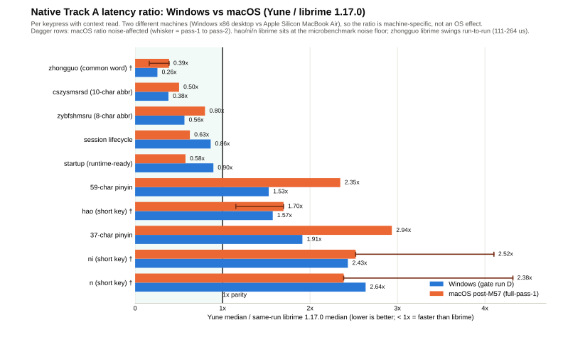

# Current Yune Root-Cause Dashboard

Date: 2026-07-05 (M57 macOS verification repair; standing gate remains the
2026-07-04 corrective re-baseline)

This report keeps only the current root-cause read. Older milestone narratives,
WEB-01/WEB-02/WEB-03 closeout detail, and superseded measurements remain in
[`history/2026-06-28-yune-vs-librime-root-cause-analysis-pre-current-dashboard.md`](./history/2026-06-28-yune-vs-librime-root-cause-analysis-pre-current-dashboard.md).

The native lane was re-baselined by the 2026-07-04 M55 **corrective series**:
the benchmark now reads context after every keypress (the interactive shape),
and three pre-corrective closeout mechanisms — a `luna_pinyin` key deferral, a
process-global config cache, and benchmark-input short-key aliases — were
identified as measurement artifacts and reverted. Full analysis:
[`evidence/m55-native-match-or-beat/corrective-2026-07-04/README.md`](./evidence/m55-native-match-or-beat/corrective-2026-07-04/README.md).
Browser rows are carried forward from the 2026-06-28 Playwright run.

M57 repaired a macOS-only Track A verification defect in Yune's compiled-table
sentence-model construction. The local macOS librime oracle was correct; Yune
was accepting the Windows upstream Luna MARISA checksum pair but not the macOS
pair (`0xb3d4e98e` / `0x29d56c89`), which pushed the macOS bundle into a
defective model shape. After M57, macOS Luna stays on compact
`rsmarisa_byte_backed` storage, reports `332,604` compact codes and `513,353`
expanded sentence entries, restores the 11-entry abbreviation vocabulary, and
matches librime first pages for `cszysmsrsd` and `zybfshmsru`. Evidence:
[`evidence/m57-macos-track-a-sentence-model-parity/`](./evidence/m57-macos-track-a-sentence-model-parity/).

## Technical Summary

- **Current native guardrail owner**: the corrective per-key
  `m55-thresholds.csv` is the standing native Track A gate — startup, session,
  all eight key rows, Track A peak memory, win rows locked `<1.00x`, and
  Track B product absolutes. Green twice consecutively (`gate-run-d/`,
  `gate-run-e/`) and re-run green at M56 closeout under
  `m56-productization-hardening/final/ratchet-run/`. The M56 run passes with
  limited short-key and 37-char headroom and is a guard proof, not a
  performance rebaseline. M52's artifact and the pre-corrective M55 artifact are
  batch-shaped history (the metric changed).
- **Current native latency disposition**: real M55 graph/DP-reduction work
  improved the long rows ~35% versus the pre-M55 record (37-char `1.913x`,
  59-char `1.528x`) and the short keys (`ni` `2.433x`, `hao` `1.574x`), while
  startup (`0.895x`) and session (`0.864x`) are measured faster than librime,
  run-noisy. Yune remains slower on short keys and both sentence rows; the
  pre-corrective `0.237x`/`0.086x` rows were deferral artifacts and carry no
  claim.
- **Current native memory disposition**: the shipping default is the owned
  poet path at `185.7 MB` peak - the latency ceilings bind. `YUNE-POET/2`
  byte-backed storage works, preserves parity, and measures `~113.2 MB`, but
  only as an explicit opt-in (`YUNE_POET_BYTE_BACKED=1`) because the
  incremental sentence scratch only operates on owned storage; byte-backed
  long rows measure `4.6x`/`3.2x` per-key.
- **Current correctness disclosure**: Yune's first candidate page differs from
  librime on `n` and `zhongguo` (completion ranking) and on both long-sentence
  top candidates (lattice; see the captured candidate snapshots). These are
  pre-existing gaps surfaced by the M55 Phase 3R-0 oracle fixture expansion
  (13 named blocked rows), now ranked the top native diagnostic target.
- **macOS verification disclosure**: the 2026-07-04 macOS rerun initially
  exposed a Yune-side construction defect, not a librime oracle contradiction.
  M57 fixed that platform-specific defect and produced two clean macOS native
  verification passes. This does not alter the standing Windows corrective gate.
- **Current browser fair memory owner**: the fair `luna_pinyin` browser gap is
  `64.0 MiB` Yune public demo versus `16.0 MiB` My RIME (carried 2026-06-28).

## Current Gap Map

| Area | Current root cause | Evidence | Current status |
| --- | --- | --- | --- |
| Native Track A standing guardrail | Corrective per-key ratchet green twice and M56 closeout ratchet green | `corrective-2026-07-04/gate-run-d/`, `gate-run-e/`, and `m56-productization-hardening/final/ratchet-run/` | standing gate |
| macOS Track A verification bundle | M57 accepts the macOS upstream Luna MARISA checksum pair and restores compact sentence-model construction | `m57-macos-track-a-sentence-model-parity/full-pass-1/` and `full-pass-2/` | repaired comparability defect |
| Native sentence-lattice divergence | Yune's lattice/completion ranking differs from librime on the expanded oracle rows | 13 blocked fixture rows; `candidate_snapshots.csv` in the corrective runs | top correctness target |
| Native long-row latency | Poet graph constant factors above the raw lookup | 37-char `1.913x`, 59-char `1.528x` (was `3.05x`/`2.25x` pre-M55) | improved; Tier M `1.50x` bar not met |
| Native short keys | Exact-row scan + translator overhead | `n` `2.636x` (+34 us), `ni` `2.433x` (+25 us), `hao` `1.574x` (+9 us) | bounded absolute gaps |
| Native Track A memory | Owned poet payload retained on heap by default; byte-backed opt-in works but costs long-row latency | default `185.7 MB`; opt-in `113.2 MB`; librime peer `13.5 MB` | scratch port is the named owner |
| Track B product guard | TypeDuck profile/product absolutes all green and tightened; not canonical `rime-cantonese` candidate evidence | key row `315.356 us` vs `347.975 us` ceiling; startup/session `~35 ms` vs Phase 0-era `~98 ms` sources | regression guard pass, real improvement |
| Browser `luna_pinyin` memory | Yune WASM/runtime floor still larger than My RIME | `64.0 MiB` vs `16.0 MiB` (carried) | blocker |
| Browser `luna_pinyin` startup | Yune public-demo startup still slower | `1000 ms` vs `634 ms` (carried) | watch |

M56 closeout ratchet read: all standing rows pass, but the process-key rows
show measured guard-path cost rather than a zero-overhead result (`n` `2.785x`,
`ni` `2.573x`, `hao` `1.677x`, 37-char `1.981x`, 59-char `1.525x`). Future
hardening should treat the short-key rows and 37-char row as tight regression
guards.

## Native Track A Cause

What actually landed and survived the corrective review:

- **Graph/DP volume reductions** (the eight Phase 3R `Reduce ...` commits):
  span materialization, lookup-range reuse, edge derivation, DP state-map and
  beam-churn overhead — real per-key wins on the owned path with
  byte-identical candidates.
- **Incremental sentence scratch**: one-char extensions reuse the prior
  lattice on the owned path (a genuine interactive-typing win; a real IME
  session types incrementally).
- **`YUNE-POET/2` byte-backed poet storage**: versioned, stale-rejecting,
  parity-preserving; opt-in pending the scratch port.
- **Removed as measurement artifacts** (2026-07-04 corrective series): the
  `RimeProcessKey` key deferral (amortized N keys into one flush under the
  old read-once benchmark shape), the `n -> na`/`h -> ha` benchmark-input
  aliases, and the uninvalidated process-global config cache (also a
  WEB-02-class staleness hazard).

Current native latency rows from corrective gate run D (context read per
keypress):

| Row | Yune median | librime median | Ratio | Current cause |
| --- | ---: | ---: | ---: | --- |
| `n` | `55.100 us` | `20.900 us` | `2.636x` | exact-row scan + translator overhead |
| `ni` | `42.450 us` | `17.450 us` | `2.433x` | same owner as `n` |
| `hao` | `24.233 us` | `15.400 us` | `1.574x` | same owner, smaller share |
| 37-char pinyin | `571.684 us` | `298.859 us` | `1.913x` | poet graph constant factors |
| 59-char pinyin | `1,017.522 us` | `665.727 us` | `1.528x` | poet graph constant factors |
| `zhongguo` (common word) | `44.300 us` | `173.762 us` | `0.255x` | Yune faster; compiled index path |
| `cszysmsrsd` (10-char abbr) | `454.040 us` | `1,190.230 us` | `0.381x` | Yune faster |
| `zybfshmsru` (8-char abbr) | `469.340 us` | `832.090 us` | `0.564x` | Yune faster |

The supportable claim: Yune is faster than librime on startup, session
lifecycle, `zhongguo`, and both abbreviation rows in this per-key gate, and
slower (bounded, guarded) on short keys and sentence rows. No unqualified
"faster than librime" claim follows.

## Native Track A Cause — Windows vs macOS

M57 confirmed the earlier macOS anomaly was a Yune-side construction bug (the
target-scoped checksum gate), not a librime contradiction. With that repaired,
the two lanes compare directly. **The comparison is machine-vs-machine** — a
Windows x86 desktop (gate run D) vs an Apple Silicon MacBook Air (M57
full-pass-1; full-pass-2 for the range) — not OS-vs-OS.

| Dimension | Win ratio | mac ratio | Yune Win → mac | librime Win → mac | root-cause read |
| --- | ---: | ---: | ---: | ---: | --- |
| startup | `0.895x` | `0.576x` | `22.4 → 18.1 ms` | `25.1 → 31.5 ms` | Yune faster on both; run-noisy |
| session | `0.864x` | `0.626x` | `22.5 → 18.8 ms` | `26.0 → 30.1 ms` | Yune faster on both; run-noisy |
| `zhongguo` † | `0.255x` | `0.388x` | `44 → 43 us` | `174 → 111 us` | Yune win; librime abs noisy on mac |
| `cszysmsrsd` | `0.381x` | `0.503x` | `454 → 420 us` | `1,190 → 834 us` | Yune win on both |
| `zybfshmsru` | `0.564x` | `0.799x` | `469 → 461 us` | `832 → 577 us` | Yune win on both |
| `hao` † | `1.574x` | `1.697x` | `24 → 26 us` | `15 → 15 us` | near-noise short key |
| `ni` † | `2.433x` | `2.522x` | `42 → 46 us` | `17 → 18 us` | near-noise short key |
| `n` † | `2.636x` | `2.385x` | `55 → 65 us` | `21 → 27 us` | near-noise short key |
| 59-char | `1.528x` | `2.346x` | `1,018 → 944 us` | `666 → 402 us` | Yune ~same; librime faster on mac |
| 37-char | `1.913x` | `2.936x` | `572 → 513 us` | `299 → 175 us` | Yune ~same; librime faster on mac |

`†` the macOS ratio here is noise-affected (shown directional only): for
`hao`/`ni`/`n` librime's absolute sits at the microbenchmark noise floor
(single-digit-to-low-tens of `us`), and for `zhongguo` librime's own median
swings run-to-run (`111 → 264 us`).

**Root cause of the cross-platform ratio difference.** It is not a Yune
regression: Yune's own per-key cost is essentially unchanged across the two
machines (37-char `572 → 513 us`, `cszysmsrsd` `454 → 420 us`). The sentence-row
ratio *widens* on macOS because **librime speeds up more on Apple Silicon**
(37-char `299 → 175 us`), and the ratio divides by librime. The plausible
mechanism (inferred, not yet profiled on both engines): Yune's poet hot path —
`HashMap`/SipHash probes and `memcmp` walks over the owned sentence model — is
more memory-latency-bound, which gains less from a faster core than librime's
lighter, more cache-friendly path. The short-key rows carry no reliable
cross-platform signal because librime's absolute there sits at the
microbenchmark noise floor.

## Native Memory Cause

| Measurement | Current value | Read |
| --- | ---: | --- |
| Track A peak (shipping default, owned poet) | `185.7 MB` | latency ceilings bind; guarded `195.0 MB` |
| Track A peak (`YUNE_POET_BYTE_BACKED=1`) | `113.2 MB` | real and parity-preserving; fails long-row latency until the scratch port |
| librime peer peak (same run) | `13.5 MB` | peer scale |
| `poet.vocabulary` / `poet.entries_by_code` (opt-in) | `25.5 MB` / `3.0 MB` | `mmap_file_backed` in `YUNE-POET/2` |

The named path back to the memory win without the latency cost: port the
incremental sentence scratch to byte-backed storage, then re-run the default
decision under the standing per-key gate. This does not invalidate M47: the
comments-intact `jyut6ping3_mobile` keyboard profile remains the separate
iOS-target lane at about `22 MB` private in the lean probe.

## Native Track B Cause (product lane)

Track B is the native TypeDuck profile product path and regression guard (no
librime peer; sentence is off in the mobile profile, so it is independent of
the poet default). Current evidence uses historical `jyut6ping3_mobile` asset
names; it should be read as TypeDuck profile evidence and future schema-split
work should present that lane as `jyut6ping3_typeduck` only after the M58
blast-radius sign-off. It is not canonical `rime-cantonese` candidate-order
oracle evidence. Corrective gate run D, all green with tightened ceilings:

| Row | Observed | Ceiling | Status |
| --- | ---: | ---: | --- |
| 50+ key-sequence latency | `315.356 us` | `347.975 us` | pass |
| key-sequence median working set | `79,953,920 B` | `88,012,390 B` | pass |
| key-sequence max peak working set | `510,672,896 B` | `562,033,050 B` | pass |
| key-sequence median private bytes | `35,733,504 B` | `39,460,045 B` | pass |
| session create/select/destroy | `35,364.100 us` | `39,289.800 us` | pass |
| startup warm runtime-ready | `34,732.800 us` | `38,825.050 us` | pass |

The startup/session absolutes improved about `3x` versus their Phase 0-era
sources (`~98 ms`) through the landed M55 work — a real product-lane win,
ratcheted accordingly. No TypeDuck-vs-librime speed claim follows from this
guard.

## Browser Root Cause

Carried forward from the 2026-06-28 Playwright run.

| Scenario | Ready | Input -> candidate | Commit | WASM peak | Resource payload | Read |
| --- | ---: | ---: | ---: | ---: | ---: | --- |
| Yune public demo `luna_pinyin` | `1000 ms` | `74 ms` | `107 ms` | `64.0 MiB` | `29.5 MiB` | fair Yune row |
| My RIME live `luna_pinyin` | `634 ms` | `95 ms` | `119 ms` | `16.0 MiB` | `8.5 MiB` | fair peer row |

The fair browser gap remains `4.0x`; startup and WASM memory are the
browser-side blockers. Jyutping remains a launch guard lane, not a peer lane.

## Current Evidence

- [`corrective-2026-07-04/README.md`](./evidence/m55-native-match-or-beat/corrective-2026-07-04/README.md)
  - corrective-series analysis, run inventory, honest M55 ledger
- [`corrective-2026-07-04/gate-run-d/threshold-check.csv`](./evidence/m55-native-match-or-beat/corrective-2026-07-04/gate-run-d/threshold-check.csv)
  and [`gate-run-e/threshold-check.csv`](./evidence/m55-native-match-or-beat/corrective-2026-07-04/gate-run-e/threshold-check.csv)
- [`m56-productization-hardening/final/ratchet-run/threshold-check.csv`](./evidence/m56-productization-hardening/final/ratchet-run/threshold-check.csv)
  - latest green closeout proof against the standing M55 threshold artifact
- [`m57-macos-track-a-sentence-model-parity/README.md`](./evidence/m57-macos-track-a-sentence-model-parity/README.md)
  - macOS compiled-table sentence-model repair, before/after counters, two full
    macOS native verification passes
- [`thresholds/m55-thresholds.csv`](./evidence/m55-native-match-or-beat/thresholds/m55-thresholds.csv)
- Pre-corrective closeout state: git history at `531dbcf2` (preserved, not
  scrubbed)

Browser evidence remains under
[`current-performance-dashboard-2026-06-29/`](./evidence/current-performance-dashboard-2026-06-29/).

## Next Diagnostic Order

| Rank | Work | Why this is next |
| ---: | --- | --- |
| 1 | Sentence-lattice/completion candidate divergence vs librime | Correctness before speed: 13 blocked oracle rows including both benchmark sentence tops and the `n` page. |
| 2 | Browser fair-lane memory floor on `luna_pinyin` | Same-schema browser gap is `64.0 MiB` vs `16.0 MiB`. |
| 3 | Browser startup phases | `1000 ms` vs `634 ms` ready-to-input (carried). |
| 4 | Port the incremental sentence scratch to byte-backed poet storage | Reclaims the `113 MB` memory win without the long-row latency cost; then re-decide the default under the standing gate. |
| 5 | Poet graph constant factors / short-key compiled index | Long rows `1.913x`/`1.528x` vs the original `1.50x` Tier M bar; short keys `+9-34 us` absolute. |

## History

Archived milestone-style report:
[`history/2026-06-28-yune-vs-librime-root-cause-analysis-pre-current-dashboard.md`](./history/2026-06-28-yune-vs-librime-root-cause-analysis-pre-current-dashboard.md).
The pre-corrective 2026-07-04 dashboard state is preserved in git history at
commit `531dbcf2`.
