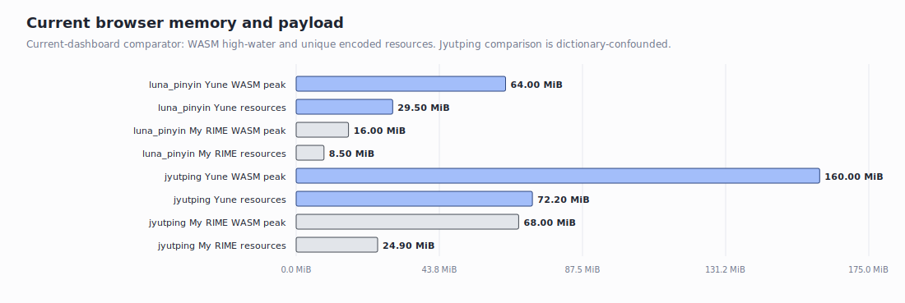

# Current Yune Web vs My RIME Browser Dashboard

Date: 2026-06-28

This report shows the current browser benchmark state. The previous WEB-01/M46
handoff narrative has been archived at
[`history/2026-06-28-yune-web-vs-my-rime-browser-baseline-pre-current-dashboard.md`](./history/2026-06-28-yune-web-vs-my-rime-browser-baseline-pre-current-dashboard.md).

## Technical Summary

- **Fair same-schema lane**: on `luna_pinyin`, Yune public demo currently uses
  `64.0 MiB` WASM peak versus My RIME `16.0 MiB`. Yune is slower to ready
  (`1000 ms` vs `634 ms`) but faster on first input (`74 ms` vs `95 ms`) and
  commit (`107 ms` vs `119 ms`) in the refreshed comparator.
- **Jyutping lane**: Yune public demo currently uses `160.0 MiB` WASM peak and
  is byte-backed. The My RIME Jyutping row is retained only as guard context
  because it uses a different Cantonese-only dictionary.
- **Long input**: current Yune WEB-03 evidence covers both short and long
  browser input rows. The longest Jyutping row is `74 ms` exact
  keydown-to-paint, and the 28-character Jyutping row is `130 ms`.
- **Current blocker**: the clean browser target is now the fair `luna_pinyin`
  memory/startup gap, not the old Jyutping `893.1 MiB` source-fallback row.

## Comparison Validity

| Lane | Meaning | Validity |
| --- | --- | --- |
| Yune public demo vs My RIME on `luna_pinyin` | Same schema and dictionary family | fair cross-engine browser comparison |
| Yune public demo Jyutping | Yune launch/profile guard | not fair against My RIME; dictionary-confounded |
| My RIME Jyutping | Cantonese-only My RIME guard context | not a target for TypeDuck `jyut6ping3` |

The current dashboard source bundle is
[`evidence/current-performance-dashboard-2026-06-28/`](./evidence/current-performance-dashboard-2026-06-28/).

## Current Browser Peer Results




| Scenario | Schema | Ready | Input -> candidate | Commit | WASM ready | WASM peak | Unique encoded resources | Commit check |
| --- | --- | ---: | ---: | ---: | ---: | ---: | ---: | --- |
| Yune public demo | `luna_pinyin` | `1000 ms` | `74 ms` | `107 ms` | `64.0 MiB` | `64.0 MiB` | `29.5 MiB` | `ni -> 你` |
| My RIME live | `luna_pinyin` | `634 ms` | `95 ms` | `119 ms` | `16.0 MiB` | `16.0 MiB` | `8.5 MiB` | `ni -> 你` |
| Yune public demo | Jyutping | `1347 ms` | `103 ms` | `108 ms` | `160.0 MiB` | `160.0 MiB` | `72.2 MiB` | `nei -> 你` |
| My RIME live | Jyutping | `998 ms` | `99 ms` | `114 ms` | `56.6 MiB` | `68.0 MiB` | `24.9 MiB` | `nei -> 你` |

Fresh comparator command:

```powershell
$env:YUNE_WEB_COMPARATOR_BASELINE='1'
$env:YUNE_WEB_COMPARATOR_INCLUDE_MY_RIME='1'
$env:YUNE_WEB_COMPARATOR_SAMPLES='3'
$env:YUNE_WEB_COMPARATOR_PHASE='current-dashboard'
npm.cmd --prefix apps/yune-web/e2e run test:e2e -- --grep "YUNE WEB COMPARATOR" --workers=1
```

Result: passed, writing
[`../../apps/yune-web/e2e/results/yune-web-vs-my-rime-baseline/current-dashboard/`](../../apps/yune-web/e2e/results/yune-web-vs-my-rime-baseline/current-dashboard/).

## Current Yune Input-Latency Suite


| Schema | Input | Exact keydown-to-paint | Max during input | Worker process sum | WASM peak | First candidate |
| --- | --- | ---: | ---: | ---: | ---: | --- |
| `luna_pinyin` | `hao` | `40 ms` | `40 ms` | `6 ms` | `64.0 MiB` | `好` |
| `luna_pinyin` | `ni` | `22 ms` | `22 ms` | `0 ms` | `64.0 MiB` | `你` |
| `luna_pinyin` | `zhongguo` | `19 ms` | `30 ms` | `2 ms` | `64.0 MiB` | `中國大陸` |
| `luna_pinyin` | `ceshiyixiachangjushuruxingnengzenyang` | `43 ms` | `45 ms` | `8 ms` | `64.0 MiB` | `測是一下長據書如行能怎樣` |
| `luna_pinyin` | `zhegeyinqingqishiyinggaizhichichaochangjuzishurucainengyong` | `75 ms` | `78 ms` | `16 ms` | `64.0 MiB` | `這個因請其是應該之喫差哦長據子書如才能用` |
| `luna_pinyin` | `cszysmsrsd` | `26 ms` | `29 ms` | `7 ms` | `64.0 MiB` | placeholder row |
| `luna_pinyin` | `zybfshmsru` | `34 ms` | `47 ms` | `1 ms` | `64.0 MiB` | placeholder row |
| `jyut6ping3_mobile` | `hai` | `47 ms` | `47 ms` | `7 ms` | `160.0 MiB` | `係` |
| `jyut6ping3_mobile` | `ngo` | `23 ms` | `24 ms` | `2 ms` | `160.0 MiB` | `我` |
| `jyut6ping3_mobile` | `caksi` | `89 ms` | `90 ms` | `60 ms` | `160.0 MiB` | `測時` |
| `jyut6ping3_mobile` | `ngogokdak` | `22 ms` | `33 ms` | `4 ms` | `160.0 MiB` | `我覺得` |
| `jyut6ping3_mobile` | `sihaacoenggeoisyujapgecukdou` | `130 ms` | `136 ms` | `93 ms` | `160.0 MiB` | `試下場據輸入嘅速都` |
| `jyut6ping3_mobile` | `taihaajyugwodaahoucoenggegeoizigosingnangwuidimjoeng` | `74 ms` | `74 ms` | `12 ms` | `160.0 MiB` | `睇下如果打好場嘅據自個責會點樣` |

Evidence:
[`../../apps/yune-web/e2e/results/web03-latency-regression-fix/local-browser-latency/`](../../apps/yune-web/e2e/results/web03-latency-regression-fix/local-browser-latency/).

## Current Browser Read

| Dimension | Current read |
| --- | --- |
| Fair memory gap | Yune `luna_pinyin` is `4.0x` My RIME on WASM peak (`64.0 MiB` vs `16.0 MiB`). |
| Fair startup gap | Yune `luna_pinyin` ready-to-input is `1.58x` My RIME (`1000 ms` vs `634 ms`). |
| Fair first-input latency | Yune `luna_pinyin` is faster in the refreshed comparator (`74 ms` vs `95 ms`). |
| Public-demo Jyutping memory | Current byte-backed launch path is `160.0 MiB`; old `893.1 MiB` is historical source-fallback evidence. |
| Public-demo Jyutping long typing | Current WEB-03 long rows are below `150 ms` exact keydown-to-paint in the checked-in local evidence. |

## Current Blockers

1. **Browser fair-lane memory floor**: reduce or explain the `64.0 MiB` Yune
   `luna_pinyin` WASM high-water against My RIME's `16.0 MiB`.
2. **Browser fair-lane startup**: attribute the `1000 ms` ready-to-input row
   against My RIME's `634 ms`.
3. **Resource payload**: Yune `luna_pinyin` transfers `29.5 MiB` unique encoded
   resources versus My RIME `8.5 MiB`; this is visible, but must be separated
   from runtime heap before claiming a memory fix.

## History

Archived milestone-style browser report:
[`history/2026-06-28-yune-web-vs-my-rime-browser-baseline-pre-current-dashboard.md`](./history/2026-06-28-yune-web-vs-my-rime-browser-baseline-pre-current-dashboard.md).
