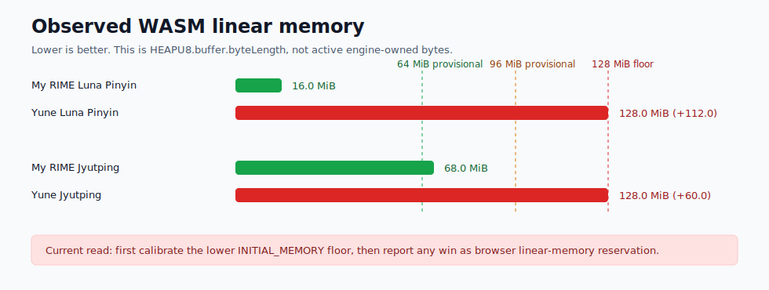
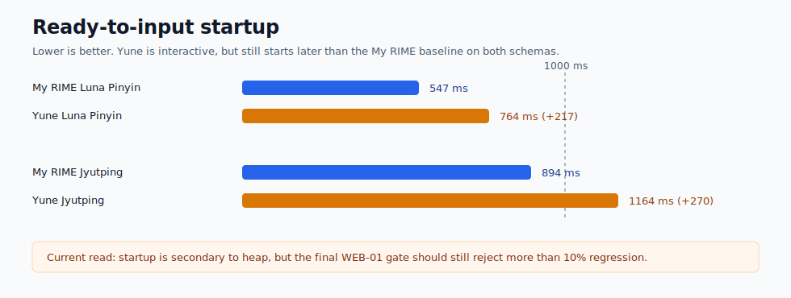
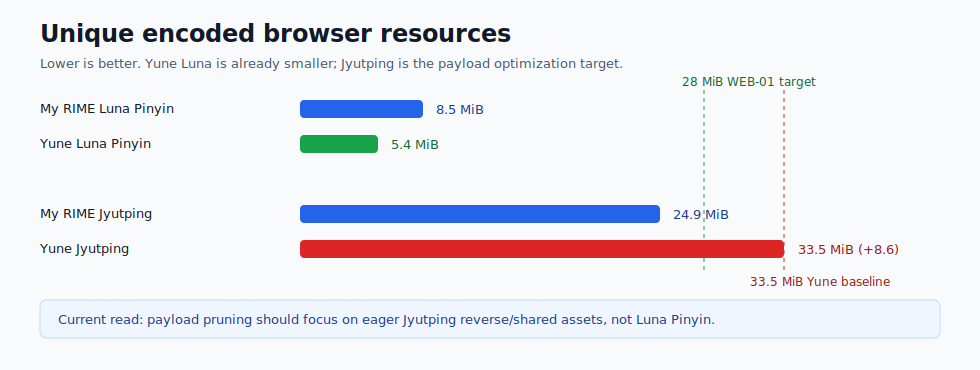
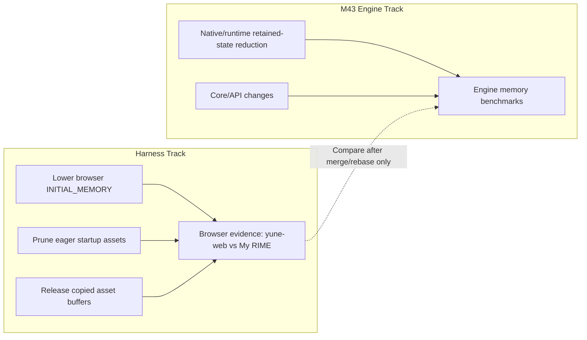

# Yune Web vs My RIME Browser Baseline

Date: 2026-06-26

## Scope

This compares the current local `apps/yune-web` production artifacts against
the open-source My RIME deployment at <https://my-rime.vercel.app/>.

Yune samples used freshly rebuilt local production outputs:

- `apps/yune-web/dist`
- `apps/yune-web/public-demo/dist`
- worker/runtime asset version: `yune-web-wasm-heap-v1`

My RIME samples used the live deployment because the local clone at
<https://github.com/LibreService/my_rime> commit
`c73ea172d28f07031ba87a1d71c4d2e1c8ba82a3` has source but no built
`public/rime.*` runtime assets in this local checkout. The live footer matched
`Commit c73ea17`.

Evidence was generated under:

- `apps/yune-web/e2e/results/yune-web-vs-my-rime-baseline/2026-06-26/report.md`
- `apps/yune-web/e2e/results/yune-web-vs-my-rime-baseline/2026-06-26/summary.json`
- `apps/yune-web/e2e/results/yune-web-vs-my-rime-baseline/2026-06-26/samples.json`

## Method

- Browser: Chromium through Playwright, headless, `1365x900`, `zh-HK`.
- Samples: 3 fresh browser profiles per app/schema row.
- Schemas:
  - `luna_pinyin`, input `ni`
  - Jyutping, input `nei`
- Latency:
  - `ready ms`: navigation start to app-ready text input.
  - `input->candidate ms`: type the schema input until any candidate is visible.
  - `commit ms`: press Space until textarea contains committed text.
- WASM memory:
  - Yune: harness diagnostic/UI `wasmMemory.currentBytes` and
    `wasmMemory.peakBytes`.
  - My RIME: direct worker evaluation of `Module.HEAPU8.byteLength`.
    My RIME does not expose a high-water counter, so its "peak" here is the max
    of snapshots at ready, candidate, and commit.
- Metric meaning: these values are `HEAPU8.buffer.byteLength`, meaning current
  or peak observed WASM linear-memory size. They are real browser memory
  reservation/commitment pressure, but they are not precise active bytes used
  by the engine.
- Resources: page plus dedicated-worker `performance.getEntriesByType("resource")`.

## Results

| Scenario | Schema | Ready ms | Input->candidate ms | Commit ms | WASM linear ready | Observed linear peak | Unique encoded resources | Commit |
| --- | --- | ---: | ---: | ---: | ---: | ---: | ---: | --- |
| My RIME live | Jyutping | 894 | 30 | 19 | 56.6 MiB | 68.0 MiB | 24.9 MiB | `你` |
| Yune public demo build | Jyutping | 1164 | 30 | 20 | 128.0 MiB | 128.0 MiB | 33.5 MiB | `你` |
| Yune tracked build | Jyutping | 1172 | 33 | 24 | 128.0 MiB | 128.0 MiB | 33.5 MiB | `你` |
| My RIME live | Luna Pinyin | 547 | 30 | 17 | 16.0 MiB | 16.0 MiB | 8.5 MiB | `你` |
| Yune public demo build | Luna Pinyin | 764 | 30 | 24 | 128.0 MiB | 128.0 MiB | 5.4 MiB | `伱` |
| Yune tracked build | Luna Pinyin | 775 | 30 | 22 | 128.0 MiB | 128.0 MiB | 5.4 MiB | `伱` |

## Post-M43 Yune-Only Baseline

After M43 landed on `main`, WEB-01 was rebased onto `ad93ec7` and the existing
WASM linear-memory benchmark was rerun with freshly rebuilt WASM, tracked
production output, and public-demo output. Evidence is under
`apps/yune-web/e2e/results/yune-web-wasm-heap-optimization/post-m43-baseline/`.

This is not yet the reusable My RIME comparator benchmark; building that
comparator remains WEB-01 Task 0. It does confirm that the post-M43 browser
baseline still has the same `128.0 MiB` linear-memory floor.

The WEB-01 branch still contains the known native `crates/yune-rime-api`
userdb/schema-installer diff, so this is post-M43 branch-state evidence rather
than final WEB01-00-clean baseline evidence.

| Scenario | Samples | Ready ms | First key ms | WASM linear ready | Observed linear peak | Unique encoded resources |
| --- | ---: | ---: | ---: | ---: | ---: | ---: |
| tracked `luna_pinyin` cold | 3 | 776 | 28 | 128.0 MiB | 128.0 MiB | 5.4 MiB |
| tracked `jyut6ping3_mobile` cold | 3 | 1250 | 13 | 128.0 MiB | 128.0 MiB | 33.5 MiB |
| public-demo `luna_pinyin` cold | 3 | 777 | 31 | 128.0 MiB | 128.0 MiB | 5.4 MiB |
| public-demo `jyut6ping3_mobile` cold | 3 | 1263 | 13 | 128.0 MiB | 128.0 MiB | 33.5 MiB |

## Visual Dashboard

The current dashboard uses the same direct-label SVG style as
[`yune-vs-librime-performance.md`](./yune-vs-librime-performance.md). The
charts use median values from the table above. My RIME's peak WASM linear
memory is the maximum observed worker `HEAPU8.buffer.byteLength` across ready,
candidate, and commit snapshots, not a true internal allocator high-water
counter.

Reading path:

- Heap gap: Yune's fixed 128 MiB WASM linear-memory floor is the most direct
  harness-owned gap.
- Startup gap: Jyutping has a second gap from eager browser asset loading.
- Latency: input-to-candidate timings are close enough that latency should not
  be the first optimization target in this harness track.

Yune internal diagnostics for the same samples stayed low:

- Jyutping public-demo median internal keydown-to-paint: `27 ms`
- Jyutping public-demo median worker process time: `5 ms`
- Luna public-demo median internal keydown-to-paint: `28 ms`
- Luna public-demo median worker process time: `4 ms`

## Findings

1. Yune still has a harness-level WASM memory target.

   My RIME proves that a browser RIME-style worker does not need a fixed
   128 MiB WASM linear-memory floor for these two schemas. My RIME starts at
   16 MiB for `luna_pinyin`, and grows from 56.6 MiB to 68.0 MiB for Jyutping.
   Yune starts and stays at 128.0 MiB because
   `scripts/yune-web-wasm-build.sh` currently sets
   `-sINITIAL_MEMORY=134217728`.

   This is a harness memory-reservation finding. Reducing `INITIAL_MEMORY`
   would reduce the browser's reserved/current WASM linear-memory footprint; it
   would not by itself prove that native engine active memory use decreased.

2. My RIME's build flags point to the first experiment.

   My RIME uses `ALLOW_MEMORY_GROWTH=1` and `MAXIMUM_MEMORY=4GB`, but does not
   set `INITIAL_MEMORY`. Yune already has `ALLOW_MEMORY_GROWTH=1` plus bounded
   linear growth, so the next low-risk harness-only experiment is to calibrate
   a lower `INITIAL_MEMORY` floor and let the heap grow if Jyutping actually
   needs more. The acceptance gate should be derived from observed high-water
   linear memory plus explicit headroom, not from the current 128 MiB floor.

3. Yune's Jyutping resource footprint is also larger.

   Yune public-demo Jyutping loads about 33.5 MiB unique encoded resources,
   versus My RIME's 24.9 MiB. The top Yune resources include both source YAML
   dictionaries and compiled assets:

   - `jyut6ping3_scolar.dict.yaml`: 6.8 MiB
   - `jyut6ping3_scolar.table.bin`: 5.8 MiB
   - `jyut6ping3.table.bin`: 4.1 MiB
   - `jyut6ping3_scolar.reverse.bin`: 3.4 MiB
   - `jyut6ping3.dict.yaml`: 3.3 MiB
   - `yune-web.wasm`: 2.5 MiB

   This is separate from the displayed WASM linear-memory number, but it is
   still harness-owned startup and browser memory pressure.

4. Typing latency is not the blocker in this comparison.

   External input-to-candidate timings are similar across both apps in this
   small benchmark. The optimization target should stay memory and startup
   payload first, not candidate lookup latency.

## Harness-Only Follow-Up Plan

### Step 1: Make the comparison benchmark reusable

- Add a focused Playwright benchmark that can collect:
  - Yune startup diagnostics and WASM linear-memory size.
  - External worker `Module.HEAPU8.byteLength` for same-origin comparator apps.
  - Page and worker resource timing.
  - Input-to-candidate and Space-to-commit timings.
- Keep outputs under
  `apps/yune-web/e2e/results/yune-web-vs-my-rime-baseline/`.
- Keep My RIME as an optional external baseline, not a required CI dependency.

### Step 2: A/B test lower Yune `INITIAL_MEMORY`

- Change only `scripts/yune-web-wasm-build.sh`.
- First run a calibration pass with lower `INITIAL_MEMORY` plus
  `ALLOW_MEMORY_GROWTH=1`, exercise `luna_pinyin` and `jyut6ping3_mobile`, and
  derive the final per-schema gates from observed high-water linear memory plus
  explicit headroom.
- Then test these values in order unless calibration points elsewhere:
  - `67108864` (64 MiB)
  - `50331648` (48 MiB), only if 64 MiB is stable
  - `33554432` (32 MiB), only if 48 MiB is stable
- Keep:
  - `ALLOW_MEMORY_GROWTH=1`
  - `MEMORY_GROWTH_GEOMETRIC_STEP=0`
  - `MEMORY_GROWTH_LINEAR_STEP=33554432`
  - `STACK_SIZE=8388608`
- Success gate:
  - `luna_pinyin` observed peak linear memory meets the calibrated target
    (provisionally <= 64 MiB).
  - `jyut6ping3_mobile` observed peak linear memory meets the calibrated target
    (provisionally <= 96 MiB).
  - Startup median and first-key median regress by no more than 10%, using
    enough samples for latency or publishing the observed noise band.
  - Userdb, schema switching, and reverse lookup smoke still pass.

### Step 3: Prune eager Jyutping assets

- Audit each path in `YUNE_WEB_JYUTPING_SHARED_ASSETS`.
- Split assets into:
  - required at schema init,
  - required only for reverse lookup triggers,
  - required only for schema switching,
  - not required in the default harness path.
- Specifically test whether these can be deferred or removed from default
  Jyutping startup:
  - `jyut6ping3_scolar.dict.yaml`
  - `jyut6ping3_scolar.table.bin`
  - `jyut6ping3_scolar.reverse.bin`
  - `loengfan.dict.yaml`
  - `cangjie3.dict.yaml`
  - `cangjie5.dict.yaml`
  - `luna_pinyin_yune_reverse.dict.yaml`
- Preserve the UI-visible reverse lookup list, but load heavy reverse lookup
  backing files only when the relevant trigger path is first used if the runtime
  allows it.

### Step 4: Stop retaining copied asset buffers in the worker

- `loadedExtraSharedAssets` and the adapter's current asset references keep
  asset content arrays after they have been written into MEMFS.
- Replace long-lived `{ path, content }` retention with:
  - metadata for diagnostics,
  - a reload callback or path list for redeploy/schema switch,
  - explicit buffer release after `fs.writeFile`.
- This will mostly reduce worker JS memory, not the `WASM 佔用` metric, but it
  is still part of the harness memory story.

### Step 5: Re-run evidence and decide ownership

- Re-run:
  - current Yune WASM linear-memory benchmark,
  - My RIME comparison benchmark,
  - targeted typing/userdb/schema/reverse lookup smoke.
- If Yune remains above My RIME after lower `INITIAL_MEMORY` and asset pruning,
  classify the remaining heap as native runtime retention and hand that back to
  M43. Do not widen this harness track into `crates/yune-core` or
  `crates/yune-rime-api`.

## Recommendation

Yes, the harness can likely be optimized further independent of M43. The most
promising immediate win is lowering Yune's browser `INITIAL_MEMORY` from the
current 128 MiB floor while keeping bounded linear growth. The exact target
should be set after a calibration run proves the observed high-water linear
memory for each schema. The comparison also shows a second harness-owned
opportunity in eager Jyutping asset loading, but that should come after the
build-flag A/B test because it is behavior-sensitive around reverse lookup.
